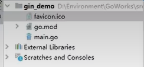
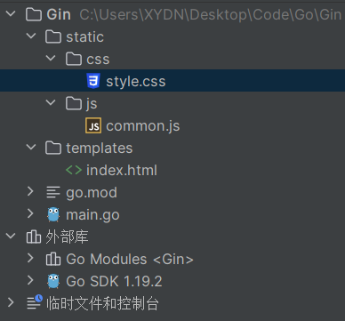

# Gin安装使用

Gin是golang的一个微框架，封装比较优雅，API友好，源代码比较明确。具有方便灵活，容错方便等特点。其实对于Golang而言，web框架的依赖远比Java、python之类的要小，自身的net/http库足够简单，性能也非常不错。框架更像一个常用函数和工具的集合


> 安装Gin（本质上是git-clone）

```shell
go get -u github.com/gin-gonic/gin
```

# 创建第一个web程序

```go
package main

//导入Gin包
import (
	"github.com/gin-gonic/gin"
)

func main() {
	//创建一个服务
	ginServer := gin.Default()

	//访问地址，处理我们的请求
    //将函数作为方法的参数
	ginServer.GET("/hello", func(context *gin.Context) {
        //返回JSON格式的数据，通过默认的H方法
		context.JSON(200, gin.H{"msg": "Hello,Gin"})
	})
	//指定运行端口，也可以不指定
	ginServer.Run(":8082")
}
```

## 设置网页图标

```go
//导入相关包
import "github.com/thinkerou/favicon"

func main(){
    ginServer := gin.Default()
    ginServer.User(favicon.New("./favicon.icon"))
}
```



# RESTful API

> 以前写网站

get	/user

post	/create_user

post	/update_user

post	/delete_user

> RESTful API

get	/user

post	/user

put	/user

delete	/user

```go
package main

import (
	"github.com/gin-gonic/gin"
)

func main() {
	//创建一个服务
	ginServer := gin.Default()

	//访问地址，处理我们的请求
	ginServer.GET("/hello", func(context *gin.Context) {
		context.JSON(200, gin.H{"msg": "Hello,Gin"})
	})
	ginServer.POST("/user", func(context *gin.Context) {
		context.JSON(200, gin.H{"msg": "post,user"})
	})
	//指定运行端口
	ginServer.Run(":8082")
}
```

## 响应页面



创建一个templates文件夹用于存放HTML文件，在文件夹中创建一个index.html文件

index.html

```html
<!DOCTYPE html>
<html lang="en">
<head>
    <meta charset="UTF-8">
    <title>Go Web</title>
    <link rel="stylesheet" href="/static/css/style.css">
    <script src="/static/js/common.js"></script>
</head>
<body>
    <h1>第一个Go Web页面</h1>
    获取的后端数据为
    {{.msg}}
</body>
</html>
```

mian.go

```go
package main

import (
	"github.com/gin-gonic/gin"
	"net/http"
)

func main() {
	//创建一个服务
	ginServer := gin.Default()

	//加载静态页面
	//加载templates文件夹下的所有静态页面
	ginServer.LoadHTMLGlob("templates/*")
	//加载templates文件夹下的index文件
	ginServer.LoadHTMLFiles("templates/index.html")

	//加载静态资源
	ginServer.Static("/static", "./static")
	//响应一个页面给前端
	ginServer.GET("/index", func(context *gin.Context) {
		context.HTML(http.StatusOK, "index.html", gin.H{
			"msg": "这是后端传来的数据",
		})
	})
	//指定运行端口
	ginServer.Run(":8082")
}
```

# 获取请求的参数

```go
package main

import (
	"encoding/json"
	"github.com/gin-gonic/gin"
	"net/http"
)

func main() {
	//创建一个服务
	ginServer := gin.Default()

	//加载静态页面
	//加载templates文件夹下的所有静态页面
	ginServer.LoadHTMLGlob("templates/*")
	//加载templates文件夹下的index文件
	ginServer.LoadHTMLFiles("templates/index.html")

	//加载静态资源
	ginServer.Static("/static", "./static")
	//响应一个页面给前端
	ginServer.GET("/index", func(context *gin.Context) {
		context.HTML(http.StatusOK, "index.html", gin.H{
			"msg": "这是后端传来的数据",
		})
	})
	//接收前端传过来的参数
	//usl?userid=xxx&username=hsy
	ginServer.GET("/user/info", func(context *gin.Context) {
		userid := context.Query("userid")
		username := context.Query("username")
		context.JSON(http.StatusOK, gin.H{
			"userid":   userid,
			"username": username,
		})
	})
	//usl/info/1/hsy
	ginServer.GET("user/info/:userid/:username", func(context *gin.Context) {
		userid := context.Param("userid")
		username := context.Param("username")
		context.JSON(http.StatusOK, gin.H{
			"userid":   userid,
			"username": username,
		})
	})

	//前端给后端传递JSON
	ginServer.POST("/json", func(context *gin.Context) {
		//request.body
		data, _ := context.GetRawData()

		var m map[string]interface{}
		//包装为JSON数据
		_ = json.Unmarshal(data, &m)
		context.JSON(http.StatusOK, m)
	})
	//处理表单
	ginServer.POST("/user/add", func(context *gin.Context) {
		username := context.PostForm("username")
		password := context.PostForm("password")
		context.JSON(http.StatusOK, gin.H{
			"msg":      "OK",
			"username": username,
			"password": password,
		})
	})
	//指定运行端口
	ginServer.Run(":8082")
}
```

# 路由

```go
//路由
ginServer.GET("/test", func(context *gin.Context) {
    //重定向	301
    context.Redirect(http.StatusMovedPermanently, "http://www.kbws.xyz:2048/")
})

//404 NoRoute
ginServer.NoRoute(func(context *gin.Context) {
    context.HTML(http.StatusNotFound, "404.html", nil)
})

//路由组
userGroup := ginServer.Group("/user")
{
    userGroup.GET("/add")
    userGroup.POST("/login")
    userGroup.POST("/logout")
}
orderGroup := ginServer.Group("order")
{
    orderGroup.GET("/add")
    orderGroup.DELETE("/delete")
}
```

# 中间件(拦截器)

```go
// 自定义Go中间件 拦截器
func myHandler() gin.HandlerFunc {
	return func(context *gin.Context) {
		//通过自定义的中间件，设置的值，在后续处理只要调用了这个中间件的都可以拿到这里的参数
		context.Set("userSession", "userid-1")
		context.Next() //放行

		//context.Abort() //阻止
	}
}

//注册中间件
ginServer.Use(myHandler())

ginServer.GET("/user/info", myHandler(), func(context *gin.Context) {
		//取出中间件的值
		usersession := context.MustGet("userSession").(string)
		log.Println("=========>", usersession)
		userid := context.Query("userid")
		username := context.Query("username")
		context.JSON(http.StatusOK, gin.H{
			"userid":   userid,
			"username": username,
		})
	})
```

