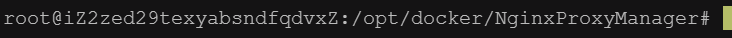

# 停止Docker

```
sudo systemctl stop docker
```

# 启动Docker

```
docker.socket
```



# 删除镜像

 查询镜像

```
docker images
```

先查询容器

```
docker ps -a
```

删除容器

```
docker rm <容器id>
```

然后删除镜像

```
docker rmi <jing'x>
```

