# Git概述

## Git简介

Git是一个分布式版本控制工具，通常用来对软件开发过程中的源代码文件进行管理。通过Git仓库来存储和管理这些文件，Git仓库分为两种:

- 本地仓库：开发人员自己电脑上的Git仓库
- 远程仓库：远程服务器上的Git仓库

commit：提交，将本地文件和版本信息保存到本地仓库

push：推送，将本地仓库文件和版本信息上传到远程仓库

pull：拉取，将远程仓库文件和版本信息下载到本地仓库

## Git下载和安装

下载地址：https://git-scm.com/download

下载完成后在任意目录中点击鼠标右键，看到如下菜单表示安装完成

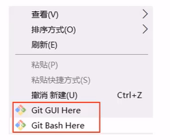

Git GUI Here：打开Git图形界面

Git Bash Here：打开Git命令行

# Git常用命令

## Git全局设置

安装Git后首先要设置用户名称和邮箱地址，因为每次Git提交都会提交该用户的信息

在Git命令行中执行下面命令

- 设置用户信息

```shell
git config --global user.name "Eternal"
git config --global user.email "hello@Eternal.cn"
```

- 查看配置信息

    ```shell
    git config --list
    ```

## 获取Git仓库

获取Git仓库通常有两种方式：

- 本地初始化一个Git仓库（不常用）
- 从远程仓库克隆（常用）

### 在本地初始化Git仓库

执行步骤：

1. 在任意目录下创建一个空目录作为本地的Git仓库
2. 进入这个目录，右键打开Git Bash
3. 执行命令`git init`

在当前目录看见`.git`文件夹说明Git仓库创建成功

### 从远程仓库克隆

可以通过Git命令从远程仓库进行克隆，将远程仓库克隆到本地

命令：`git clone [远程Git仓库地址]`

## 工作区、暂存区和版本库

工作区：包含.git文件夹的目录就是工作区，主要用于存放开发的代码

暂存区：.git文件夹中有很多文件，其中一个index文件就是暂存区，也可以叫做stage，暂存区是一个临时保存修改文件的地方

版本库：.git隐藏文件夹就是版本库，版本库中存储了很多配置信息、日志信息和文件版本信息登

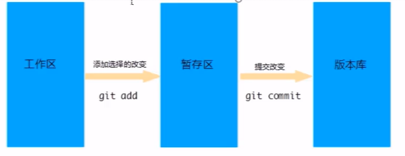

## Git工作区中文件的状态

Git工作区中的文件存在两种状态：

- untracked 未跟踪（未被纳入版本控制）
- tracked 已跟踪（被纳入版本控制）
    - Unmodified 未修改状态
    - Modified 已修改状态
    - Staged 已暂存状态

## 本地仓库操作

本地仓库常用命令如下：

- `git status`查看文件状态

    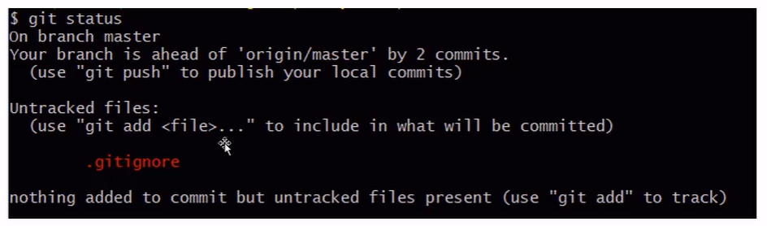

- `git add`将文件的修改加入暂存区

    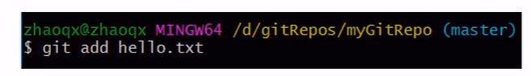

- `git reset`将暂存区的文件取消暂存或者是切换到固定的版本

    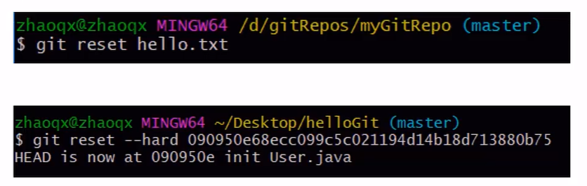

- `git commit`将暂存区的文件修改提交的版本库

    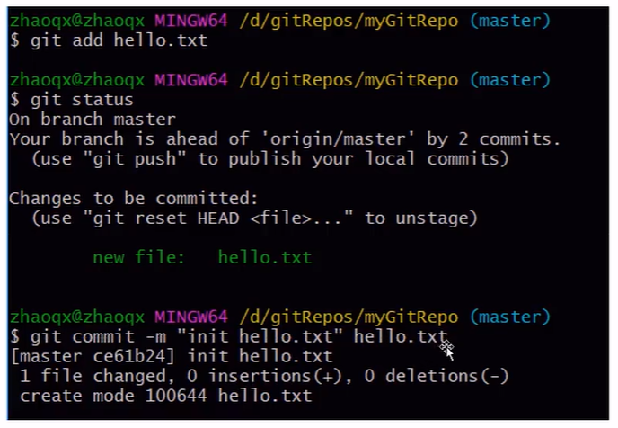

- `git log`查看日志

    

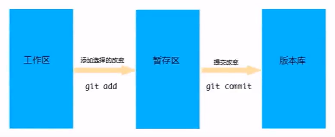

## 远程仓库操作

- `git remote` 查看远程仓库

    如果想查看已经配置的远程仓库服务器，可以运行 git remote 命令，它会列出每一个远程服务器的简写。如果已经克隆了远程仓库，那么至少应该能看到origin，这是Git克隆的仓库服务器的默认名字。

    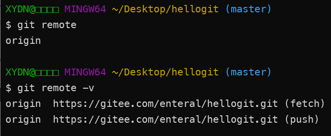

- `git remote add` 添加远程仓库

    添加远程仓库，运行`git remote add <shortname> <url>`添加一个新的远程Git仓库，同时指定一个可以引用的简写

    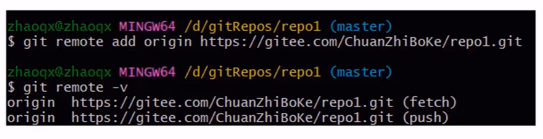

- `git clone` 从远程仓库克隆

    命令格式：`git clone [url]`

    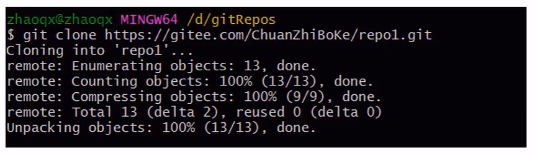

- `git pull` 从远程仓库拉取

    从远程仓库获取最新版本并合并到本地仓库，命令格式：`git pull [short-name] [branch-name]`

    注意：如果当前本地仓库不是从远程仓库克隆，而是本地创建的仓库，并且仓库中存在文件，此

    时再从远程仓库拉取文件的时候会报错（ fatal: refusing to merge unrelated histories )

    解决此问题可以在git pull命令后加入参数`--allow-unrelated-histories`

- `git push` 推送到远程仓库

    将本地仓库内容推送到远程仓库，可以使用命令：`git push [remote-name] [branch-name]`

    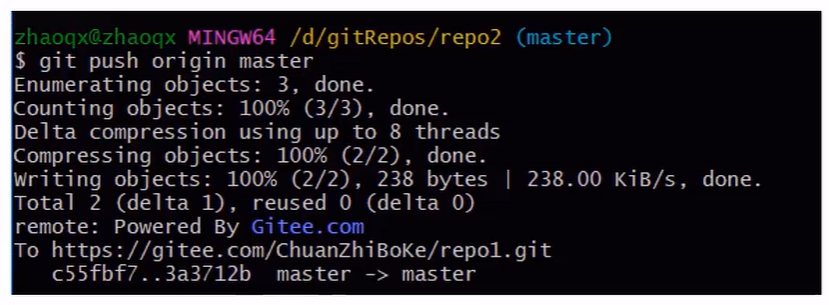

## 分支操作

分支是Git使用过程中非常重要的概念。使用分支意味着你可以把你的工作从开发主线上分离开来，以

免影响开发主线。同一个仓库可以有多个分支，各个分支相互独立，互不干扰。

通过`git init`命令创建本地仓库时默认会创建一个master分支

- `git branch` 查看所有本地分支

    - `git branch -r` 列出所有远程分支
    - `git branch -a` 列出所有本地分支和远程分支

    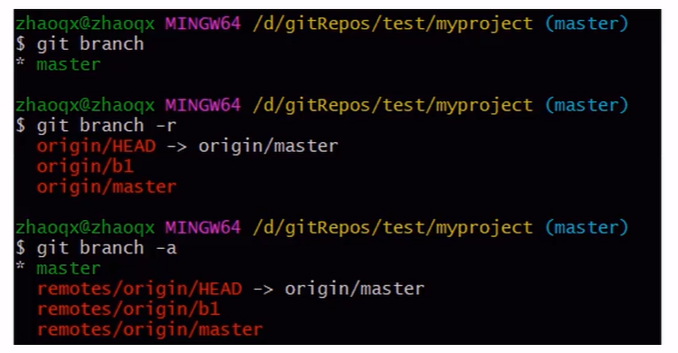

- `git branch [name]` 创建分支

    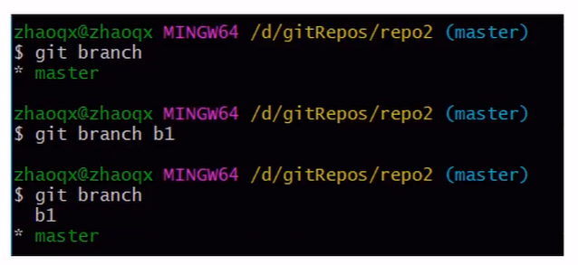

- `git checkout [name]` 切换分支

    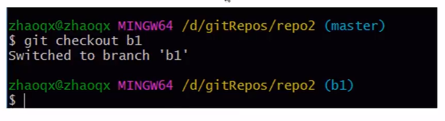

- `git push [shortName] [name]` 推送至远程仓库分支

    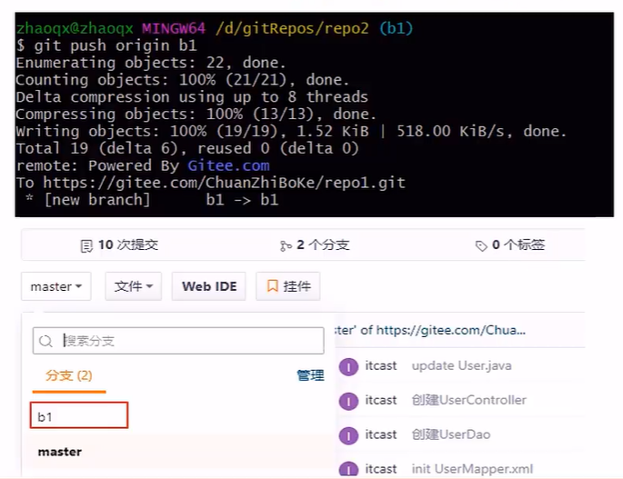

- `git merge [name]` 合并分支

    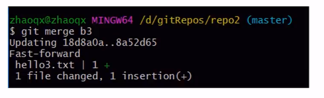

注意：报错误`cannot do a partial commit during a merge`时，在命令后面加上`-i`

## 标签操作

Git中的标签，指的是某个分支某个特定时间点的状态。通过标签，可以很方便的切换到标记时的状

态。比较有代表性的是人们会使用这个功能来标记发布结点（v1.0、v1.2等)。下面是mybatis-plus的标

签:

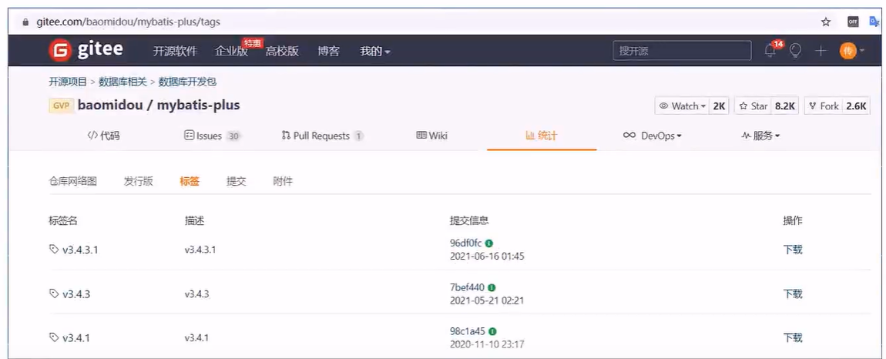

- `git tag ` 列出已有的标签

    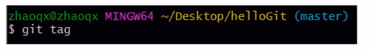

- `git tag [name]` 创建标签

    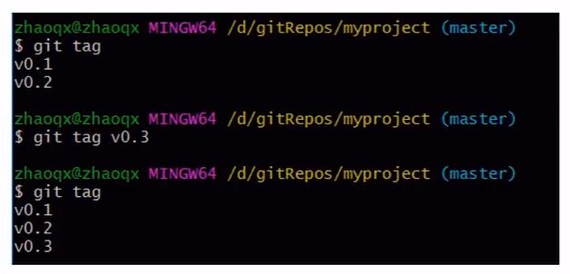

- `git push [shortName] [name]` 将标签推送至远程仓库

    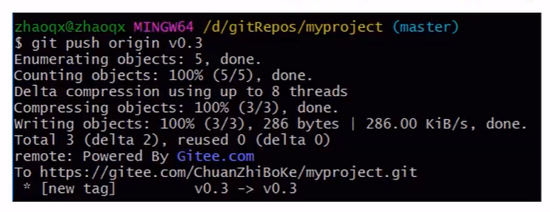

- `git checkout -b [branch] [name]` 检出标签

    检出标签时需要新建一个分支来指向某个标签

    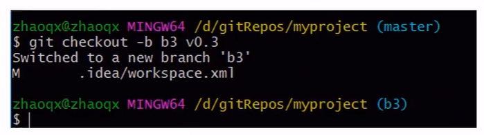

# 在IDEA中使用Git

## 配置Git

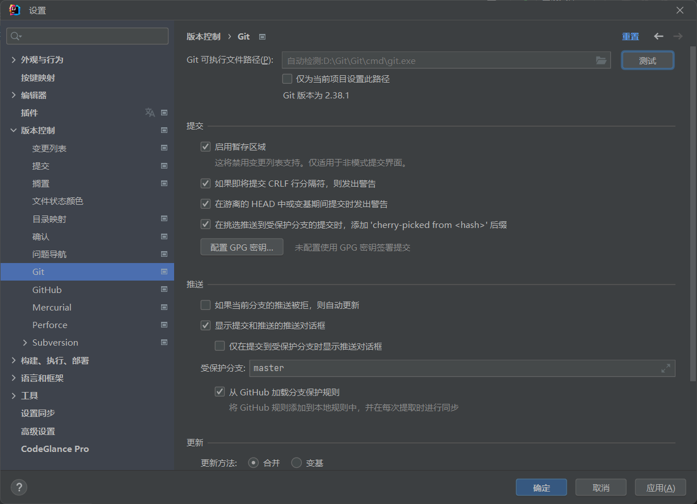


## 获取Git仓库

在IDEA中使用Git获取仓库的方式有两种：

- 本地初始化仓库
- 从远程仓库克隆

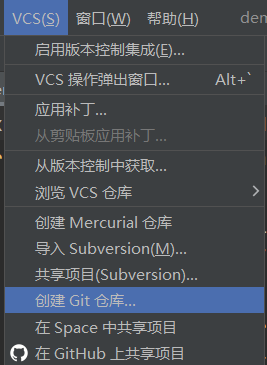

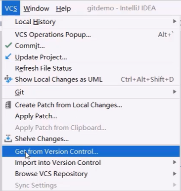

