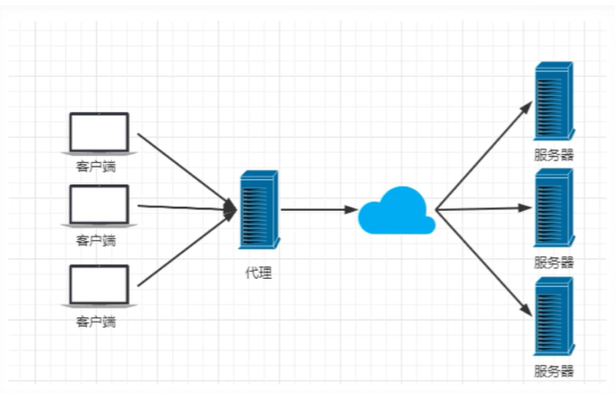
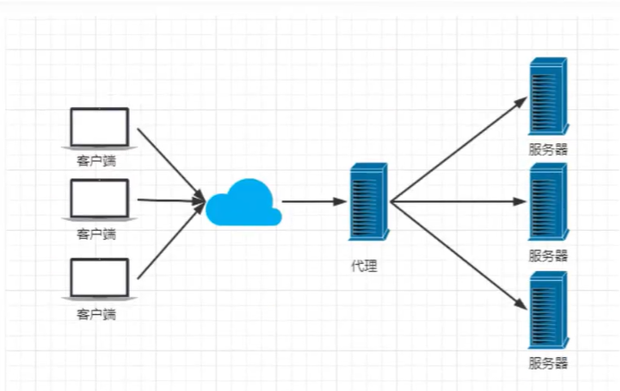
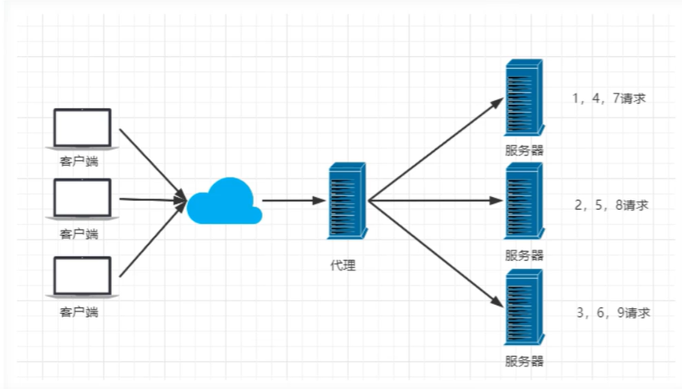
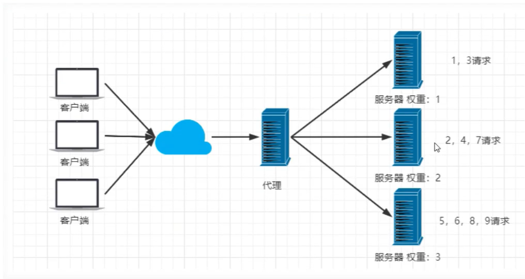
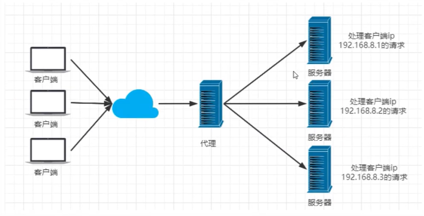
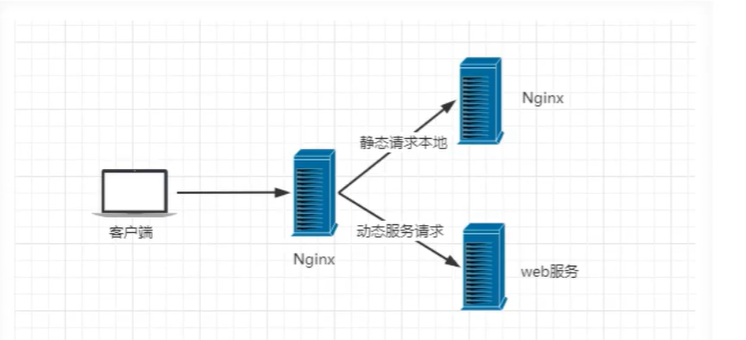

# 什么是Nginx

Nginx是一个高性能的HTTP和反向代理Web服务器，同时也提供了IMAP/POP3/SMTP服务

其特点是占用内存少，并发能力强

Nginx是一个安装非常简单，配置文件非常简洁（支持perl语法）、Bug非常少的服务。Nginx启动非常容易，并且几乎可以做到7*24不间断运行，还能在不间断服务的情况下进行软件版本的升级

# Nginx作用

> HTTP代理，反向代理：作为web服务器最常用的功能之一，尤其是反向代理

正向代理



反向代理



> Nginx提供的负载均衡策略有两种。内置策略为轮询，加权轮询，Ip hash。扩展策略可以随意发挥

轮询



加权轮询



Ip hash对客户端请求的IP进行hash操作，然后根据hash结果将同一个客户端IP的请求分发给同一台服务器进行处理，可以解决session不共享的问题



> 动静分离，在软件开发中，有些请求是需要后台处理的，有些请求是不需要经过后台处理的（如：css、html、jpg、js等），这些不需要通过后台处理的文件称为静态文件。让动态网站里的动态网页根据一定规则把不变的资源和经常变的资源区分开来，静态资源做好拆分之后，我们就根据静态资源的特点将其做缓存操作，提高资源响应的速度



# Nginx安装

## Linux下安装

Ubuntu系统下

> sudo apt-get install nginx #安装
>
> nginx -v #查看安装版本
>
> 启动或停止
>
> sudo /etc/init.d/nginx start|stop|restart|status
> 或
> sudo service nginx start|stop|restart|status

# 常用命令

```shell
cd /user/local/nginx/sbin/
./nginx	启动
./nginx -s stop	停止
./nginx -s quit	安全退出
./nginx -s reload	重新加载配置文件
ps aux|grep nginx	查看Nginx进程
```

# 配置文件

修改配置文件

```
sudo vim /etc/nginx/sites-enabled/default
```


```
server {
	listen 80 default_server;
	listen [::]:80 default_server;
	server_name _;

	#location / {
	#	uwsgi_pass 127.0.0.1:8003; #重定向到127.0.0.1的8000端口
     # 	include /etc/nginx/uwsgi_params; #将所有的参数转到uwsgi下
	#}
}
server
{
        listen 8004;
        server_name _; 
        location / {
                proxy_pass http://localhost:8003;
                include /etc/nginx/uwsgi_params;
        }
}
server {
	listen 2333;
	listen [::]:2333;
	server_name _;
	root /home/xgkx/counselor/dist;
	index index.html;

	location /api {
		# First attempt to serve request as file, then
		# as directory, then fall back to displaying a 404.
		proxy_pass  http://127.0.0.1:2022;
	}
}
server{
	listen 8002;
	listen [::]:8002;
	server_name _;
	location / {
		uwsgi_pass 127.0.0.1:8001;
		include /etc/nginx/uwsgi_params;
	}
	location /static {
		root /home/xgkx/django/weixinAPP;
	}
}
server{
	listen 2024;
	server_name _;
	root /home/build;
	index index.html;
	
	
	location / {
		root /home/build;
    		try_files $uri /index.html;
	}

}
# server{
#	listen 2023 default_server;
#	server_name _;
#
#	root /home/xgkx/major/dist;
#
#	location /api {
#		proxy_pass  http://127.0.0.1:2021;
#	}
#	location /static {
#		root /home/xgkx/major/dist;
#	}	
#	
# }
server {
	listen 3500 default_server;
	listen [::]:3500 default_server;

	# SSL configuration
	#
	# listen 443 ssl default_server;
	# listen [::]:443 ssl default_server;
	#
	# Note: You should disable gzip for SSL traffic.
	# See: https://bugs.debian.org/773332
	#
	# Read up on ssl_ciphers to ensure a secure configuration.
	# See: https://bugs.debian.org/765782
	#
	# Self signed certs generated by the ssl-cert package
	# Don't use them in a production server!
	#
	# include snippets/snakeoil.conf;

	root /home/xgkx/html/dist;

	# Add index.php to the list if you are using PHP
	index index.html index.htm index.nginx-debian.html;

	server_name _;

	location / {
		# First attempt to serve request as file, then
		# as directory, then fall back to displaying a 404.
		try_files $uri $uri/ =404;
	}
        location /static {
		root /home/xgkx/html/dist;
	}
	location /api {
            rewrite  ^.+api/?(.*)$ /$1 break;
            proxy_pass  http://kbws.xyz:3501;
            client_max_body_size    500m;
            proxy_redirect  off;
            proxy_set_header  Host $host;
            proxy_set_header  X-Real-IP $remote_addr;
            proxy_set_header  X-Forwarded-For $proxy_add_x_forwarded_for;        
   	 }
}
server {
    listen 80;    # 监听端口
    server_name code.kbws.xyz;       # 域名
    # nginx请求日志地址
    access_log  /usr/local/webserver/nginx/logs/code.access.log;  
    location / {
        proxy_pass  http://127.0.0.1:2021;
        proxy_redirect     off;
        proxy_set_header   Host             $host;          # 传递域名
        proxy_set_header   X-Real-IP        $remote_addr;   # 传递ip
        proxy_set_header   X-Scheme         $scheme;        # 传递协议
        proxy_set_header   X-Forwarded-For  $proxy_add_x_forwarded_for;
        proxy_set_header   Accept-Encoding  gzip;
        # code-server的websocket连接需要Upgrade、Connection这2个头部
        proxy_set_header   Upgrade          $http_upgrade;
        proxy_set_header   Connection       upgrade; 
    }
}

server {
        listen 80;
        server_name  py.kbws.xyz;
        location / {
            proxy_pass          http://127.0.0.1:8888;
            proxy_set_header    Host $host;
            proxy_set_header    X-Real-Scheme $scheme;
            proxy_set_header    X-Real-IP $remote_addr;
            proxy_set_header    X-Forwarded-For $proxy_add_x_forwarded_for;
            proxy_http_version  1.1;
            proxy_set_header    Upgrade $http_upgrade;
            proxy_set_header    Connection "upgrade";
            proxy_read_timeout  120s;
            proxy_next_upstream error;
        }
}

server{
	listen 2048;
	listen [::]:2048;

	root /home/code/2048;
	index index.html;
	
	location / {
		try_files $uri $uri/ =404;
	}
}
```

例子

```

	server {
		listen 80;
		server_name localhost;

		location / {
			root html;
			index index.html index.htm;
			proxy_pass http://kuangstudy
		}
	}
```

这样只要访问localhost，Nginx就会将请求自动分配到8080和8081两端口
