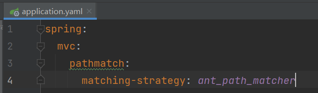
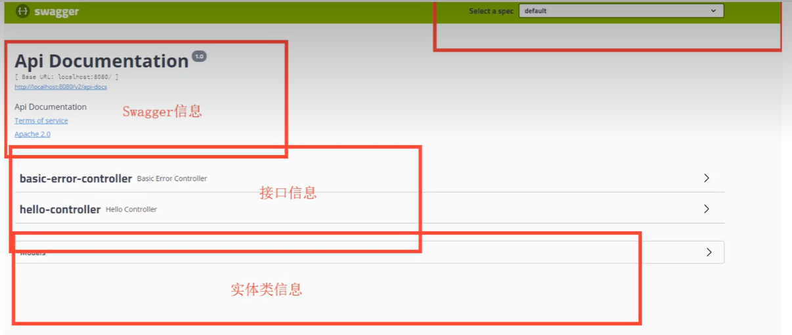
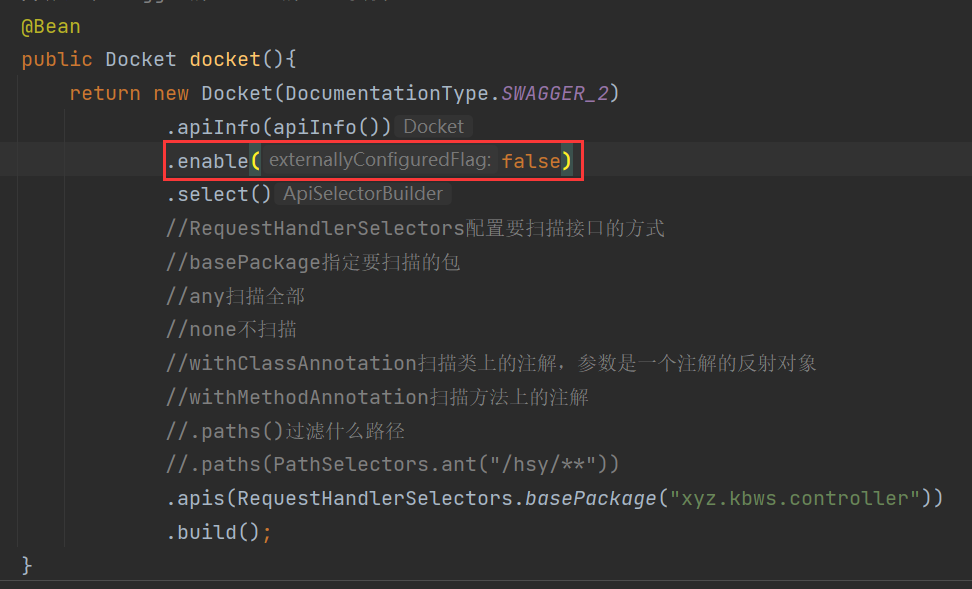

# 简介

**前后端分离**

Vue + Springboot

- 前后端交互：API

- 前后端相对独立，松耦合

- 前后端甚至可以部署在不同的服务器上


产生问题：前后端集合联调，前端人员和后端人员无法做到”即时协商，尽早解决“，导致问题爆发

解决方案：

- 首先指定schema[计划的提纲]，实时更新API，降低集成的风险
- 早些年，指定word文档
- 前后端分离：
    - 前端测试后端接口：postman
    - 后端提供接口：需要实时更新最新的消息及改动


# Swagger

- 号称世界上最流行的API框架
- RestFul Api文档在线自动生成工具=>API文档与API定义同步更新
- 直接运行，可以在线测试API接口
- 支持多种语言：（Java、Php。。。）

在项目使用Swagger需要springbox

- swagger2
- ui


# Spring Boot集成Swagger

1. 新建一个SpringBoot项目（Web项目）

2. 导入相关依赖

    ```xml
    <dependency>
        <groupId>io.springfox</groupId>
        <artifactId>springfox-swagger2</artifactId>
        <version>2.9.2</version>
    </dependency>
    <dependency>
        <groupId>io.springfox</groupId>
        <artifactId>springfox-swagger-ui</artifactId>
        <version>2.9.2</version>
    </dependency>
    <dependency>
        <groupId>com.github.xiaoymin</groupId>
        <artifactId>swagger-bootstrap-ui</artifactId>
        <version>1.9.6</version>
    </dependency>
    ```

3. 编写一个Hello工程

4. 配置Swagger ==>config

    ```java
    package xyz.kbws.config;
    
    import org.springframework.context.annotation.Configuration;
    import springfox.documentation.swagger2.annotations.EnableSwagger2;
    
    /**
     * @author hsy
     * @date 2023/3/2
     */
    @Configuration
    @EnableSwagger2
    public class SwaggerConfig {
        
    }
    ```

    > 注意，如果启动的时候报：Failed to start bean 'documentationPluginsBootstrapper'; nested exception is.....错误
    >
    > 解决方法为：在配置文件中配置

5. 运行测试

    http://localhost:8080/swagger-ui.html

    


# 配置Swagger

Swagger的bean实例 Docket；

```java
package xyz.kbws.config;

import org.springframework.context.annotation.Bean;
import org.springframework.context.annotation.Configuration;
import springfox.documentation.service.ApiInfo;
import springfox.documentation.service.Contact;
import springfox.documentation.spi.DocumentationType;
import springfox.documentation.spring.web.plugins.Docket;
import springfox.documentation.swagger2.annotations.EnableSwagger2;

import java.util.ArrayList;

/**
 * @author hsy
 * @date 2023/3/2
 */
@Configuration
@EnableSwagger2
public class SwaggerConfig {

    //配置了Swagger的Docket的bean实例
    @Bean
    public Docket docket(){
        return new Docket(DocumentationType.SWAGGER_2)
                .apiInfo(apiInfo());
    }
    //配置Swagger的信息=apiInfo
    private ApiInfo apiInfo(){
        //作者信息
        Contact contact = new Contact("hsy", "http://kbws.xyz", "hsy040506@163.com");
        return new ApiInfo(
                "SwaagerAPI文档",
                "111",
                "1.0",
                "http://kbws.xyz",
                contact,
                "Apache 2.0",
                "",
                new ArrayList()
        );
    }
}
```


# Swagger配置扫描接口

```java
//配置了Swagger的Docket的bean实例
@Bean
public Docket docket(){
    return new Docket(DocumentationType.SWAGGER_2)
        .apiInfo(apiInfo())
        .select()
        //RequestHandlerSelectors配置要扫描接口的方式
        //basePackage指定要扫描的包
        //any扫描全部
        //none不扫描
        //withClassAnnotation扫描类上的注解，参数是一个注解的反射对象
        //withMethodAnnotation扫描方法上的注解
        //.paths()过滤什么路径
        //.paths(PathSelectors.ant("/hsy/**"))
        .apis(RequestHandlerSelectors.basePackage("xyz.kbws.controller"))
        .build();
}
```

配置是否启动swagger



若希望Swagger在生产环境使用，在发布时不使用

- 判断是不是生产环境   flag=false
- 注入enable(flag)

```java
//配置了Swagger的Docket的bean实例
    @Bean
    public Docket docket(Environment environment){
        //设置要显示的Swagger环境
        Profiles profiles = Profiles.of("dev","test");
        //通过environment.acceptsProfiles判断自己是否处在设定的环境中
        boolean flag = environment.acceptsProfiles(profiles);
        return new Docket(DocumentationType.SWAGGER_2)
                .apiInfo(apiInfo())
                .enable(flag)
                .select()
                .apis(RequestHandlerSelectors.basePackage("xyz.kbws.controller"))
                .build();
    }
```

# 注意

如果项目中配置了拦截器，要放开相应的资源路径

```java
public void addInterceptors(InterceptorRegistry registry){
    registry.addInterceptor(new LoginHandler(jwtUtils))
        .addPathPatterns("/**")
        .excludePathPatterns("/user/login","/error")
        .excludePathPatterns("/swagger-ui.html")
        .excludePathPatterns("/swagger-resources/**")
        .excludePathPatterns("/webjars/**")
        .excludePathPatterns("/v2/api-docs/**")
        .excludePathPatterns("/doc.html");
}
```

