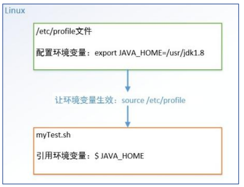

# 入门

编写Shell脚本`hello.sh`

```shell
#!/bin/bash
echo 'Hello,World'
```

运行

```
# 方法1
sh hello.sh
# 方法2
chmod +x hello.sh
./hello.sh
```

终端打印出`Hello,World`

> - `#!`告诉系统这个脚本需要什么解释器来执行
> - 文件名`.sh`不是强制要求的
> - 方法1 直接运行解释器，第一行可以去掉
> - 方法2 `hello.sh`作为可执行程序，Shell脚本第一行一定要指定解释器

# 变量

## Shell变量

定义

Shell变量分为**系统变量**和**自定义变量**。系统变量有`$HOME`、`$PWD$`、`$USER`等，显示当前Shell中所有变量：`set`。变量名可以由字母、数字、下划线组成，不能以数字开头

基本语法

- 定义变量：变量名=变量值，等号两侧不能有空格，变量名一般习惯大写
- 删除变量：`unset`变量名
- 声明静态变量：`readonly` 变量名，静态变量不能`unset`
- 使用变量：`$变量名`

### 将命令返回值赋给变量

- A=\`ls\`
- A=$(ls)等价于反引号

## Shell环境变量

定义



基本语法

- `export 变量名=变量值`，将shell变量输出为环境变量
- `source 配置文件路径`，让修改后的配置信息立即生效
- `echo $变量名`，检查环境变量是否生效

## 位置参数变量

基本语法

- `$n`：`$0`代表命令本身、`$n-$9`代表第1-9个参数，10以上参数用花括号，如`${10}`
- `$*`：命令行中所有参数，且把所有参数看成一个整体
- `$@`：命令行中所有参数，且把每个参数区别对待
- `$#`：所有参数个数

示例：

编写脚本，输出命令行输入的各个参数信息

```shell
#!/bin/bash
echo $0 $1 $2
echo $* 
echo $@
echo 参数个数=$#
```

运行

```
sh position.sh 10 20
```

输出

```
position.sh 10 20
10 20
10 20
参数个数=2
```

## 预定义变量

定义

在赋值变量之前，事先在Shell脚本中直接引用的变量

基本语法

- `$$`：当前进程的PID进程号
- `$！`：后台运行的最后一个进程的PID进程号
- `$?`：最后一次执行的命令的返回状态，0为执行正确，非0执行失败

示例

```shell
#!/bin/bash
echo 当前进程号=$$
# &:以后台的方式运行程序
./hello.sh &
echo 最后一个进程的进程号=$!
echo 最后执行命令的结果=$?
```

运行结果

```shell
当前进程号=3609421
最后一个进程的进程号=3609422
最后执行命令的结果=0
root@iZ2zed29texyabsndfqdvxZ:/home/shell# Hello,World
```

# 运算符

基本语法

- `$((运算符))`或`$[运算符]`
- `expr m + n`，注意`expr`运算符间要有空格
- `expr m - n`
- `expr \*, /,%`，分别代表乘，除，取余

示例

```shell
#!/bin/bash
echo $(((2+3)*4))

echo $[(2+3)*4]

TEMP=`expr 2 + 3`
echo `expr $TEMP \* 4`
```

# 条件判断

基本语法

`[ condition ]`，注意`condition `前后要有空格，非空返回0，0为true，否则为false

示例

```shell
#!/bin/bash
if [ 'test01' = 'test' ]
then    
        echo '等于'
fi      
# 20是否大于10
if [ 20 -gt 10 ]
then    
        echo '大于'
fi      
# 是否存在文件/root/shell/a.txt
if [ -e /home/shell/hello.sh ]
then    
        echo '存在'
fi
if [ 'test02' = 'test02' ] && echo 'hello' || echo 'world'
then
        echo '条件满足，执行后面的语句'
fi
```

运行结果

```shell
大于
存在
hello
条件满足，执行后面的语句
```

# 流程控制

## if判断

基本语法

```shell
if [ 条件判断式 ];then
	程序
fi

# 或者
if [ 条件判断式 ]
then
	程序
elif [ 条件判断式 ]
then
	程序
fi
```

示例

输入参数大于60，输出“及格”，反之输出“不及格”

```shell
#!/bin/bash
if [ $1 -ge 60 ]
then    
        echo "及格"
elif [ $1 -lt 60 ]
then    
        echo "不及格"
fi 
```

## case分支

基本语法

```shell
case $变量名 in
"值1")
如果变量值等于1，则执行此处程序1
;;
"值1")
如果变量值等于1，则执行此处程序1
;;
.......
*)
如果变量值不等于以上列出的值，则执行此处程序
;;
esac
```

示例

当命令行参数为1时输出“周一”，2时输出“周二”，其他情况输出“其他”

```shell
#!/bin/bash
case $1 in
"1")
echo 周一
;;
"2")
echo 周二
;;
*)
echo 其他
;;
esac
```

## for循环

基本语法

```shell
# 语法1
for 变量名 in 值1 值2 值3...
do
	程序
done
# 语法2
for((初始值;循环控制条件;变量变化))
do
	程序
done
```

示例

打印命令行输出的参数

```shell
#!/bin/bash
for i in "$*"
do      
        echo "the arg is $i"
done    
echo "===================="
for j in "$@"
do      
        echo "the arg is $j"
done
```

运行结果

```
the arg is 1 2 3
====================
the arg is 1
the arg is 2
the arg is 3
```

输出从1加到100的值

```shell
#!/bin/bash
SUM=0
for ((i=1;i<=100;i++)) do
        SUM=$[$SUM+$i]
done    
echo $SUM
```

## while循环

基本语法

```shell
while [ 条件判断式 ]
do
	程序
done
```

示例

输出1加到100的值

`sh sum2.sh 100`

```shell
#!/bin/bash
SUM=0
i=0
while [ $i -le $1 ]
do
        SUM=$[$SUM+$i]
        i=$[$i+1]
done    
echo $SUM
```

# 读取控制台输入

基本语法

read(选项)(参数)

## 选项

- `-p`：指定读取值时的提示符
- `-t`：指定读取值时等待的时间（秒），如果没有在指定时间内输入，就不再等待了

## 参数

- 变量名：读取值的变量名

示例

读取控制台输入一个num值

```shell
#!/bin/bash
read -p "请输入一个数num=" NUM1
echo "你输入num1的值是：$NUM1"
read -t 10 -p "请在10秒内输入一个数num2=" NUM2
echo "你输入num2的值是：$NUM2"
```

运行结果

```
请输入一个数num=12
你输入num1的值是：12
请在10秒内输入一个数num2=23
你输入num2的值是：23
```

# 函数

## 系统函数

`basename`，删掉路径最后一个`/`前的所有部分（包括`/`），常用于获取文件名


基本语法

- `basename [pathname][suffix]`
- `basename [string] [suffix]`
- 如果指定`suffix`，也会删掉`pathname`或`string`的后缀部分

示例

```shell
# basename /usr/bin/sort
sort
# basename include/stdio.h
stdio.h
# basename include/stdio.h.h
stdio
```


`dirname`，删掉路径最后一个`/`后的所有部分（包括`/`），常用于获取文件路径

基本语法

- `dirname pathname`
- 如果路径中不含`/`，则返回`.`（当前路径）

示例

```shell
# dirname /usr/bin/
/usr
# dirname dir1/str dir2/str
dir1
dir2
# dirname stdio.h
.
```

## 自定义函数

基本语法

```
[ function ] funname[()]
{
	Action;
[return int;]
}
# 调用
funname 参数1 参数2....
```

示例

计算输入两个参数的和

```shell

```

