# CSS简介

CSS的主要场景就是美化网页，布局页面的

## HTML的局限性

HTML只关注内容的语义，样式较丑

## CSS

CSS是层叠样式表(Cascading Style Sheets)的简称

CSS也是一种标记语言

CSS主要用于设置HTML中的文本内容（字体、大小、对齐方式等）、图片的外形（宽高、边框样式、边距等）以及版面的布局和外观显示样式

CSS最大价值：由HTML专注去做结构呈现，样式交给CSS，即结构（HTML）与样式（CSS）相分离

## CSS语法规范

CSS规则由两个主要的部分构成：选择器以及一条或多条声明

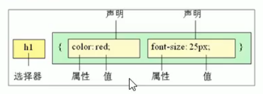

- 选择器是用于指定CSS样式的HTML标签，花括号是对该对象设置的具体样式
- 属性和属性值以”键对值“的形式出现
- 属性是对指定的对象设置的样式属性，例如字体大小、文本颜色等
- 属性和属性值之间用”：“分开
- 多个”键值对“之间用英文”;“分开

## CSS代码风格

### 样式书写

展开格式

```css
h3{
    color:pink;
    font-size:20px;
}
```

### 样式大小写

建议样式选择器，属性名，属性值关键字全部使用小写字母，特殊清空除外

### 空格规范

1. 属性值前面，冒号后面，保留一个空格
2. 选择器（标签）和大括号中间保留空格

# CSS基础选择器

## CSS选择器的作用

选择器（选择符）就是根据不同的需求把不同标签选出来就是选择器的作用。简单来说，就是用来选择标签的。

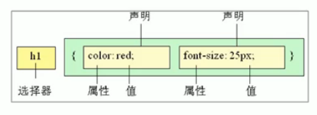

上面的CSS做了两件事：

1. 找到所有的h1标签，选择器
2. 设置这些标签的样式，比如颜色为红色

## 选择器分类

选择器分为基础选择器和复合选择器两个大类，先讲解基础选择器

- 基础选择器是由单个选择器组成的
- 基础选择器包括：标签选择器、类选择器、id选择器和通配符选择器

## 标签选择器

标签选择器（元素选择器）是指用HTML标签名称作为选择器，按照标签名称分类，为页面中某一类标签指定统一的CSS样式

语法

```css
标签名{
    属性1:属性值1;
    属性2:属性值2;
    属性3:属性值3;
    ...
}
```

作用：可以将某一类标签全部选择出来，比如全部的div标签和span标签

优点：能够快速为页面中同类型的标签统一设置样式

缺点：不能设置差异化样式，只能选择全部的当前标签

## 类选择器

想要差异化选择不同的标签，单独选一个或者某几个标签，可以使用类选择器

类选择器在HTML中以class属性显示，在CSS中，类选择器以一个点" . "号显示

语法

```css
.类名{
    属性1:属性值1;
    ...
}
```

例如将所有red类的HTML元素改成红色

```css
.red{
    color:red;
}
```

结构中需要使用class属性来调用class类的意思

```css
<div class='red'>变红色</red>
```

注意：

1. 类选择器以一个点" . "号进行标识，后面紧跟类名（自定义，自己命名）
2. 可以理解为给标签起了一个名字，来表示
3. 长名称或者词组可以使用中横线来为选择器命名
4. 不要使用纯数字、中文等命名，尽量使用英文名称来命名
5. 命名要有意义，尽量使别人一眼就知道这个类的目的

## 类选择器-多类名

我们可以给一个标签指定**多个类名**，从而达到更多的选择的目的

多类名使用方式

```html
<div class="red font20">亚瑟</div>
```

- 在标签class属性中写多个类名
- 多个类名中间必须用空格隔开
- 节省CSS代码，统一修改也方便
- 多类名选择器在后期布局比较复杂的情况，会较多使用

## id选择器

id选择器可以为标有特定id的HTML元素指定特定的样式

HTML元素以id属性来设置id选择器，CSS中id选择器以“#”来定义

语法：

```css
#id名{
	属性1:属性值1;
	...
}
```

例如，将id为nav元素中的内容设置为红色

```css
#nav{
	color:red;
}
```

注意：id属性只能在每个HTML文档中只能出现一次。

## 通配符选择器

在CSS中，通配符选择器使用“*”定义，它表示选取页面中所有的元素（标签）

语法

```css
*{
	属性1:属性值1;
	...
}
```

- 通配符选择器不需要调用，自动就给所有的元素使用样式
- 特殊情况才使用，后面讲解

```css
*{
	margin:0;
	padding:0;
}
```


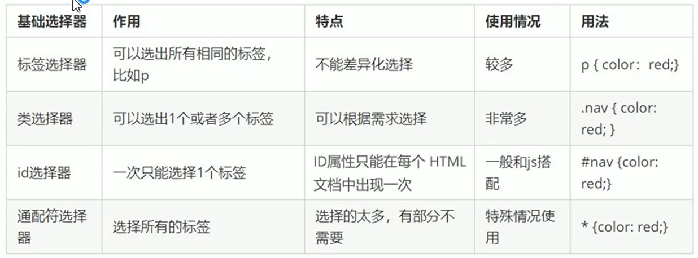


# CSS字体属性

CSS字体属性用于定义字体系列、大小、粗细和文字样式

## 字体系列

CSS使用`font-family`属性定义文本的字体系列

```css
p{
	font-family:"微软雅黑";
}
div{
	font-family:Arial,"Microsoft Yahei","微软雅黑"
}
```

- 各种字体之间必须使用英文逗号隔开
- 一般情况下，如果有空格隔开的多个单词组成的字体，加引号
- 尽量使用系统默认的字体，保证在任何用户浏览器中都能正确的显示
- 最常见的字体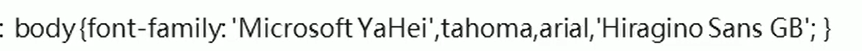

## 字体大小

CSS使用`font-size`属性定义字体大小

```css
p{
	font-size:20px;
}
```

- px（像素）大小是我们网页的最常用单位
- 谷歌浏览器字体默认大小是16px
- 可以给body指定整个页面字体的大小

## 字体粗细

CSS使用`font-wight`定义字体的粗细

```css
P{
	font-wight:bold;
}
```

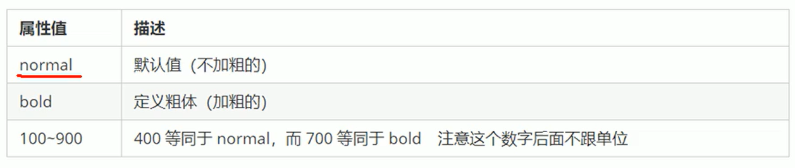

## 文字样式

CSS使用`font-style`属性设置文本的风格

```css
p{
	font-style:normal;
}
```

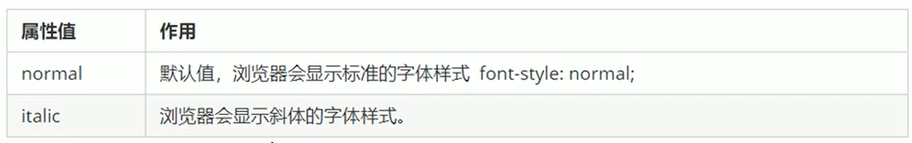

注意：平时很少给文字加斜体反而要给斜体标签（em，i）改为不倾斜字体

## 字体复合属性

字体属性可以把以上文字样式综合来写，这样可以更节约代码

```css
body{
	font:font-style font-weight font-size/line-height font-family;
}
```

- 使用font属性时必须按照上面格式中的顺序书写，不能更换顺序，每个属性之间用空格隔开
- 不需要设置的属性可以省略，但必须要设置font-size和font-family属性，否则font属性将不起作用

# CSS文本属性

## 文本颜色

color属性用于定义文本的颜色

```css
div{
    color:red;
}
```

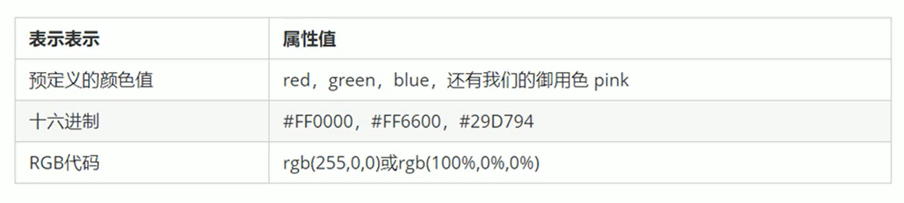

**开发中常用十六进制**

## 对齐文本

text-align属性用于设置文本的水平对齐方式

```css
div{
    text-align:center;
}
```


## 装饰文本

text-decoration属性规定添加到文本的修饰。可以给文本添加下划线、删除线和上划线等

```css
div{
    text-decoration:underline;
}
```

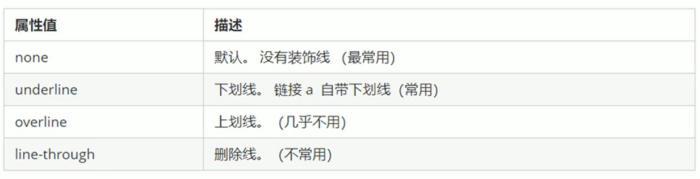

## 文本缩进

text-indent属性用来指定文本第一行的缩进，通常是将段落的首行缩进

```css
div{
    text-indent:10px;
}
```

通过设置该属性，所有元素的第一行都可以缩进一个指定的长度，甚至可以是负值

```css
p{
    text-indent:2em;
}
```

em是一个相对单位，就是当前元素（font-size）一个文字的大小，如果当前元素没有设置大小，则会按照父元素的1个文字大小

## 行间距

line-height属性用于设置行间的距离（行高）。可以控制行与行之间的距离

```css
p{
    line-height:26px;
}
```


# CSS的引入方式

## CSS的三种样式表

按照CSS书写的位置，CSS样式表可以分为三类：

1. 行内样式表
2. 内部样式表
3. 外部样式表

## 内部样式表

内部样式表是将CSS代码写到HTML页面顶部，是将所有的CSS代码抽取出来，集中在一个`<style>`标签中

```html
<style>
    div{
        color:red;
        font-size:12px;
    }
</style>
```

- `<style>`标签理论上可以放在HTML文档的任何地方，但一般放在head标签中
- 通过此种方式可以方便控制当前整个页面中的元素样式设置
- 代码结构清晰，但没有完全实现结构与样式的分离
- 练习时常用的方式

## 行内样式表

行内样式表是在元素标签内部的style属性中设置CSS样式，适用于简单的修改

```html
<div style="color:red;font-size:12px;">青春不再</div>
```

- style其实就是标签的属性
- 在双引号中间，写法要规范
- 可以控制当前的标签设置样式
- 没有体现出结构与样式分离的思想，不建议大量使用

## 外部样式表

实际开发中都是外部样式表，核心是将样式写到CSS文件中，然后把CSS文件引入到HTML文件中使用

引用外部样式表分两步：

1. 新建一个后缀名为.css的样式文件，把所有CSS代码写在这里

2. 在HTML页面中，使用link标签引用这个文件

    ```html
    <link rel="stylesheet" href="css文件路径">
    ```

    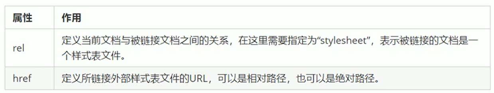


# Chrome调试工具

## 打开调试工具

打开Chrome浏览器，按F12

## 使用调试工具

1. Ctrl+滚轮可以缩放开发者工具代码大小
2. 坐标是HTML元素结构，右边是CSS样式
3. 右边CSS样式可以改动数值（左右箭头或者直接输入）和查看颜色
4. Ctrl+0复原浏览器大小
5. 如果点击元素，发现右侧没有样式引入，极有可能是类名或者样式引入错误
6. 如果有样式引入，但是样式前面有黄色叹号提示，则是样式属性书写错误

# Emmet语法

Emmet语法的前身是Zen coding，它使用缩写来提高html/css的编写速度，VScode内部已经集成了该语法

## 快速生成HTML结构语法

1. 生成标签，直接输入标签名按Tab键即可
2. 如果想要生成多个相同的标签 加上*就可以了，比如`div*3`
3. 如果有父子级的关系，可以用> 比如`ul>li`
4. 如果有兄弟关系的标签，用+就可以了比如`div+p`
5. 如果生成带有类名或id名字的，直接写.demo或者 #two然后按Tap就行
6. 如果生成的div类名是有顺序的，可以使用自增符号$，例如`.demo$*5`
7. 如果想要在生成的标签内部写东西可以使用`{}`表示，例如`div{Hello World}`

## 快速生成CSS结构语法

CSS基本采取简写的形式即可

1. 比如w200按Tab可以直接生成`width:200px`
2. 比如lh26按Tab可以直接生成`line-height:26px`

# CSS的复合选择器

复合选择器是建立在基础选择器之上，对基本选择器进行组合而成的

- 复合选择器可以更准确、高效的选择目标元素
- 复合选择器是由两个或多个选择器组合而成
- 常用的复合选择器包括：后代选择器、子选择器、并集选择器、伪类选择器等

## 后代选择器

后代选择器又称包含选择器，可以选择父元素里面的子元素，其写法就是把外层标签写在前面，内层标签写在后面，中间用空格隔开。当标签发生嵌套时，内层标签就称为外层标签的后代

语法：

```css
元素1 元素2{
    样式声明
}
```

上述语法表示选择元素1里面所有的元素2（后代元素）

- 元素1和元素2中间用空格隔开
- 元素1是父级，元素2是子级，最终选择的是元素2
- 元素2可以是儿子，也可以是元素2的孙子等，只要是元素1的后代就行
- 元素1和元素2可以是任意基础选择器

## 子选择器

子选择器只能选择作为某元素的最近一级子元素

语法：

```css
元素1>元素2{
    样式声明
}
```

- 元素1和元素2用大于号隔开
- 元素1是父级，元素2是子级，最终选择的是元素2
- 元素2必须是亲儿子

## 并集选择器

并集选择器可以选择多组标签，并定义相同的样式

并集选择器是各选择器使用英文逗号(,)连接而成

语法：

```css
元素1,元素2{
    样式声明
}
```

上述语法表示选择元素1和元素2

- 元素1和元素2中间用逗号隔开
- 逗号可以理解为和的意思
- 并集选择器通常用于集体声明

## 伪类选择器

伪类选择器用于向某些选择器添加特殊的效果，比如给链接添加特殊的效果

伪类选择器书写最大的特点是用冒号(:)表示:`:hover`

伪类选择器有很多，只讲解链接伪类选择器

### 链接伪类选择器

```css
a:link		选择所有未被访问的链接
a:visted		选择所有已被访问的链接
a:hover		选择鼠标指针位于其上的链接
a:active		选择活动链接（鼠标按下未弹起的链接）
```

注意：

1. 为了确保生效，请按照：link-visted-hover-active的顺序书写
2. 因为链接在浏览器中有默认样式，所以我们实际工作中需要给链接单独指定样式

写法：

```css
/* a是标签选择器 所有的链接 */
a{
    color:gray;
}
/* :hover是伪类选择器 */
a:hover{
    color:red;/* 鼠标经过链接时，由原来的灰色变成了红色 */
}
```

### :focus伪类选择器

:focus伪类选择器用于选取获取焦点的表单元素

焦点就是光标，一般情况下`<input>`类表单元素才能获取，也就是说这个选择器是针对表单元素来说的

```css
input:focus{
    background-color:yellow;
}
```

# CSS的元素显示模式

HTML一般分为块元素和行元素两种类型

## 块元素

常见的块元素有`<h1>~<h6> <p> <div> <ul> <li> <ol>`等，其中div是最经典的块元素

特点

1. 自己独占一行
2. 高度、宽度、外边距、内边距都可以控制
3. 宽度默认是容器的100%
4. 是一个容器及盒子，里面可以放行内元素或块级元素

注意：

1. 文字类元素内不能放块级元素
2. `<p>`标签主要用于存放文字，因此里面不能放块级元素

## 行内元素

常见的行内元素有：`<a> <strong> <b> <em> <i> <del> <s> <ins> <u> <span>`，行内元素也被称为内联元素

特点：

1. 行内元素可以在同一行，一行可以放多个
2. 高宽直接设置是无效的
3. 默认宽度就是它本身的宽度
4. 行内元素只能容纳文字和行内元素

注意：

- 链接里面不能放链接
- 特殊情况链接`<a>`里面可以存放块级元素，但是给a链接转换一下块级模式最安全

## 行内块元素

在行内元素中有几个特殊的标签：` <input> <td>`它们同时具有块元素和行内元素

特点：

1. 和相邻行内元素在一行内，但是它们之间会有空白缝隙，一行可以显示多个
2. 默认宽度就是它自身内容的宽度
3. 高度、行高、外边距和内边距都可以控制

## 元素显示模式的转换

特殊情况下，我们需要元素模式的转换，比如想要增加链接`<a>`的触发范围

转换为块元素:`display:block;`

转换为行内元素:`display:inline;`

转换为行内块:`display:inline-block;`

## 案例

小米侧边栏

1. 把链接a转换为块级元素，这样链接就能单独占一行，并能设置宽度和高度
2. 鼠标经过链接给链接设置背景色

```html
<!DOCTYPE html>
<html lang="en">

<head>
    <meta charset="UTF-8">
    <meta http-equiv="X-UA-Compatible" content="IE=edge">
    <meta name="viewport" content="width=device-width, initial-scale=1.0">
    <title>小米侧边栏</title>
    <style>
        /* 把a转换为块级元素 */
        a {
            display: block;
            width: 230px;
            height: 40px;
            background-color: #55585a;
            font-size: 14px;
            color: #fff;
            text-decoration: none;
            text-indent: 2em;
            line-height: 40px;
        }

        /* 鼠标经过链接变换背景颜色 */
        a:hover {
            background-color: #ff6700;
        }
    </style>
</head>

<body>
    <a href="">手机 电话卡</a>
    <a href="">电视 盒子</a>
    <a href="">笔记本 平板</a>
    <a href="">出行 穿戴</a>
    <a href="">智能 路由器</a>
    <a href="">健康 儿童</a>
    <a href="">耳机 音响</a>
</body>

</html>
```

# CSS的背景

## 背景颜色

`background-color`属性定义了元素的背景颜色

```css
backgroun-color:颜色值;
```

一般情况下背景颜色默认值是透明（`transparent`）

## 背景图片

`background-image`属性定义了元素的背景图片

```css
background-image:none|url(url)
```

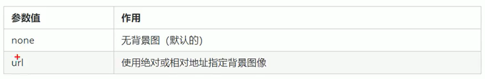

## 背景平铺

如果需要在HTML网页中对背景图进行平铺，可以使用`background-repeat`属性

```css
background-repeat:repeat|no-repeat|repeat-x|repeat-y
```

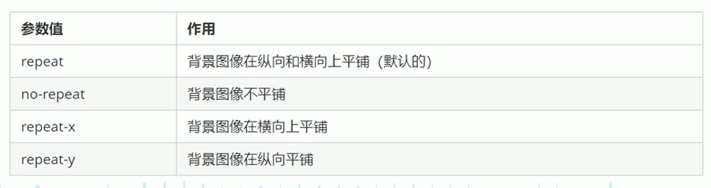

## 背景图片位置

利用`background-position`属性可以设置图片在背景中的位置

```css
backeground-position:x y;
```

参数代表的意思是：x坐标和y坐标，可以使用方位名词或精准单位

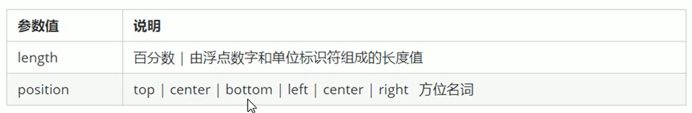

1. 参数是方位名词
    - 如果指定的两个值都是方位名词，则两个值前后顺序无关
    - 如果只指定了一个方位名词，另一个值省略，则第二个值默认为居中
2. 参数是精准单位
    - 如果参数值的精准单位，则第一个肯定是x坐标，第二个是y坐标
    - 如果只指定一个值，那该数值一定是x坐标，另一个默认垂直居中
3. 参数是混合单位
    - 如果指定的两个值是混合单位，则第一个值是x坐标，第二个值是y坐标

## 背景固定

`background-attachment`属性设置背景图像是否固定或者随着页面的其余部分滚动

后期可以制作视差滚动的效果

```css
background-attachment:scroll|fixed
```

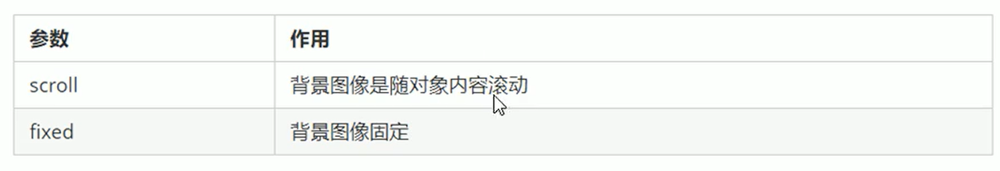

为了简化代码量，将多条属性合并简写在一起

`background:背景颜色 背景图片地址 背景平铺 背景图像滚动 背景图片位置`

```css
background:transparent url(image.jpg) repeat-y fixed top;
```

## 背景半透明

CSS3为我们提供了背景颜色半透明的效果

```css
background:rgba(0,0,0,0.3);
```

- 最后一个参数是alpha透明度，取值范围在0~1之间
- 0.3的0可以省略
- 注意：是盒子背景半透明，盒子里的内容不受影响

# CSS的三大特性

## 层叠性

相同的选择器给设置相同的样式，此时一个样式会覆盖另一个样式，层叠性主要解决这样的问题

层叠性原则

- 样式冲突，遵循原则是就近原则，哪个样式里结构进就执行哪个样式
- 样式不冲突不会层叠

## 继承性

子标签会继承父标签的某些样式，如文本颜色和字号

- 恰当的使用继承可以简化代码，降低CSS样式的复杂性
- 子元素可以继承父元素的样式（text，font，line，color这些属性开头的都可以继承）

行高的继承


- 行高可以根单位也可以不跟单位

## 优先级

当同一个元素指定多个选择器，就会有优先级产生

- 选择器相同则执行层叠性
- 选择器不同则根据选择器的权重执行

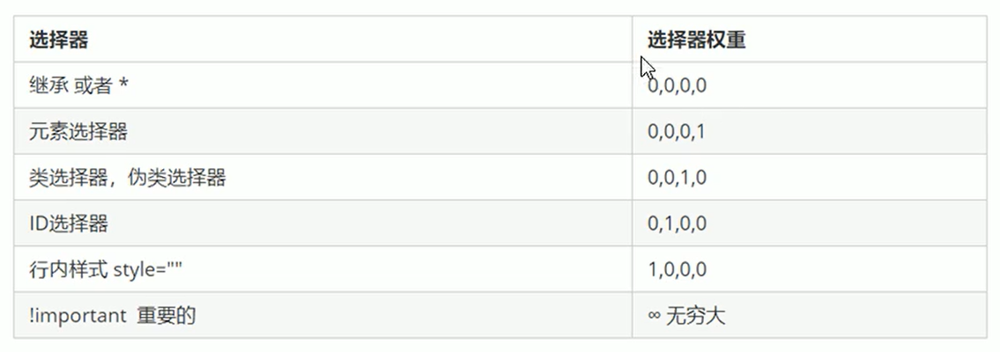

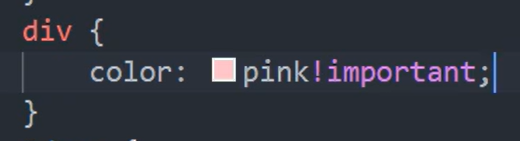

注意

1. 权值由4位数字组成，但是不会有进位
2. 可以理解为类选择器永远大于元素选择器，id选择器大于类选择器
3. 等级判断从左向右，如果某一位数值相同，则判断下一位数值
4. ==继承权重位0==

### 权重叠加

如果是复合选择器，会有权重叠加，需要重新计算权重

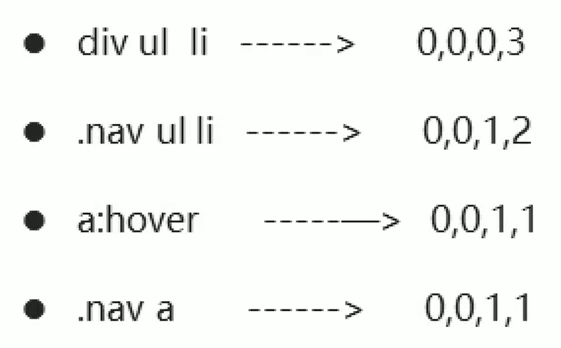


# 盒子模型

## 盒子模型组成

盒子模型：就是把HTML页面中的布局元素看作是一个矩形的盒子，就是一个盛装内容的容器

CSS盒子模型本质上就是一个盒子，它封装周围HTML元素，它包括：内边距、外边距、边框和实际内容

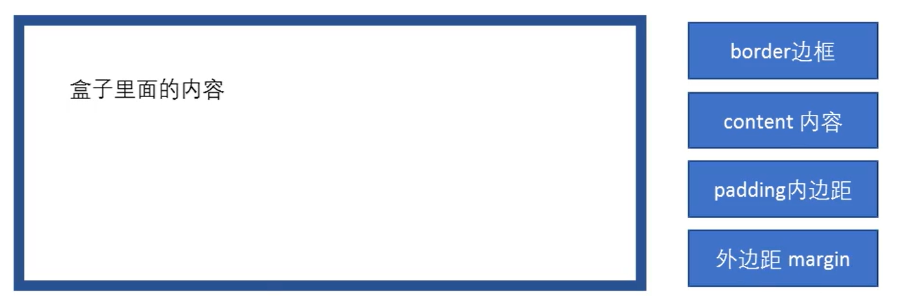

##  边框

border可以设置元素的边框。边框由三部分组成：宽度、样式、颜色

语法

```css
border:border-width || border-style || border-color;
```

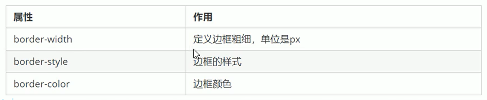

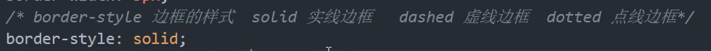

边框简写

```css
border:1px solid red;//没有顺序
```

边框分开写法：

```css
border-top:1px solid red;//只设置上边框，其余同理
```


# 综合案例


# 圆角边框


# 盒子阴影


# 文字阴影