# 导读

## 网页

网站是在因特网上根据一定的规则，使用HTML等制作的用于展示特定内容相关的网页集合

网页是网站中的一“页”，通常是HTML格式的文件，它要通过浏览器来阅读

网页是构成网站的基本元素，它通常有图片、链接、文字、声音、视频等元素组成。通常我们看到的网页，常见以.htm或.html后缀结尾的文件，因此俗称HTML文件

### HTML

HTML指的是超文本标记语言(Hyper Text Markup Language)，它是用来描述网页的一种语言

HTML不是编程语言，而是一种标记语言

标记语言是一套标记标签(markup tag)


所谓超文本：

1. 它可以加入图片、声音、动漫、多媒体等内容（超越了文本限制）
2. 它还可以从一个文件跳转到另一个文件，与世界各地主机的文件链接（超级链接文本）

### 网页的形成

网页是由网页元素组成的，这些元素是利用html标签描述出来，然后通过浏览器解析来显示给用户的

前端人员开发代码---->浏览器显示代码（解析、渲染）---->生成最后的Web页面

## 常用浏览器

浏览器是网页显示、运行的平台。常用的浏览器由IE、火狐、谷歌、Safari和Opera称为五大浏览器

### 浏览器内核

浏览器内核(渲染引擎)：负责读取网页内容，整理讯息，计算网页的显示方式并显示页面

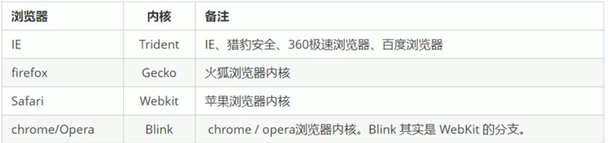

## Web标准

Web标准是由W3C组织和其他标准化组织制定的一系列标准的集合

### 为什么需要Web标准

浏览器不同，它们显示的页面或排版由些许差异

### Web标准的构成

主要包括结构(Structure)、表现(Presentation)和行为(Behavior)


结构写到HTML文件中，表现写到CSS文件中，行为写到JavaScript文件中

# HTML标签(上)

## HTML语法规范

### 基本语法概述

1. HTML标签是由尖括号包围的关键词，例如`<html>`
2. HTML通常是成对出现的，例如`<html>`和`</html>`，我们称为双标签。标签对中的第一个标签是开始标签，第二个标签是结束标签
3. 有些特殊标签必须是单个标签。例如`</br>`，我们称为单标签

### 标签关系

标签关系分为两类：包含关系和并列关系

包含关系：

```html
<head>
	<title></title>
</head>
```

并列关系：

```html
<head></head>
<body></body>
```

## HTML基本结构标签

### 第一个HTML网页

每一个网页都有一个基本的结构标签（也叫骨架标签），网页的基本内容就是在这些基本标签上书写的

```html
<html>
    <head>
        <title>我的第一个网页</title>
    </head>
    <body>
        
    </body>
</html>
```

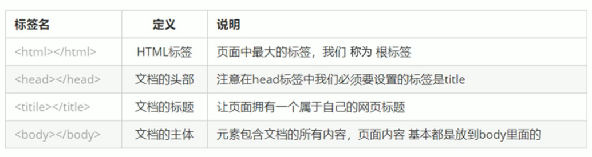

HTML文档后缀名必须是html，浏览器的作用是读取HTML文件，并以网页的形式显示出它们

### 基本结构标签总结

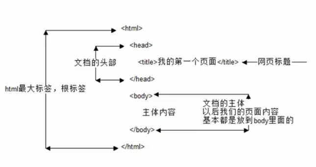

## 开发者工具

下载vscode

https://code.visualstudio.com/

### 使用

1. 双击打开软件

2. 新建文件(Ctrl+N)

3. 保存（Ctrl+S）,注意要保存为 .html 文件

4. Ctrl + 加号/减号键可以缩放视图

5. 生成骨架结构

    输入！按下Tab键

6. 利用插件在浏览器中预览页面：单机鼠标右键，在弹出窗口点击"Open in Default Browser"

### vscode插件安装


### 生成代码解读

#### 文档类型声明标签

`<!DOCTYPE>`文档类型声明，作用是告诉浏览器使用哪种HTML版本来显示网页

```html
<!DOCTYPE HTML>
```

这句代码的意思是：当前页面采取的是HTML5版本来显示网页

注意：

1. `<!DOCTYPE>`声明位于文档中的最前面的位置，出于`<html>`标签之前
2. `<!DOCTYPE>`不是一个HTML标签，只是文档类型声明标签

#### lang语言种类

用来定义当前文档显示的语言

1. en定义语言为英文
2. zh-CN定义语言为中文

### 字符集

字符集（Character set）是多个字符的集合。以便计算机能够识别和存储各种文字

在`<head>`标签内，可以通过`<meta>`标签的charset属性来规定HTML文档内应该使用哪种字符编码

```html
<mate charset="UTF-8"/>
```

charset常用的值有：GB2315、BIG5、GBK和UTF-8，其中UTF-8称为万国码，基本包含了全世界所有国家需要用到的字符

## HTML常用标签

### 标签语义

学习标签最重要的是记住每个标签的语义，简单理解就是标签的含义

### 标题标签

为了使语义更具有语义化，会经常在页面中用到标题标签。HTML标签提供了6个等级的网页标题，即`<h1>-<h6>`

```html
<h1>我是一级标题</h1>
```

单词head的缩写，意为头部、标题

标签语义：作为标题使用，并且根据重要性递减

#### 特点

1. 加了标题的文字会变的加粗，字号会依次变大
2. 一个标题独占一行

### 段落和换行标签

在网页中，要把文字有条理地显示出来，就需要将这些文字分段显示。在HTML标签中，`<p>`标签用于定义段落，它可以将整个网页非为若干段落

```html
<p>我是一个段落标签</p>
```

单词paragraph的缩写，意为段落

标签语义：可以把HTML文档分隔为若干段落

#### 特点

1. 文本在一个段落中会根据浏览器窗口的大小自动换行
2. 段落和段落之间保有空袭

在HTML中，一个段落中的文字会从左到右依次排列，直到浏览器的右端，然后才自动换行，如果希望某段文本强制换行显示，就需要使用换行标签`<br/>`

```html
<br/>
```

单词break的缩写，意为打断

标签语义：强制换行

#### 特点

1. `<br/>`是个单标签
2. `<br/>`标签是开始新的一行，跟段落不一样，段落之间会插入一些垂直的距离

### 文本格式化标签

在网页中，有时需要为文本设置粗体、斜体和下划线等效果

标签语义：突出重要性，比普通文字重要

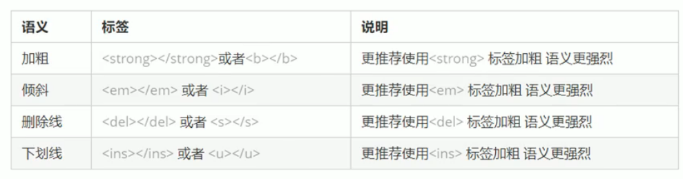

### `<div>`和`<span>`标签

`<div>`和`<span>`是没用语义的，它们就是一个盒子，用来装内容的

```html
<div>这是头部</div>
<span>今日价格</span>
```

div是division的缩写，意为分区，span意为跨度

#### 特点

1. `<div>`标签用来布局，一行只能放一个	大盒子
2. `<span>`标签用来布局，一行可以放多个     小盒子

### 图像标签和路径

#### 图像标签

在HTML标签中，``标签用于定义HTML页面中的图像

```html

```

单词image的缩写

src是``标签的必须属性，用于指定图像文件的路径和文件名

图像标签的其他属性

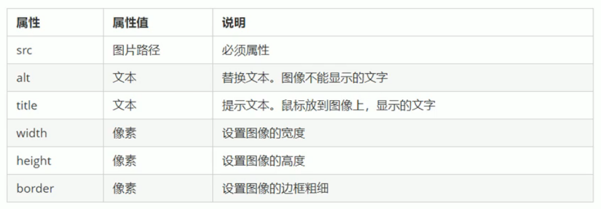

注意：

1. 图像标签可以有多个属性，必须写在标签名后面
2. 属性之间不分先后顺序，标签名与属性、属性与属性之间均以空格隔开
3. 属性采取键值对的格式，即key="value"，属性=“属性值”

#### 路径

页面中的照片非常多时，通常我们会新建一个文件夹来存放这些图像文件，这是再查找图像需要采用“路径”的方式来指定图像文件的位置

路径可以分为：

1. 相对路径

    以引用文件所在位置为参考基础，而建立出的目录路径，简单说，就是照片相对于HTML页面的位置

    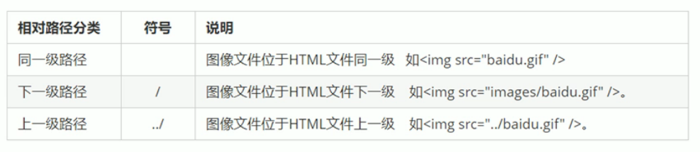

2. 绝对路径

    指目录下的绝对位置，直接到达目标位置，通常是从盘符开始的路径

    例如，“D:\web\img\logo.gif”

### 超链接标签

在HTML标签中，`<a>`标签用于定义超链接，作用是从一个页面链接到另一个页面

#### 链接的语法

```html
<a href="跳转目标" target="目标窗口的弹出方式">文本或图像</a>
```

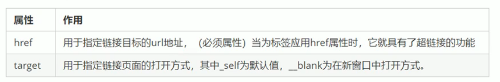

#### 链接分类

1. 外部链接：例如`<a href="http://www.baidu.com">百度</a>`

2. 内部链接：

    网站内部页面之间的相互链接，直接链接内部页面名称即可。例如`<a href="index.html">首页</a>`

3. 空链接：如果没有确定链接目标时，`<a href="#">首页</a>`

4. 下载链接：如果href里面地址是一个文件或者压缩包是，会下载这个文件

5. 网页元素链接：在网页中的各种网页元素，例如文本、图像、表格、音频、视频等都可以添加超链接

6. 锚点链接：点击链接，可以快速定位到页面中的某个位置

    - 在链接文本的href属性中，设置属性值为#名字的形式，如`<a href="#two">第二集</a>`
    - 找到目标位置标签，里面添加一个id属性=刚才的名字，如：`<h3 id="two">第二集介绍</h3>`

## HTML中的注释和特殊字符

### 注释

如果需要在HTML文档中添加一些便于阅读和理解但又不需要在页面显示的注释文字，就需要使用注释标签

```html
<!-- -->		快捷键：Ctrl+/
```

### 特殊字符

在HTML页面中，一些特殊的符号很难或者不方便直接使用，我们用下面这些字符来替代

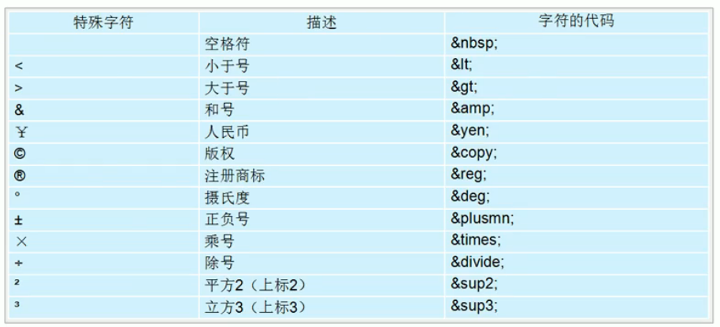

# HTML标签(下)

## 表格标签

### 表格的主要作用

表格主要用于显示、展示数据，因为它可以让数据显示的非常规整，可读性非常好。特别是后台展示数据时，能够熟练运用表格就显得特别重要

```html
<table>
    <tr>
    	<td>单元格内的文字</td>
        ...
    </tr>
    ...
</table>
```

1. `<table></table>`是用于定义表格的标签
2. `<tr></tr>`标签用于定义表格中的行，必须嵌套在`<table></table>`标签中
3. `<td></td>`用于定义表格中的单元格，必须嵌套在`<tr></tr>`标签中
4. 字母td指表格数据，即数据单元格的内容

### 表头单元格标签

一般表头单元格位于表格的第一行或第一列，表头单元格里面的文本加粗居中显示

```html
<table>
    <tr>
    	<th>姓名</th>
        ...
    </tr>
    ...
</table>
```

### 表格属性

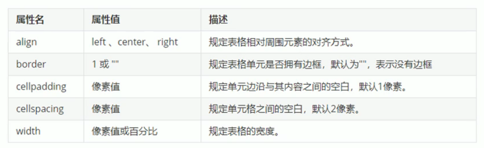

### 案例

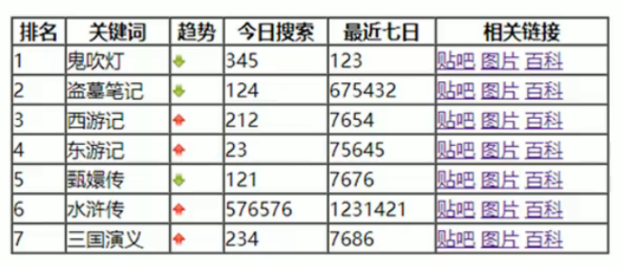

```html
<!DOCTYPE html>
<html lang="en">
<head>
    <meta charset="UTF-8">
    <meta http-equiv="X-UA-Compatible" content="IE=edge">
    <meta name="viewport" content="width=device-width, initial-scale=1.0">
    <title>排行榜</title>
</head>
<body>
    <table align="center" width="500" heigth="249" border="1" cellspacing="0">
        <tr>
            <th>排名</th>
            <th>关键词</th>
            <th>趋势</th>
            <th>进入搜索</th>
            <th>最近七日</th>
            <th>相关链接</th>
        </tr>
        <tr>
            <td>1</td>
            <td>鬼吹灯</td>
            <td></td>
            <td>456</td>
            <td>123</td>
            <td><a href="#">贴吧</a> <a href="#">图片</a> <a href="#">百度</a></td>
        </tr>
        <tr>
            <td>2</td>
            <td>盗墓笔记</td>
            <td></td>
            <td>124</td>
            <td>673423</td>
            <td><a href="#">贴吧</a> <a href="#">图片</a> <a href="#">百度</a></td>
        </tr>
        <tr>
            <td>3</td>
            <td>西游记</td>
            <td></td>
            <td>456</td>
            <td>123</td>
            <td><a href="#">贴吧</a> <a href="#">图片</a> <a href="#">百度</a></td>
        </tr>
        <tr>
            <td>4</td>
            <td>东游记</td>
            <td></td>
            <td>23</td>
            <td>4399</td>
            <td><a href="#">贴吧</a> <a href="#">图片</a> <a href="#">百度</a></td>
        </tr>
        <tr>
            <td>5</td>
            <td>甄嬛传</td>
            <td></td>
            <td>121</td>
            <td>3232</td>
            <td><a href="#">贴吧</a> <a href="#">图片</a> <a href="#">百度</a></td>
        </tr>
        <tr>
            <td>6</td>
            <td>水浒传</td>
            <td></td>
            <td>5687</td>
            <td>9078</td>
            <td><a href="#">贴吧</a> <a href="#">图片</a> <a href="#">百度</a></td>
        </tr>
        <tr>
            <td>7</td>
            <td>三国演义</td>
            <td></td>
            <td>101</td>
            <td>123</td>
            <td><a href="#">贴吧</a> <a href="#">图片</a> <a href="#">百度</a></td>
        </tr>
    </table>
</body>
</html>
```

### 表格结构标签

使用场景

因为表格可能很长，为了更好的表示表格的语义，可以将表格分割成头部和表格主体两大部分

在表格标签中，分别用：`<thead>`标签 表格的头部区域`<tbody>`标签 表格的主题区域，这样可以更好的分清表格结构

1. `<thead></thead>`：用于定义表格的头部。`<thead>`内部必须拥有`<tr>`标签，一般位于第一行
2. `<body></body>`：用于定义表格的主体，主要用于放数据本体
3. 以上标签都是放在`<table></table>`标签中

### 合并单元格

- 合并单元格方式

    - 跨行合并：`rowspan="合并单元格个数"`
    - 跨列合并：`colspan="合并单元格个数"`

- 目标单元格

    - 跨行：最上侧单元格为目标单元格，写合并代码
    - 跨列：最左侧单元格为目标单元格，写合并代码

- 合并单元格三步

    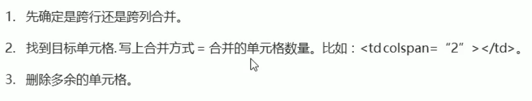


## 列表标签

列表最大的特点就是整齐、整洁、有序，它作为布局会更加自由和方便

列表可以分为三大类：无序列表、有序列表和自定义列表

### 无序列表

`<ul>`标签表示HTML页面中项目的无序列表，一般会以列表符号呈现列表项，而列表项使用`<li>`标签定义

语法格式

```html
<ul>
    <li>列表项1</li>
    <li>列表项2</li>
    <li>列表项3</li>
    ...
</ul>
```

1. 无序列表的各个列表项之间没有顺序级别之分，都是并列的
2. ul中只能嵌套li，直接在ul中输入其他标签或文字是不允许的
3. li标签相当于一个容器可以容纳所有元素
4. 无序列表会有自己的样式属性，实际使用时会使用CSS来设置

### 有序列表

`<ol>`标签用于定义有序列表，列表排序以数字来表示，并且使用`<li>`标签来定义列表项

语法格式

```html
<ol>
    <li>列表项1</li>
    <li>列表项2</li>
    <li>列表项3</li>
    ...
</ol>
```

1. ol中只能嵌套li，直接在ul中输入其他标签或文字是不允许的
2. li标签相当于一个容器可以容纳所有元素
3. 有序列表会有自己的样式属性，实际使用时会使用CSS来设置

### 自定义列表

自定义列表常用于对术语或名词进行解释或描述，定义列表的列表项没有任何项目符号

在HTML标签中，`<dl>`标签用于定义描述列表，该标签与`<dt>`（定义项目/名字）和`<dd>`（描述每一个项目/名字）一起使用

```html
<dl>
    <dt>名词1</dt>
    <dd>名词1解释1</dd>
    <dd>名词1解释2</dd>
</dl>
```

### 总结

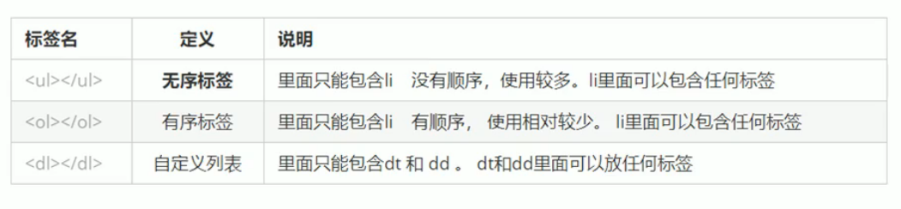

## 表单标签

### 为什么需要表单

与用户交互、收集用户信息

### 表单的组成

在HTML在，一个表单通常由表单域、表单控件（也叫表单元素）和提示信息三个部分组成

### 表单域

表单域是一个包含表单元素的区域

在HTML标签中，`<form>`标签用于定义表单域，以实现用户信息的收集和传递

`<form>`会把它范围内的表单元素信息提交给服务器

```html
<form action="url地址" method="提交方式" name="表单域名称">
    各种表单元素控件
</form>
```

常用属性

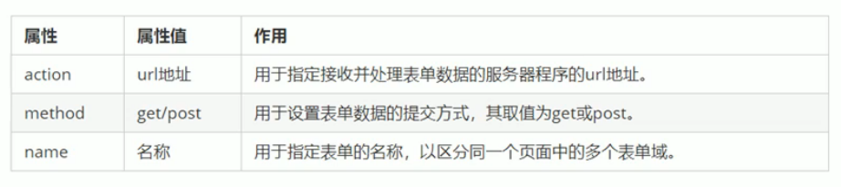

### 表单控件(表单元素)

#### input输入标签

`<input>`用于收集用户信息

在`<input>`标签中，包含一个type属性，根据不同的type属性值，输入的字段有很多种形式（可以是文本字段、复选框、掩码后的文本控件、单选按钮、按钮等）

```html
<input type="属性值" />
```

- `<input/>`标签为单标签
- type属性设置不同的属性值来指定不同的控件类型

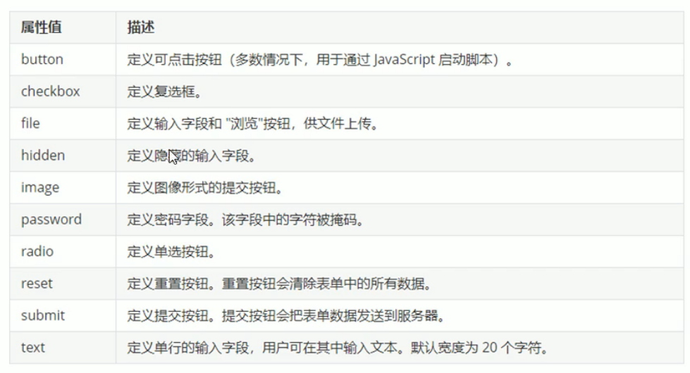

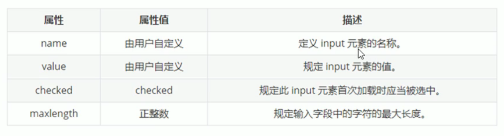

1. name和value是每个表单元素都有的属性值，主要给后台人员使用
2. name表单元素的名字，要求单选按钮和复选框要有相同的name值
3. checked属性主要是针对单选框和复选框，主要作用是一打开页面，就要默认选中某个表单元素
4. maxlength是用户可以在表单中输入的最大字符数，一般较少使用

##### 常见问题

1. 有些表单元素想刚打开页面就显示几个文字怎么做

    给这些表单元素设置value属性="值"

    ```html
    用户名：<input type="text" value="请输入用户名"/>
    ```

2. 表单元素很多，如何区分不同的表单元素

    name属性：当前input表单的名字，后台可以通过这个name属性找到这个表单。页面中的表单很多，name的主要作用是区分不同的表单

    ```html
    用户名：<input type="text" value="请输入用户名" name="username"/>
    ```

    - name属性后面的值，是自定义的
    - radio（或者checkbox）如果是一组，我们必须给他们命名相同的名字

    ```html
    <input type="radio" name="sex" />男
    <input type="radio" name="sex" />女
    ```

3. 如果页面一打开就让某个单选按钮或者复选框是选中状态

    checked属性：表示默认选中状态

    ```html
    性别：
    <input type="radio" name="sex" value="男" checked="checked" />男
    <input type="radio" name="sex" value="女" />女
    ```

##### lable标签

`<lable>`标签为input元素定义标注

`<lable>`标签用于绑定一个表单元素，当点击`<lable>`标签内的文本时，浏览器会自动将焦点转到或者选择对应的表单元素上用来增加用户体验

语法

```html
<lable for="sex">男</lable>
<input type="radio" name="sex" id="sex"/>
```

核心：`<lable>`标签的for属性应当与相关元素的id属性相同

#### select选择标签

有多个选项让用户选择时，想要节约空间，可以使用`<select>`标签定义下拉列表

语法

```html
<select>
    <option>选项1</option>
    <option>选项2</option>
    <option>选项3</option>
    ...
</select>
```

1. `<select>`中至少包含一对`<option>`
2. 在`<option>`中定义select="selected"时，当前项即为默认选中项

#### textarea文本标签

当用户输入的内容较多时，可以使用`<textarea>`标签

在表单元素中`<textarea>`是用于定义多行文本输入的控件，常见于留言板、评论

语法

```html
<textarea row="3" cols="20">
	文本内容
</textarea>
```

cols="每行中的字符数"，rows="显示的行数"，我们在实际开发中，都是使用CSS来改变其大小

## 查阅文档

推荐网址

- 百度：http://www.baidu.com
- W3C：http://www.w3school.com.cn/


