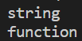
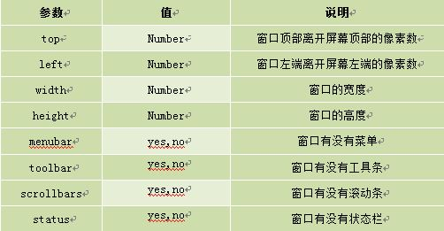

# JavaScript基础

## 输入输出

常用语句

| 方法             | 说明                 |
| ---------------- | -------------------- |
| alert(msg)       | 浏览器弹出警告框     |
| console.log(msg) | 浏览器控制台打印信息 |
| promot(info)     | 浏览器弹出输入框     |


## 直接量

直接量就是表面上可以见到的数据值。常见的直接量有数字、小数、字符串

字符串必须使用双引号包裹

## 变量的声明

定义一个变量，并让其指向一个直接量

```js
var a;
a = "Hello World";
//更简单的形式
var a = "Hello World";
```

## 数据类型

在JavaScript中数据类型分为两类，原生数据类型和对象数据类型

原生数据类型包括：数字、字符串、布尔值、还有两个特殊的类型：`null`和`undefined`

> 用法上，null和defined都代表了直接量的空缺，变量指向其中任意一个都代表false的含义，也就是没有或者空的意思
>
> 从根本意义上讲，undefined更严重一些，代表不应该出现的错误。比如定义了一个变量，但是没有被赋给任何直接量，那么a默认指向undefined；而null不同，有时需要给变量赋值null来达到清零的目的


## 对象数据类型

对象数据类型是一种复合型数据类型，它可以把多个数据放在一起，每一个数据都可以看作是一个单元，每一个都有自己的名字和值

创建一个对象

```js
//常用方式
var conrainer = {};
```

创建一个对象之后就相对于开辟了一块内存，对象包括若干数据，每个数据都有自己的名字和值。

对象中存放数据

```js
var container = {
    caoyao : "草药"
};
```

对象中存放数据采取键值对的形式，键值之间用冒号分隔

多个数据

```js
var container = {
    caoyao:"草药",
    nihao:"你好"
};
```

上面是在对象创建时设置键值对，下面是在对象创建之后，在外面对对象这个变量进行操作

```js
var container = {};
container.caoyao = "草药";
container.nihao = "你好";
```

`container.caoyao`中的（.）是对象访问属性的意思。对象中包含若干数据，每条数据都是一个键值对，这些数据也叫对象的属性。这些键值对中的键就是属性的名称，键值对中的值就是属性值。

注意：如果访问一个根本不存在的值得到的结果就是`undefined`

## 对象的取值

如果事先不知道调用的属性叫什么，该如何调用一个变量定义属性

```js
var container = {
    caoyao:"草药",
    nihao:"你好"
};
var prop = "caoyao";
```

此时直接点p是不行的，因为container对象中没有叫做prop的属性。

这时可以用一个变量存储属性的名字，然后用中括号访问对象的变量

```js
var container = {
    caoyao:"草药",
    nihao:"你好"
};
var prop = "caoyao";
console.log(container[prop]);
//等价于
console.log(container["caoyao"]);
```

## 对象内容的遍历

判断对象中哪些是属性哪些是函数

typeof关键字

```js
var a = "123";
var fun = function(){
    
};
console.log(typeof(a));
console.log(typeof(fun))
```

运行结果：



例子：

```js
var aaa = {
    name:"hsy",
    age:20,
    eat:function(){
        console.log("KFC");
    }
}
//for循环遍历
for(var p in aaa){//p是aaa对象的属性名称
    console.log(p+"="+aaa[p]);
}
```


## 运算符

```js
var a= 10;
var b= 2;
var a1= a+b;
var a2= a-b;
var a3= a*b;
var a4= a/b;
```

还有取余运算符`%`和自增自减运算符

## 数组

在JavaScript中，数组是一个非常灵活的类型。数组是一个容器可以存放多个对象，这些对象的类型没有限制

定义数组

直接量定义数组

```js
var arr = ["first","second","third"];
console.log(arr);
```

构造函数法法创建数组

在javascript中，每个类型都有一个函数作为支撑，这个方法中Array叫构造函数

```js
var a = new Array();
```

有初始长度建数组

8代表给数组对象添加一个初始化的长度

```js
var b = new Array(8);
```

赋初值创建数组

创建数组对象的同时给其赋予了初值

```js
var c = new Array("first","second","third");
```

数组中只有一个`length`属性，表示数组所占的内存空间的数量，而不只是数组中元素的个数

## 数组方法

### 添加数据

push方法

把一个元素添加到数组的尾部，但数组原来的空间无法占用

```js
var b = new Array(8);
b.push("苹果");
console.log(b);
```

### 修改数据

```js
var b = new Array(8);
b.push("苹果");
b.push("香蕉");
b.push("西瓜");
b[0]="栗子";
console.log(b);
```

### 删除数据

pop方法

```js
var b = new Array(8);
b.push("苹果");
b.push("香蕉");
b.push("西瓜");
b.pop();
console.log(b);
```

删除数组末尾的元素

splice方法

splice方法的作用是插入、删除或者替换数组元素，它不仅会在原有的数组上进行修改，还会返回被处理的内容。splice方法用前两个参数进行定位，余下的参数表示插入的部分

第一个参数为需要操作的数组的起始位置，第二个参数代表要删除的元素个数

```js
var a = [1,2,3,4,5];
a.splice(2,1);
console.log(a);
//从下标为2的元素开始，删除一个元素
//结果为[1,2,4,5]
```

如果要把数字3替换成数字38，并且在38后面加一个元素66怎么办

splice余下的两个参数表示插入部分。要把3替换称38，思路就是先把3删掉，然后在后面加上一个38.如果后面还要加66，则再多写一个参数66

```js
var a = [1,2,3,4,5];
a.splice(2,1,38,66);
console.log(a);
//运行结果为[1,2,38,66,4,5]
```

### 数组转字符串

join方法

join方法可以把数组中所有元素放入一个字符串。元素是通过指定的分隔符进行分隔的，分隔符就是join方法的参数。

例如

```js
var arr = [1,2,3];
var str = arr.join(",");
console.log(str);
```


## 函数定义

函数定义使用`function`关键字，然后空一格，再加上函数名字，名字右边的小括号用来放参数的，大括号括起来的是函数体

```js
function test(){
    alert("函数被调用了");//tan'c
}
test();//调用函数

//定义函数
function myFunction(){
    //document.write方法表示用javascript向页面输出一句话
    document.write("This is my First Function!<br>");
}
```

定义一个变量，再将函数赋给变量a，因为赋给变量a，所有函数定义时不需要加上函数名字，这样定义的函数，函数的名字就是变量的名字

```js
var a = function myFunction(){
    document.write("This is my First Function!<br>");
}
//调用函数
a();
```

如果是用第一种方法定义函数，把调用语句放在前面则可以成功调用，但第二种会**报错**

```js
a();
var a = function myFunction(){
    document.write("This is my First Function!<br>");
}
```

原因是第一种方法定义的函数，会被提前加载，所以调用语句可以写在函数定义zhi'q

## 常用互动

### 输出内容

`document.write()`可以直接在网页中输出内容

第一种输出内容用" "括起，直接输出""号内的内容。

```html
<script type="text/javascript">
  document.write("I love JavaScript！"); //内容用""括起来，""里的内容直接输出。
</script>
```

第二种通过变量，输出内容

```html
<script type="text/javascript">
  var mystr="hello world!";
  document.write(mystr);  //直接写变量名，输出变量存储的内容。
</script>
```

第三种输出多项内容，内容之间用 + 号连接。

```html
<script type="text/javascript">
  var mystr="hello";
  document.write(mystr+"I love JavaScript"); //多项内容之间用+号连接
</script>
```

第四种输出HTML标签，并起作用，标签使用" "括起来。

```html
<script type="text/javascript">
  var mystr="hello";
document.write(mystr+"<br>");//输出hello后，输出一个换行符
  document.write("JavaScript");
</script>
```

**关于JS输出空格问题，如果想要实现输出空格，可以使用特殊字符“ ”实现**

```html
<script type="text/javascript">
  document.write("&nbsp;");//输出空格
</script>
```

### 警告

`alert(字符串或变量)`

```html
<script type="text/javascript">
   var mynum = 30;
   alert("hello!");
   alert(mynum);
</script>
```

### 确认

`confirm(str)`

参数说明:

```
str：在消息对话框中要显示的文本
返回值: Boolean值
```

返回值:

```
当用户点击"确定"按钮时，返回true
当用户点击"取消"按钮时，返回false
```

**注:** **通过返回值可以判断用户点击了什么按钮**

例子：

```html
<script type="text/javascript">
    var mymessage=confirm("你喜欢JavaScript吗?");
    if(mymessage==true)
    {   document.write("很好,加油!");   }
    else
    {  document.write("JS功能强大，要学习噢!");   }
</script>
```

### 提问

`prompt(str1, str2);`

参数说明：

```
str1: 要显示在消息对话框中的文本，不可修改
str2：文本框中的内容，可以修改
```

返回值:

```
1. 点击确定按钮，文本框中的内容将作为函数返回值
2. 点击取消按钮，将返回null
```

看看下面代码:

```js
var myname=prompt("请输入你的姓名:");
if(myname!=null)
  {   alert("你好"+myname); }
else
  {  alert("你好 my friend.");  }
```

### 打开新窗口

`window.open([URL],[窗口名称],[参数字符串])`

**参数说明:**

```
URL：可选参数，在窗口中要显示网页的网址或路径。如果省略这个参数，或者它的值是空字符串，那么窗口就不显示任何文档。
窗口名称：可选参数，被打开窗口的名称。
    1.该名称由字母、数字和下划线字符组成。
    2."_top"、"_blank"、"_self"具有特殊意义的名称。
       _blank：在新窗口显示目标网页
       _self：在当前窗口显示目标网页
       _top：框架网页中在上部窗口中显示目标网页
    3.相同 name 的窗口只能创建一个，要想创建多个窗口则 name 不能相同。
    4.name 不能包含有空格。
参数字符串：可选参数，设置窗口参数，各参数用逗号隔开。
```

**参数表:**

**[](https://img.mukewang.com/52e3677900013d6a05020261.jpg)**

例如:打开http://www.imooc.com网站，大小为300px * 200px，无菜单，无工具栏，无状态栏，有滚动条窗口：

```js
<script type="text/javascript"> window.open('http://www.imooc.com','_blank','width=300,height=200,menubar=no,toolbar=no, status=no,scrollbars=yes')
</script>
```

### 关闭窗口

```
window.close();   //关闭本窗口
```

或

```
<窗口对象>.close();   //关闭指定的窗口
```

例如:关闭新建的窗口。

```
<script type="text/javascript">
   var mywin=window.open('http://www.imooc.com'); //将新打的窗口对象，存储在变量mywin中
   mywin.close();
</script>
```

**注意:上面代码在打开新窗口的同时，关闭该窗口，看不到被打开的窗口。**


## 作用域

在JavaScript中，作用域分为两种，一种是全局作用域，另一种是函数作用域

所谓作用域，就是当你要查找一个变量时，你可以在什么范围内找到这个变量，这个范围就是作用域

例子

```js
var a = 10;
function test(){
    console.log(a);
}
```

变量a和函数test都直接暴露在外面，因此它们都属于全局作用域，而test函数的函数体是函数作用域。这就形成了作用域的嵌套，函数作用域里的变量可以访问全局作用域中的变量，但反过来不可以

例子

```js
if(false){
    var a = 10;
}
console.log(a);
//输出是undefined
```

`var a = 10;`这句话在if判断语句中，而if的判断条件是false，所以这句语句不会执行，但是执行代码是在运行阶段，在代码的分词和解析阶段，变量a依然会被获取，并且系统会默认给它一个undefined，又因为变量a不是在一个函数的函数体中，而是在全局作用域中，所以`console.log`方法依然可以访问这个变量

题目

```js
var a = 1;
function test(){
    var a;
    
    var inner = function(){
        console.log(a);
    }
    inner();
}

test();
//答案是undefined
```

## 参数传递

所谓参数，就是当调用函数时传进来的值

```js
function add(a,b,c){
    var sum = a+b+c;
    console.log(sum);
}
add(1,2,3);
```

### 少传参数

```js
function fun(a){
    console.log(a);
}
fun();
//结果显示undefined

function add(a,b,c){
    var sum = a+b+c;
    console.log(a);
}
add(1);
//结果是NaN，代表无法计算
```

### 多传参数

当多传递参数时什么都不会发生


其实函数所有的参数都会被装载到函数内部一个叫`arguments`的数组里面

### 累加器

```js
function add(){
    var sum = 0;
    for(var i=0;i<arguments.length;i++){
        sum = sum+arguments[i];
    }
    console.log(sum);
}

add(1,2,3,4);
```

### 返回值

```js
function add(){
    var sum = 0;
    for(var i=0;i<arguments.length;i++){
        sum = sum+arguments[i];
    }
    return sum;
}

var sum = add(1,2,3);
console.log(sum);
```

## 闭包

闭包产生条件：

1. 在函数的内部还有一个函数
2. 函数内部的函数用到了外部函数的局部变量
3. 外部函数把内部函数作为返回值`return`出去

```js
function test(){
    var a = 0;
    return function(){
        console.log(a);
    }
}
//如果需要执行内部函数的函数体
test()();
```

闭包的好处：

正常情况下，调用一个函数，其里面的局部变量会在函数调用后销毁，这也是在全局作用域无法访问函数局部变量的原因。但是，如果你使用了闭包，那么这个局部变量就不会随着原函数的销毁而销毁，而是继续存在。这样就相当于在全局作用域中定义了一个变量，可以减少很多不必要的全局变量


注意：局部变量可以被抹除，只要在一个特定的时刻手动将那个变量赋值为null，JavaScript会自动扫描函数中值为null的变量，一旦找到就会自动消除这些无用的变量

## 自执行函数

当你想执行一个函数，却无所谓这个函数叫什么名字，那么就可以考虑使用自定义函数

语法

```js
(定义一个没有名字的函数)();
```

例子

```js
(
	function(){
        console.log(123);
    }
)();
```

这是一个简单的自定义函数，所谓自定义函数，就是定义之后就立刻执行的函数，虽然它会被立刻执行，但是它只会被执行一次。

自执行函数一般可以和闭包配合使用

```js
var inner = (function(){
    var a = 0;
    return function(increment){
        a = a+increment;
        console.log(a);
    }
})();

inner(2);
inner(3);
inner(4);
```

这样就能直接得到闭包环境下的内部函数，外部函数只是为了产生闭包环境而临时定义的函数，因此，没有必要给外部函数单独取一个名字

## "new"一个函数

```js
function hello(){
    console.log(this)
}
//结果是window
//this是JavaScript的关键字，它永远指向当前函数的调用者
```

> 全局作用域中的所有变量和函数都是window对象的

在调用函数时使用new关键字

```js
function hello(){
    console.log(this);
}
new hello();
```

结果是hello函数内部产生了一个新的对象，也就是hello函数的真实调用者----this关键字指向的那个对象

就是函数内部产生了一个新的对象，并且this指向了这个对象，然后函数默认返回了这个新的对象

```js
function hello(){
    console.log(this);
}
new hello();

var newObject = new hello();
//这种函数也叫构造函数
console.log(newObject);
```

通过构造函数，可以创建对象模板

一般来说，如果是构造函数，那么首字母要大写

```js
function Fruit(name,smell,color){
    this.name=name;
    this.smell=smell;
    this.color=color;
}
var apple = new Fruit('苹果','甜','红色')；
```

除了用函数创建一个对象，也可以直接制作一个对象出来

使用花括号直接定义一个对象，对象里面的属性和属性值都采用**键值对**的形式

```js
var apple2 = {
    name:"苹果",
    smell:"甜",
    color:"红色"
}
```

注意：不能使用直接赋值的方法来赋值对象

```js
var apple2 = {
    name:"苹果",
    smell:"甜",
    color:"红色"
}
var apple3 = apple2;
//这两个变量都指向同一个对象
```

原因是除了基本数据类型之外，其他都属于引用数据类型，apple2和apple3是属于变量区的两个不同变量，但是却指向同一块内存地址，也就是真实的对象地址，这样一来，apple2和apple3都有着操作这一块内存地址的权限，也就是说，它们都可以修改真实对象的属性

## 回调函数

回调函数：将一个函数的定义当作参数传递给另一个函数

```js
function eat(food,callback){
    callback(food);
}
```

callback就是那个函数，在这个eat函数中，直接执行了callback函数，并将food参数传入了callback。

例如

```js
//调用上面的函数时
eat('羊肉串',function(food){
    alert("撒上孜然吃"+food);
});
```

# 小数相加

```js
<script type="text/javascript">
    //1.01 1.001
    function add(num1,num2){
        //讲数字转换成字符串
    	num1 = num1.toString();
        num2 = num2.toString();

        //获取小数点的位置
        var index1 = num1.indexOf(".");
        var index2 = num2.indexOf(".");

        //如果小数点存在，你们就再获取各自的小数位数
        var ws1 = 0;
        var ws2 = 0;
        if(index1!=-1){
            ws1 = num1.split(".")[1].length;
        }
        if(index2!=-1){
            ws2 = num2.split(".")[1].length;
        }
        //比较小数位数大小
        var bigger = (ws1>ws2)?ws1:ws2;
        var smaller = (ws1<ws2)?ws1:ws2;

        //计算需要补充的0的个数
        var zeroCount = bigger-smaller;

        //去除小数点
        num1 = num1.replace(".","");
        num2 = num2.replace(".","");

        //比较num1和num2谁大，给较小的数补0
        if(ws1==smaller){
            for(var i=0;i<zeroCount;i++){
                num1+="0";
            }
        }else{
            for(var i=0;i<zeroCount;i++){
                num2+="0";
            }
        }

        //开始计算
        var sum = parseInt(num1) + parseInt(num2);

        //根据较大的小数位数计算倍数
        var beishu = 1;
        for(var i=0;i<bigger;i++){
            beishu = beishu*10;
        }
        sum = sum/beishu;
        return sum;
    }
    
    alert(add(1.001,2.002));
</script>   
```

## indexOf方法

在字符串中搜索一个特定的字符，如果找到了就返回该字符在原字符串中的位置，和数组一样，字符串的下标也是从0开始的。而如果查询一个不存在的字符，则会返回-1 。例如

```js
var str ="123456";
str.indexOf("2");
//返回结果为1
str.index("0");
//返回结果为-1
```

## replace方法

该方法用于替换字符串中的指定字符，有两个参数，第一个是需要替换的内容，第二个是替换后的内容，但如果字符串中有多个匹配项，那么只有第一个匹配项会生效

```js
"abcd".replace("c","C");
//结果为abCd
```

## toString方法

获取参数的字符串形式

```js
num1 = num1.toString();
```

## split函数

split函数是字符串自带的方法，可以根据某个标志对字符串自身进行切割，返回对象是一个数字

例如

```js
"2018-08-05".split("-");
//会得到一个数组对象["2018","08","05"]
```


# 调试


# jQuery和DOM

## 预备知识


## 简介


## jQuery选择器

```js
<input id="btn" type="button" value="点击">
<script>
    //$('#btn')是jQuery选择器，使用了jQuery的click方法，作为这个按钮的单击事件
   $('#btn').click(function func(){
       alert("111");
   })；
</script>
```

注意：如果将js代码放在head标签中是不行的，因为如果JavaScript代码下面的按钮还没有被加载，那么`$('#btn')`就灭有办法获取对应的按钮对象。想要解决需要写DOM加载完毕后的监听函数

```html
<!DOCTYPE html>
<html lang="en">
<head>
    <meta charset="UTF-8">
    <title>Document</title>
    <script type= "text/javascript" src="jquery-3.6.0.js"></script>
</head>
<script type="text/javascript">
    $(document).ready(function(){
        //这里的代码会在所有元素加载完毕后再执行
        $('#btn').click(function func(){
            alert("111");
        });
    })
</script>
<body>
    <input id="btn" type="button" value="点击">
</body>
</html>
```

`$(document).ready`方法是一个回调函数，它会等页面上所有的DOM资源（不包括图片这种占用宽带的资源）全部加载完毕后，再调用这个回调函数

## 使用jQuery操作DOM

### 查找元素

```html
<h2>列表</h2>
<ul>
    <li>one</li>
    <li>two</li>
    <li>three</li>
    <li>four</li>
    <li>five</li>
</ul>
<script>
    //首先获取ul元素
    var ul = $('ul');
    //调用jQuery对象的find方法，查找所有的li元素
    var lis = ul.find('li');
    //使用jQuery的eq方法获取第二个li元素
    var li = lis.eq(1);
    //使用text方法获取li元素内部的文本
    alert(li.text());
</script>
```

还有更直观的方法

```js
//直接利用后代选择器选择所有的li元素，然后使用eq方法
var text = $('ul li:eq(1)').text();
alert(text);
//等价于下面
var text = $('ul li').eq(1).text();
```


### 查找属性

查找最后一个li标签的id属性值

```html
<h2>列表</h2>
<ul>
    <li id="1">one</li>
    <li id="2">two</li>
    <li id="3">three</li>
    <li id="4">four</li>
    <li id="5">five</li>
</ul>
<script>
    var $li = $('ul li');
    var len = $li.length;
    var id = $li.eq(len-1).attr('id');
</script>
```

优化：使用jQuery的一种特殊选择器直接获取最后一个元素

```js
var id = $('ul li:last').attr('id');
alert(id);
```


### 链式调用

```js
var myFunction = function(){
    return {
        func01:function(){
            console.log("func01");
            return this;
        },
        func02:function(){
            console.log("func02");
            return this;
        }
    }
}
var obj = myFunction();
obj.func01().func02();
```

所谓链式调用就是在调用函数之后又立刻调用其他函数或属性，这种调用需要函数的返回值是一个对象，因为只有对象采可以调用里面的函数，所有需要返回`this`关键字

### 创造新的元素

```js
var newLi = $("<li id='a5'>新</li>");//注意这里的双引号里面不能有双引号，要用单引号代替
//或者在双引号左侧加一个反斜杠，表示转义
var newLi = $("<li id=\"a5\">新</li>");

```

这里使用了jQuery的工厂函数`#()`，当向这个函数传入一段HTML代码时，jQuery会自动解析这一段HTML，然后创建对应的DOM结点，最后将这个DOM结点的jQuery对象返回出去

将对象添加到ul元素中使用appendTo方法或append方法

```js
var newLi = $("<li id=\"a5\">新</li>");
newLi.appendTo($('ul'));
//简写如下
$("<li id='a5'>新</li>").appendTo($('ul'));
```

使用append方法，方向正好反过来，因为是用ul去append添加新的li

```js
$('ul').append($("<li id='a5'>新</li>"));
```

上面两种都代表在某一个元素中添加新的元素，还有一种HTML方法，是直接替换目标元素里面所有的HTML代码

```js
$('ul').html($("<li id='a5'>新</li>"));
```

```js
insertAfter()//把匹配的元素插入另一个指定的元素集合的后面
insertBefore()//把匹配的元素插入另一个指定的元素集合的前面
prepend()//向匹配元素集合中的每个元素的开头插入由参数指定的内容
perpendTo()//向目标的开头插入匹配元素集合的每个元素
```


### 删除和隐藏结点

```html
<body>
    <h2 id=“a1”>
        one
    </h2>
</body>
```

#### remove方法

使用remove方法可以删除DOM结点

```js
function(){
    $('#a1').remove();
}
```

#### hide方法

使用hide方法可以隐藏元素

```js
function(){
    $('#a1').hide()
}
```

该方法就是给对应的元素设置`display:none`

将元素显示出来，需要使用show方法

```js
$('#a1').show();
```


### jQuery操作属性

#### attr方法

attr方法可以获取元素属性，也能够设置元素属性，由传入参数的个数决定。传入一个参数是获取这个元素的某个属性的值，属性名就是传入的参数

```html
<!DOCTYPE html>
<html lang="en">
<head>
    <meta charset="UTF-8">
    <title>Document</title>
    <script type="text/javascript" src="jquery-3.6.0.js"></script>
    <script>
        $(document).ready(function(){
            var id = $('#a1').attr('id');
            alert(id);
        });
    </script>
</head>
<body>
    <span id="a1">我是a1</span>
</body>
</html>
```

传入两个参数则是修改属性

```html
<script>
    $(document).ready(function(){
        $('#a1').attr('id','a2');
        alert($('#a2').attr('id'));
        alert(id);
    });
</script>
```

如果要给元素设置多个属性，就需要给attr方法传入一个JavaScript对象，对象里面是键值对的集合，每个键值对的格式为

`key:value`，不同的键值对用逗号分隔

```js
$('#a1').attr({'name':'spanDom','title':'我是元素'});
```

#### removeAttr方法

想要删除某个属性，可以用removeAttr方法，传入想要删除的属性的名字

```js
$('#a1').removeAttr('name');
```


### 内容操作

#### 设置HTML、文本

使用html方法将表格插入到div标签中

```html
<!DOCTYPE html>
<html lang="en">
<head>
    <meta charset="UTF-8">
    <title>Document</title>
    <script type="text/javascript" src="jquery-3.6.0.js"></script>
    <script>
        $(document).ready(function(){
            $('#list').html(" <table border=\"1\" cellpadding = \"10\">"+
                            " <tr>"+
                            " <th>第一列</th>"+
                            " <th>第二列</th>"+
                            " <th>第三列</th>"+
                            " </tr>"+
                            " <tr>"+
                            " <td>111</td>"+
                            " <td>222</td>"+
                            " <td>333</td>"+
                            " </tr>"+
                            " <tr>"+
                            " <td>444</td>"+
                            " <td>555</td>"+
                            " <td>666</td>"+
                            " </tr>"+
                            " </table>");
        });
    </script>
</head>
<body>
    <div id="list">
        
    </div>
</body>
</html>
```

与html方法相似的还有text方法，两个不同的是，text是用来设置和获取元素的文本内容的，即使在里面写上HTML标签，也会被当成文本处理

不管是HTML方法还是text方法，都有两种使用方式，如果不传入参数，那么就会直接获取元素内部的HTML代码或者文本内容，如果传入参数，则是替换的意思

注意：如果元素内部是带有标签的HTML代码，然后用text获取元素的文本内容。text方法会过滤掉元素内部里面的HTML标签，所以获取的是标签内的文本内容

#### 操作元素值

jQuery里面有一个val方法，如果传入参数，就是给这个元素赋值，不传入参数的话，就是在获取这个元素的值，一般来说，任何元素都可以加上一个value属性，这个属性就代表元素的值

```html
<!DOCTYPE html>
<html lang="en">
<head>
    <meta charset="UTF-8">
    <title>Document</title>
    <script type="text/javascript" src="jquery-3.6.0.js"></script>
    <script>
        $(document).ready(function(){
            
        });
        function getname(){
            alert($('input:eq(0)').val());
        }
    </script>
</head>
<body>
    <input type="text">
    <input type="button" onclick="getname();" value="获取值">
</body>
</html>
```

val方法不仅可以操作input元素，还可以操作下拉框、多选框和单选按钮

下拉框

```html
<!DOCTYPE html>
<html lang="en">
<head>
    <meta charset="UTF-8">
    <title>Document</title>
    <script type="text/javascript" src="jquery-3.6.0.js"></script>
    <script>
        $(document).ready(function(){
           $('select:eq(0)').val('西瓜'); 
        });
    </script>
</head>
<body>
    <select id="fruit" style="width: 200px;">
        <option >苹果</option>
        <option >香蕉</option>
        <option >西瓜</option>
    </select>
</body>
</html>
```

也可以为标签设置value值

```html
<select id="fruit" style="width: 200px;">
    <option value="01">苹果</option>
    <option value="02">香蕉</option>
    <option value="03">西瓜</option>
</select>

$(document).ready(function(){
	$('select:eq(0)').val('02'); 
});
```

多选下拉框

```html
<!DOCTYPE html>
<html lang="en">
<head>
    <meta charset="UTF-8">
    <title>Document</title>
    <script type="text/javascript" src="jquery-3.6.0.js"></script>
    <script>
        $(document).ready(function(){
           $('select:eq(0)').val(['01','03']); 
        });
    </script>
</head>
<body>
    <select id="fruit" style="width: 200px;",multiple>
        <option value="01">苹果</option>
        <option value="02">香蕉</option>
        <option value="03">西瓜</option>
    </select>
</body>
</html>
```


### 遍历和寻找结点

#### children方法

这个方法可以获取某个元素的下一代子元素，但不包括孙子辈的元素，该方法只能沿着DOM树向下遍历单一层级

```html
<ul id="menu">
    <li>1</li>
    <li>2</li>
    <li>3</li>
    <li>4</li>
    <li>5</li>
</ul>
var lis = $('#menu').children();
console.log(lis);
```

如果想获取孙子辈的元素，只需要拿到一个li元素，再通过find方法寻找

#### find方法

```html
<body>
    <ul id="menu">
        <li>1</li>
        <li>2</li>
        <li>3</li>
        <li>4</li>
        <li>5<span style="background-color: pink;">我是span</span></li>
    </ul>
</body>
$function(){
	var lis = $('#menu').children();
	var span = lis.last().find("span");
	console.log(span);
}
```

#### parent方法

使用parent方法可以找到某一结点的父结点

```js
var li1 = $("li:eq(0)");
var ul = li1.parent();
console.log(ul);
```

#### prev方法和next方法

通过某一结点找到他的兄弟结点，例如现在给第三个li添加一个id为node，想要找到第二个和第四个li元素

```js
var node = $("#node");
var li2 = node.prev();
var li4 = node.next();
console.log(li2);
console.log(li4);
```


根据一个元素找到所有跟他同一级的兄弟元素

```js
var node = $("#node");
console.log(node.siblings());
```

