# 一、Uniapp初始化相关配置

## 工程目录结构

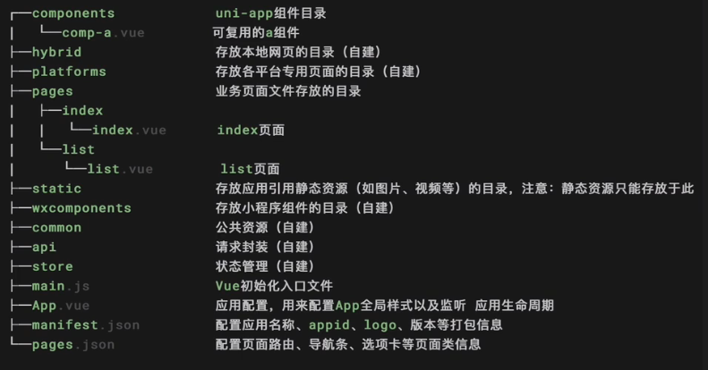

> 提示：
>
> - static目录下的js文件不会被webpack编译，如果里面有es6的代码，不经过转换直接运行，在手机设备上会报错
> - 所以less、scss等资源不要放在static目录下，建议这些公共资源放在common目录下

## 应用配置manifest.json

> `manifest.json`文件是应用的配置文件，用于指定应用的名称、图标、权限等，也可以在这为Vue、H5配置跨域拦截处理器

## 编译配置vue.config.js

> `vue.config.js`是一个可选的配置文件，如果项目的根路径中存在这个文件，他就会被自动加载，一般用于webpack等编译选项

## 全局配置page.json

> page.json文件用于对uni-app进行全局配置，决定页面文件的路径、窗口样式、原生的导航栏和底部的原生tabber，类似于微信小程序中`app.json`的页面管理部分

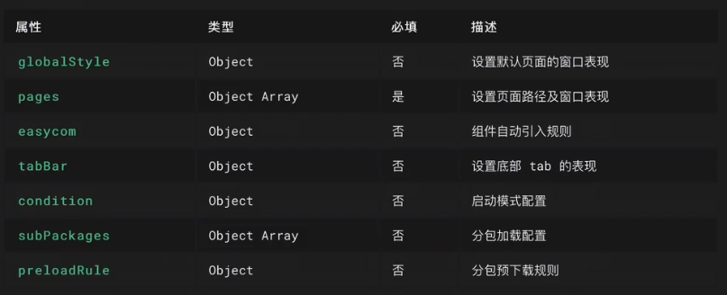

## 全局样式uni.scss

> uni.scss文件的用途是为了方便控制整体应用的风格，比如按钮颜色、边框风格，uni.scss里面预置了一批scss变量预置
>
> uni.scss是一个特殊文件，在代码中无需import这个文件就可以在scss文件中使用这里的样式变量。uni-app的编译器在webpack配置中特殊处理了这个uni.scss，使得每个scss文件都被注入uni.scss，达到全局可用的效果。如果想要less、stylus全局可用，需要在vue.config.js中自行配置webpack策略

## 主组件App.vue

> App.vue是uni-app的主组件，所以页面都是在App.vue下进行切换的，是页面入口文件。但App.vue本身不是页面，这里不能编写视图元素。
>
> 这个文件的作用包括：调用应用生命周期函数、配置全局样式、配置全局存储的globalData
>
> 应用生命周期仅可在App.vue中监听，在页面监听无效

## 入口文件main.js

> main.js是uni-app的入口文件，主要作用是初始化vue实例、定义全局组件、使用需要的插件如vuex

## Uniapp开发规范及资源路径

1. 开发规范约定

    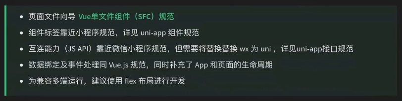

2. 资源路径说明

    > template内约会静态资源，如image、video等标签的src属性时，可用使用相对路径或者绝对路径，形式如下：

​		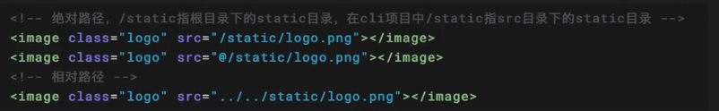

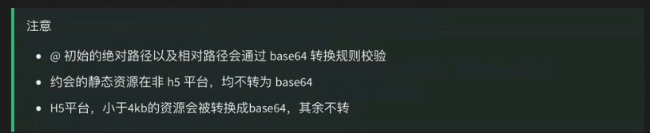

> js文件或script标签内，可以使用相对路径或绝对路径，形式如下：

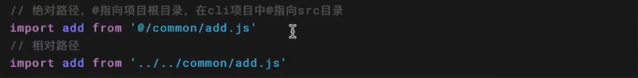

> css文件或style标签内，可以使用相对路径或绝对路径

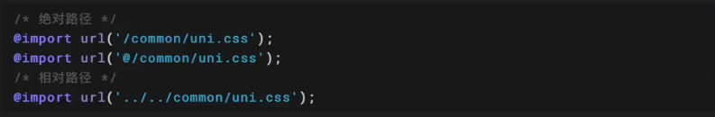

> css文件或style标签内引用的图片标签，可以使用相对路径或绝对路径

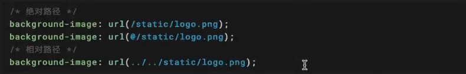

# 二、Uniapp生命周期

## 应用生命周期

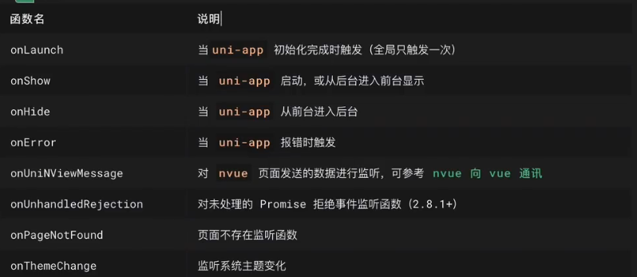

## 页面生命周期

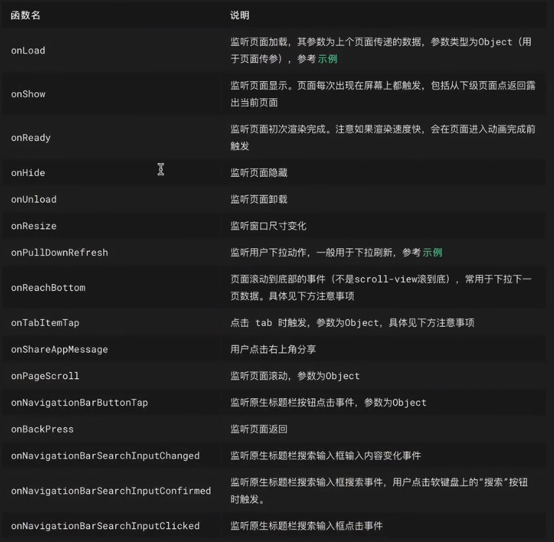

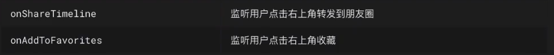

# 三、路由配置及页面跳转

## 路由配置

> uni-app页面路由全部交给框架统一管理，开发者需要在page.json里配置每个路由的路径及页面样式

```json
{
	"pages": [
		{
			"path": "pages/index/index",
			"style": {
				"navigationBarTitleText": "首页",
				"enablePullDownRefresh": true
			}
		}
	    ,{
            "path" : "pages/404/404",
            "style" :                                                                                    
            {
                "navigationBarTitleText": "页面不存在",
                "enablePullDownRefresh": false
            }
            
        }
    ],
	"globalStyle": {
		"navigationBarTextStyle": "black",
		"navigationBarTitleText": "uni-app",
		"navigationBarBackgroundColor": "#F8F8F8",
		"backgroundColor": "#F8F8F8"
	},
	"uniIdRouter": {}
}
```

## 路由跳转

> uni-app有两种页面路由跳转方式：使用navigator组件跳转（标签式导航栏）、调用API跳转（编程式导航）框架以栈的形式管理当前所有页面，当发送路由切换时，页面栈的表现如下：

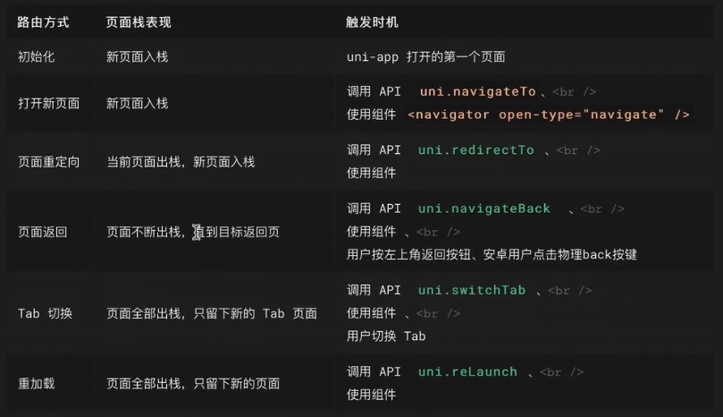

## 获取当前页面栈

> getCurrentPages()函数用于获取当前页面栈的实例，以数组形式按栈的顺序给出，第一个页面为首页，最后一个元素为当前页面
>
> 注意：getCurrentPages()用于获取展示页面栈的情况，请勿修改页面栈

## 路由传参与接收

> 说明：页面生命周期的onLoad()监听页面加载，其参数为上个页面传递的数据。如：

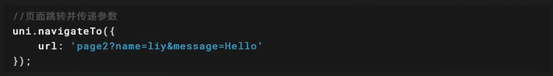

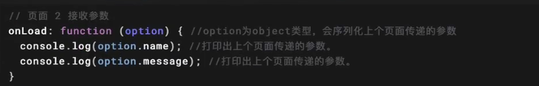


## 路由分包配置

在pages同级新建目录：subpages

在page.json文件中与pages同级写入配置

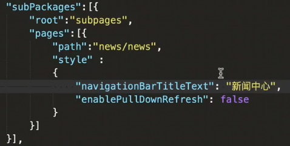

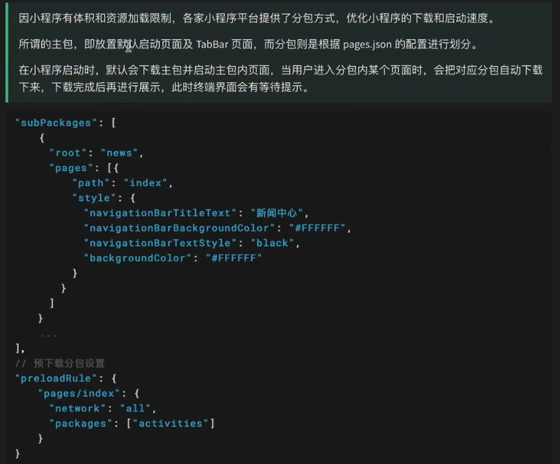

# 四、常用组件

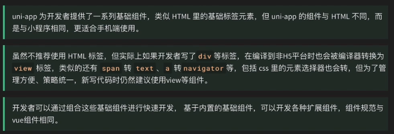

