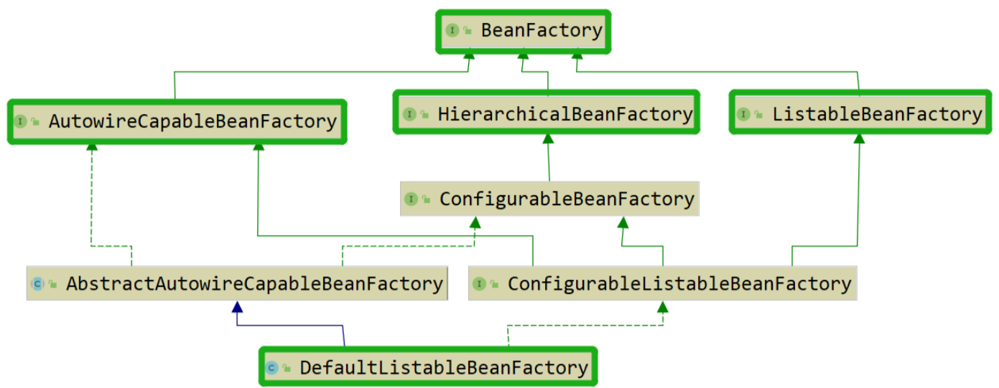
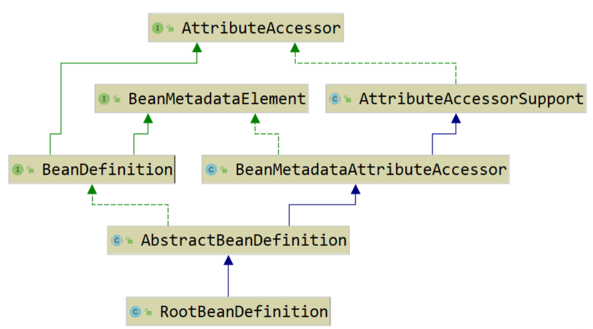
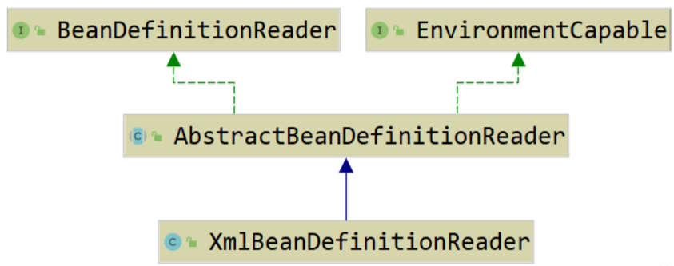
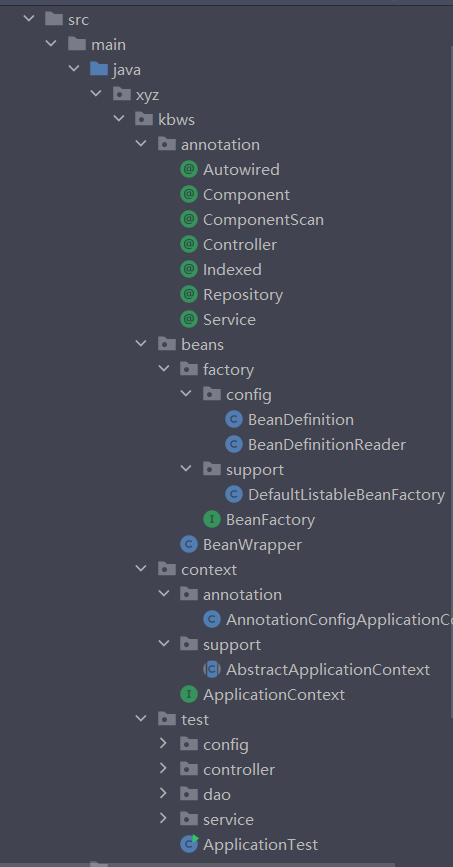
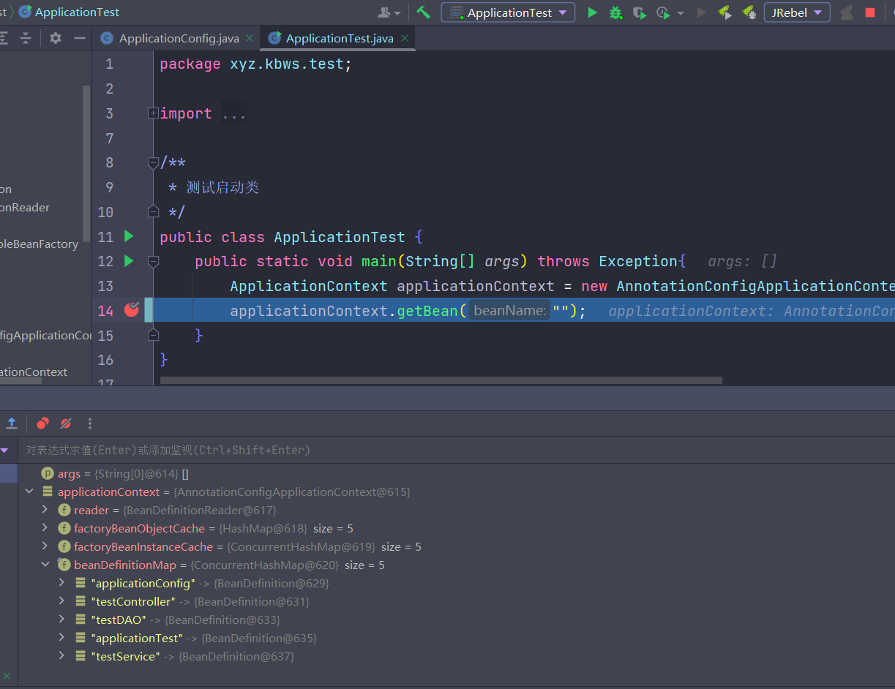

# IOC/DI思想

## 什么是IOC（控制反转）

> 控制反转（Inversion of Control，缩写为IoC），是面向对象编程中的一种设计原则，可以用来减低计算机代码之间的耦合度

简单的来说： 其实就是将原本需要程序员手动去new（实例化）的类对象，交给第三方，也就是交给Spring去管理，由Spring帮助我们去实例化一个类。

所谓的控制反转，就是将一个类的创建和初始化的控制权等操作，从程序员的手中交给第三方框架Spring去管理，从而使得程序员无需关心一个类是如何创建的，应该怎么实例化、初始化，让程序员将编程的重心回归到业务本身，以达到提高开发效率的目的

## 为什么要控制反转

假设有一个服务层对象`IndexService`，和一个DAO层对象`IndexDAOImpl`。当需要执行一个业务逻辑时，最先是请求调用`IndexService` ，而`IndexService`则会调用`IndexDAOImpl`执行对应的数据库操作。

当我们因为一些原因需要将`IndexDAOImpl`接口替换成`NewDAOImpl`接口时，需要修改所有调用`IndexDAOImpl`的服务层接口，这是非常麻烦且无意义的

而如果我们使用控制反转的思想，将对象交给Spring管理，那么当我们需要修改调用的接口时，只需要**修改Spring的配置文件或者修改配置注解**就可以了

## 什么是DI（依赖注入）

> 所谓依赖注入，是指程序运行过程中，如果需要调用另一个对象协助时，无须在代码中创建被调用者，而是依赖于外部的注入。Spring的依赖注入对调用者和被调用者几乎没有任何要求，完全支持对POJO之间依赖关系的管理。
>
> 当某个角色(可能是一个Java实例，调用者)需要另一个角色(另一个Java实例，被调用者)的协助时，在 传统的程序设计过程中，通常由调用者来创建被调用者的实例。但在Spring里，创建被调用者的工作不再由调用者来完成，因此称为控制反转;创建被调用者 实例的工作通常由Spring容器来完成，然后注入调用者，因此也称为依赖注入。
>
> 依赖注入有两种：设值注入、构造注入

**DI和IOC的关系：** IOC不是一种技术，是一种编程思想，与设计模式一样，它指导程序员应该如何去编写低耦合、高可用的代码。而DI则是IOC众多具体实现方案中的一个，并不是唯一的（除了`DI依赖注入`外，还有`DL依赖查找`、`DP依赖拖拽`，但这两种实际项目中使用的并不多）

那下面的例子来解释：

UserMapper

```java
@Repository
public interface UserMapper{
    /**
     * 返回user表中所有的数据
     */
    @Select("select * from user")
    List<Object> findAll();
}
```

在Service层调用

```java
class DemoTest{
    @Autowired
    UserMapper userMapper;
    @Test
    void contextLoads(){
        userMapper.findAll();
    }
}
```

上面Mapper接口能创建对象的原因是：

使用 **@Autowried** 注解标记的成员变量，在类被调用时，会对该类下的成员变量**使用Java的反射机制注入一个代理类对象**，其遵循配置文件以及userMapper接口的设置并装配好了sql语句，使得程序员可以直接使用这个代理类完成对数据库的操作

> 注意：上面的方法在一些特殊情况下会出现`NullPointerException`异常，这是程序执行顺序导致的，在`bean`没有完成实例化前开始对`UserMapper`执行注入，导致Spring没有找到对应bean的实例，只能注入一个`null`对象

为了解决这个问题我们需要将成员变量改成私有静态的，为其书写一个`set`方法并将`@Autowired`方法加在该方法上

```java
class DemoTest{
    
    private static UserMapper userMapper;
    @Autowired
    public void setUserMapper(UserMapper userMapper){
        DemoTest.userMapper = userMapper;
    }
}
```

# IOC/DI源码

# 一、IOC架构

## 1.BeanFactory

在Spring中，提供了许多IOC容器实现的方式由用户自己选择（下面是Spring IOC架构图）



`BeanFactory`是Spring中的顶层接口，定义了IOC容器的基本功能规范，而在BeanFactory之下存在三个重要的子类，分别是：`ListableBeanFactory`、`HierarchicalBeanFactory`、`AutowireCapableBeanFactory`，并且这三个子类接口最终都由默认实现类 `DefaultListableBeanFactory `实现。

为什么一个用于生产Bean的工厂底下还有有这么多个子类？因为每一个都有着不同的职能

- `ListableBeanFactory`：正如这个工厂接口的名字所示（能列在表单上的bean工厂），这个工厂接口最大的特点就是可以列出工厂可以生产的所有实例。

- `HierarchicalBeanFactory`：分层级的bean工厂，该接口与`ListableBeanFactory`不同的是：`ListableBeanFactory`将所有的bean实例统一的列在一张表中，但这样做的问题在于，工作出现问题后的追责问题会使得管理员十分头痛。而此时`HierarchicalBeanFactory`职责的优势就显现出来了，他会根据每个bean的归属进行一个归类，此时，工作出现问题后，管理员能够快速的找到出现问题的地方，并进行追责。

- `AutowireCapableBeanFactory`：定义bean自动装配规则

顶层`BeanFactory`源码：

```java
package org.springframework.beans.factory;

import org.springframework.beans.BeansException;
import org.springframework.core.ResolvableType;
import org.springframework.lang.Nullable;

public interface BeanFactory {

	/**
	 * <p>
	 *     这里是对FactoryBean的转义定义，因为如果使用bean的名字检索
	 *     FactoryBean得到的对象是工厂生成的对象
	 *     如果需要得到工厂本身，需要转义
	 * </p>
	 */
	String FACTORY_BEAN_PREFIX = "&";

	/**
	 * <p>
	 *     这里根据bean的名字，在IOC容器中得到bean实例，
	 *     这个IOC容器就是一个大的抽象工厂。
	 * </p>
	 */
	Object getBean(String name) throws BeansException;

	/**
	 *     这里根据bean的名字和Class类型来得到bean实例，
	 *     和上面的方法不同在于它会抛出异常：
	 *     如果根据名字取得的bean实例的Class类型和需要的不同的话。
	 */
	<T> T getBean(String name, @Nullable Class<T> requiredType) throws BeansException;
	Object getBean(String name, Object... args) throws BeansException;
	<T> T getBean(Class<T> requiredType) throws BeansException;
	<T> T getBean(Class<T> requiredType, Object... argsa) throws BeansException;


	/**
	 * <p>这里提供对bean的检索，看看是否在IOC容器有这个名字的bean</p>
	 */
	boolean containsBean(String name);

	/**
	 * <p>这里根据bean名字得到bean实例，并同时判断这个bean是不是单例</p>
	 */
	boolean isSingleton(String name) throws NoSuchBeanDefinitionException;
	
	/**
	 * <p>这里根据bean名字得到bean实例，并同时判断这个bean是不是原型</p>
	 */
	boolean isPrototype(String name) throws NoSuchBeanDefinitionException;

	boolean isTypeMatch(String name, ResolvableType typeToMatch) throws NoSuchBeanDefinitionException;

	boolean isTypeMatch(String name, @Nullable Class<?> typeToMatch) throws NoSuchBeanDefinitionException;

	/**
	 * <p>这里对得到bean实例的Class类型</p>
	 */
	@Nullable
	Class<?> getType(String name) throws NoSuchBeanDefinitionException;

	/**
	 * <p>这里得到bean的别名，如果根据别名检索，那么其原名也会被检索出来</p>
	 */
	String[] getAliases(String name);

}
```

从上面可以看出`BeanFactory`只是对IOC容器进行了基本行为的定义，并不关心一个bean是如何产生定义的

## 2.BeanDefinition

**BeanDefinition中定义了与bean实例化相关的各种信息，并通过BeanDefinition中的信息就可以实例化出一个bean对象**（下面是BeanDefinition的类结构图）



## 3.BeanDefinitionReader

`ApplicationContext`作为`BeanFactory`的子类，他们之间的区别是：前者扫描bean后会对bean进行实例化，而后者则是等到bean被调用时才进行实例化。

但一个bean的解析过程是十分复杂的，功能会被划分的非常详细，因为需要保证其扩展性、延申性和灵活性，以应对项目的各种变化。而bean的解析过程则是通过`BeanDefinitionReader`来完成的。（如下是BeanDefinitionReader的类结构图）




# 二、IOC流程

当我们启动一个以spring为框架的程序时，程序首先会去找到Java入口方法`main`方法，对spring的IOC容器`ApplicationContext`进行实例化，然后进行spring内部的一系列操作后才开始处理和执行业务需求，也就是说，`ApplicationContext`其实是spring框架的入口。

## 1.实例化ApplicationContext

因为ApplicationContext本身是一个接口，因此我们需要实例化其子类AnnotationConfigApplicationContext（这里我们使用注解配置的子类AnnotationConfigApplicationContext，除此之外还有以xml文件为配置的ClassPathXmlApplicationContext）
```java
public static void main(String[] args) {
    ApplicationContext applicationContext =
        new AnnotationConfigApplicationContext(AppConfig.class);
}
```

## 2.查看AnnotationConfigApplicationContext的构造方法

进入`AnnotationConfigApplicationContext`的非空构造方法（如下）

```java
public AnnotationConfigApplicationContext(Class<?>... annotatedClasses) {
    // 初始化注解解析器reader，扫描器scanner
    this();
    // 注册配置类annotatedClasses
    register(annotatedClasses);
    // 扫描bean的具体操作
    refresh();
}
```

### 2.1调用空构造方法

**Java中要求在子类的构造方法中调用其父类的构造方法。如果父类无构造方法（其实是一个默认无参的构造方法），那么子类的构造方法中会自动进行调用；如果 父类有自己的构造方法（这时父类不会有默认无参的构造方法），那么在子类的构造方法中，必须要调用父类的某个构造方法，而且必须是在构造方法的第一个语句中进行调用。**

因此，在真正执行this();方法之前，Java会先执行父类中的构造方法，即`AnnotationConfigApplicationContext`的父类 `GenericApplicationContext `中的构造方法。(`GenericApplicationContext`的空构造方法源码如下)
```java
public GenericApplicationContext() {
    this.beanFactory = new DefaultListableBeanFactory();
}
```

这里我们发现，`GenericApplicationContext `在初始化时居然实例化了一个 `DefaultListableBeanFactory`，也就是我们的bean工厂。作为BeanFactory的实现类，我们不妨点进去查看查看他的源码。其中，值得注意的是，在众多的成员变量中存在一个名为 `beanDefinitionMap `的map（如下）
```java
/**
 * <p>bean定义对象的map，按bean名称为键值</p>
 */
private final Map<String, BeanDefinition> beanDefinitionMap = new ConcurrentHashMap<>(256);
```

父类`GenericApplicationContext`的构造方法作用是用于实例化出一个bean工厂，也因此我们就拥有了`beanDefinitionMap`，那么子类`AnnotationConfigApplicationContext`接下来的任务无疑就是往`beanDefinitionMap`中添加`BeanDefinition`。那么Spring官方又是怎么实现的呢？我们把目光重新回到`AnnotationConfigApplicationContext`的空构造方法中（如下）
```java
public AnnotationConfigApplicationContext() {
    // 在IOC容器中初始化一个 注解bean读取器
    this.reader = new AnnotatedBeanDefinitionReader(this);
    // 在IOC容器中初始化一个 按类路径扫描注解bean的 扫描器
    this.scanner = new ClassPathBeanDefinitionScanner(this);
}
```


#### 2.1.1AnnotatedBeanDefinitionReader

首先我们先来查看`AnnotatedBeanDefinitionReader`的构造方法源码：

```java
public AnnotatedBeanDefinitionReader(BeanDefinitionRegistry registry) {
    this(registry, getOrCreateEnvironment(registry));
}
	
public AnnotatedBeanDefinitionReader(BeanDefinitionRegistry registry, Environment environment) {
    Assert.notNull(registry, "BeanDefinitionRegistry must not be null");
    Assert.notNull(environment, "Environment must not be null");
    this.registry = registry;
    this.conditionEvaluator = new ConditionEvaluator(registry, environment, null);
    AnnotationConfigUtils.registerAnnotationConfigProcessors(this.registry);
}
```

构造方法中除了成员变量的赋值外，在最后一行调用了工具类AnnotationConfigUtils中的`registerAnnotationConfigProcessors`方法，通过该方法的名称我们就可以大概知道该方法的用途（寄存器注释配置处理器），接下来我们就继续查看`registerAnnotationConfigProcessors`的源码，探究一下构造AnnotatedBeanDefinitionReader时发生了什么：
```java
public static void registerAnnotationConfigProcessors(BeanDefinitionRegistry registry) {
    registerAnnotationConfigProcessors(registry, null);
}
	
public static Set<BeanDefinitionHolder> registerAnnotationConfigProcessors(
			BeanDefinitionRegistry registry, @Nullable Object source) {

	DefaultListableBeanFactory beanFactory = unwrapDefaultListableBeanFactory(registry);
	if (beanFactory != null) {
		if (!(beanFactory.getDependencyComparator() instanceof AnnotationAwareOrderComparator)) {
			beanFactory.setDependencyComparator(AnnotationAwareOrderComparator.INSTANCE);
			}
		if (!(beanFactory.getAutowireCandidateResolver() instanceof ContextAnnotationAutowireCandidateResolver)) {
			beanFactory.setAutowireCandidateResolver(new ContextAnnotationAutowireCandidateResolver());
			}
    }

    Set<BeanDefinitionHolder> beanDefs = new LinkedHashSet<>(4);

    if (!registry.containsBeanDefinition(CONFIGURATION_ANNOTATION_PROCESSOR_BEAN_NAME)) {
        RootBeanDefinition def = new RootBeanDefinition(ConfigurationClassPostProcessor.class);
        def.setSource(source);
        beanDefs.add(registerPostProcessor(registry, def, CONFIGURATION_ANNOTATION_PROCESSOR_BEAN_NAME));
    }

    if (!registry.containsBeanDefinition(AUTOWIRED_ANNOTATION_PROCESSOR_BEAN_NAME)) {
        RootBeanDefinition def = new RootBeanDefinition(AutowiredAnnotationBeanPostProcessor.class);
        def.setSource(source);
        beanDefs.add(registerPostProcessor(registry, def, AUTOWIRED_ANNOTATION_PROCESSOR_BEAN_NAME));
    }

    if (!registry.containsBeanDefinition(REQUIRED_ANNOTATION_PROCESSOR_BEAN_NAME)) {
        RootBeanDefinition def = new RootBeanDefinition(RequiredAnnotationBeanPostProcessor.class);
        def.setSource(source);
        beanDefs.add(registerPostProcessor(registry, def, REQUIRED_ANNOTATION_PROCESSOR_BEAN_NAME));
    }

    // Check for JSR-250 support, and if present add the CommonAnnotationBeanPostProcessor.
    if (jsr250Present && !registry.containsBeanDefinition(COMMON_ANNOTATION_PROCESSOR_BEAN_NAME)) {
        RootBeanDefinition def = new RootBeanDefinition(CommonAnnotationBeanPostProcessor.class);
        def.setSource(source);
        beanDefs.add(registerPostProcessor(registry, def, COMMON_ANNOTATION_PROCESSOR_BEAN_NAME));
    }

    // Check for JPA support, and if present add the PersistenceAnnotationBeanPostProcessor.
    if (jpaPresent && !registry.containsBeanDefinition(PERSISTENCE_ANNOTATION_PROCESSOR_BEAN_NAME)) {
        RootBeanDefinition def = new RootBeanDefinition();
        try {
            def.setBeanClass(ClassUtils.forName(PERSISTENCE_ANNOTATION_PROCESSOR_CLASS_NAME,
                                                AnnotationConfigUtils.class.getClassLoader()));
        }
        catch (ClassNotFoundException ex) {
            throw new IllegalStateException(
                "Cannot load optional framework class: " + PERSISTENCE_ANNOTATION_PROCESSOR_CLASS_NAME, ex);
        }
        def.setSource(source);
        beanDefs.add(registerPostProcessor(registry, def, PERSISTENCE_ANNOTATION_PROCESSOR_BEAN_NAME));
    }

    if (!registry.containsBeanDefinition(EVENT_LISTENER_PROCESSOR_BEAN_NAME)) {
        RootBeanDefinition def = new RootBeanDefinition(EventListenerMethodProcessor.class);
        def.setSource(source);
        beanDefs.add(registerPostProcessor(registry, def, EVENT_LISTENER_PROCESSOR_BEAN_NAME));
    }
    if (!registry.containsBeanDefinition(EVENT_LISTENER_FACTORY_BEAN_NAME)) {
        RootBeanDefinition def = new RootBeanDefinition(DefaultEventListenerFactory.class);
        def.setSource(source);
        beanDefs.add(registerPostProcessor(registry, def, EVENT_LISTENER_FACTORY_BEAN_NAME));
    }

    return beanDefs;
}
```

可以看到，在该方法中主要任务是完成spring内部7个默认bean的注册：

1. ConfigurationClassPostProcessor
2. AutowiredAnnotationBeanPostProcessor
3. RequiredAnnotationBeanPostProcessor
4. CommonAnnotationBeanPostProcessor
5. PersistenceAnnotationBeanPostProcessor
6. EventListenerMethodProcessor
7. DefaultEventListenerFactory

##### 1.ConfigurationClassPostProcessor

工厂后置处理器，类上的注解基本都在此解析，spring的包扫描也在里面完成

```java
if (!registry.containsBeanDefinition(CONFIGURATION_ANNOTATION_PROCESSOR_BEAN_NAME)) {
    RootBeanDefinition def = new RootBeanDefinition(ConfigurationClassPostProcessor.class);
    def.setSource(source);
    beanDefs.add(registerPostProcessor(registry, def, 				CONFIGURATION_ANNOTATION_PROCESSOR_BEAN_NAME));
}
```


##### 2.AutowiredAnnotationBeanPostProcessor

用于处理 **@Autowired** 的后置处理器，如mybatis中的mapper属性注入就是通过该处理器进行处理注入的

```java
if (!registry.containsBeanDefinition(AUTOWIRED_ANNOTATION_PROCESSOR_BEAN_NAME)) {
    RootBeanDefinition def = new RootBeanDefinition(AutowiredAnnotationBeanPostProcessor.class);
    def.setSource(source);
    beanDefs.add(registerPostProcessor(registry, def, AUTOWIRED_ANNOTATION_PROCESSOR_BEAN_NAME));
}
```


##### 3.RequiredAnnotationBeanPostProcessor

用于处理 **@Required** 注解的后置处理器

```java
if (!registry.containsBeanDefinition(REQUIRED_ANNOTATION_PROCESSOR_BEAN_NAME)) {
    RootBeanDefinition def = new RootBeanDefinition(RequiredAnnotationBeanPostProcessor.class);
    def.setSource(source);
    beanDefs.add(registerPostProcessor(registry, def, REQUIRED_ANNOTATION_PROCESSOR_BEAN_NAME));
}

```


##### 4.CommonAnnotationBeanPostProcessor

处理公共注解的后置处理器，如：**@PostConstruct**、**@PreDestroy**、**@Resource**等

```java
if (jsr250Present && !registry.containsBeanDefinition(COMMON_ANNOTATION_PROCESSOR_BEAN_NAME)) {
    RootBeanDefinition def = new RootBeanDefinition(CommonAnnotationBeanPostProcessor.class);
    def.setSource(source);
    beanDefs.add(registerPostProcessor(registry, def, COMMON_ANNOTATION_PROCESSOR_BEAN_NAME));
}
```


##### 5.PersistentAnnotationBeanPostProcessor

提供的用于处理注解@PersistenceUnit和@PersistenceContext的处理器。用于注入相应的JPA资源:EntityManagerFactory和EntityManager (或者它们的子类变量)

```java
if (jpaPresent && !registry.containsBeanDefinition(PERSISTENCE_ANNOTATION_PROCESSOR_BEAN_NAME)) {
    RootBeanDefinition def = new RootBeanDefinition();
    try {
        def.setBeanClass(ClassUtils.forName(PERSISTENCE_ANNOTATION_PROCESSOR_CLASS_NAME,
                                            AnnotationConfigUtils.class.getClassLoader()));
    }
    catch (ClassNotFoundException ex) {
        throw new IllegalStateException(
            "Cannot load optional framework class: " + PERSISTENCE_ANNOTATION_PROCESSOR_CLASS_NAME, ex);
    }
    def.setSource(source);
    beanDefs.add(registerPostProcessor(registry, def, PERSISTENCE_ANNOTATION_PROCESSOR_BEAN_NAME));
}
```


##### 6.EventListenerMethodProcessor

对注解 **@EventListener** 的处理器，实现spring的事件监听

```java
if (!registry.containsBeanDefinition(EVENT_LISTENER_PROCESSOR_BEAN_NAME)) {
    RootBeanDefinition def = new RootBeanDefinition(EventListenerMethodProcessor.class);
    def.setSource(source);
    beanDefs.add(registerPostProcessor(registry, def, EVENT_LISTENER_PROCESSOR_BEAN_NAME));
}
```


##### 7.DefaultEventListenerFactory

`EventListenerMethodProcessor`中会调用`DefaultEventListenerFactory`的方法，注册的具体实现是由`DefaultEventListenerFactory`处理

```java
if (!registry.containsBeanDefinition(EVENT_LISTENER_FACTORY_BEAN_NAME)) {
    RootBeanDefinition def = new RootBeanDefinition(DefaultEventListenerFactory.class);
    def.setSource(source);
    beanDefs.add(registerPostProcessor(registry, def, EVENT_LISTENER_FACTORY_BEAN_NAME));
}
```


#### 2.1.2ClassPathBeanDefinitionScanner

在搞懂了`AnnotatedBeanDefinitionReader`的大致作用后，我们回到`AnnotationConfigApplicationContext`的构造方法来，继续进入另一条实例化语句的类中`ClassPathBeanDefinitionScanner`：

```java
public ClassPathBeanDefinitionScanner(BeanDefinitionRegistry registry) {
    this(registry, true);
}

public ClassPathBeanDefinitionScanner(BeanDefinitionRegistry registry, boolean useDefaultFilters) {
    this(registry, useDefaultFilters, getOrCreateEnvironment(registry));
}

public ClassPathBeanDefinitionScanner(BeanDefinitionRegistry registry, boolean useDefaultFilters,Environment environment) {

    this(registry, useDefaultFilters, environment,
         (registry instanceof ResourceLoader ? (ResourceLoader) registry : null));
}

public ClassPathBeanDefinitionScanner(BeanDefinitionRegistry registry, boolean useDefaultFilters,Environment environment, @Nullable ResourceLoader resourceLoader) {

    Assert.notNull(registry, "BeanDefinitionRegistry must not be null");
    this.registry = registry;

    if (useDefaultFilters) {
        registerDefaultFilters();
    }
    setEnvironment(environment);
    setResourceLoader(resourceLoader);
}
```

在这其中值得关注的是**registerDefaultFilters**方法，点击进入该方法：

```java
protected void registerDefaultFilters() {
    this.includeFilters.add(new AnnotationTypeFilter(Component.class));
    ClassLoader cl = ClassPathScanningCandidateComponentProvider.class.getClassLoader();
    try {
        this.includeFilters.add(new AnnotationTypeFilter(
            ((Class<? extends Annotation>) ClassUtils.forName("javax.annotation.ManagedBean", cl)), false));
        logger.debug("JSR-250 'javax.annotation.ManagedBean' found and supported for component scanning");
    }
    catch (ClassNotFoundException ex) {
        // JSR-250 1.1 API (as included in Java EE 6) not available - simply skip.
    }
    try {
        this.includeFilters.add(new AnnotationTypeFilter(
            ((Class<? extends Annotation>) ClassUtils.forName("javax.inject.Named", cl)), false));
        logger.debug("JSR-330 'javax.inject.Named' annotation found and supported for component scanning");
    }
    catch (ClassNotFoundException ex) {
        // JSR-330 API not available - simply skip.
    }
}

```

看到这个方法的第一行，这一行代码任务的其实是扫描特殊的类，比如注解类 **@Component** （包括我们熟知的 **@Controll**，**@Service**，**@Repository** 等）

至此，this()方法的任务完成的有：

1. 初始化bean工厂
2. 注册处理器
3. 扫描特殊的类（如注解类）

### 2.2注册bean配置类

接下来我们继续研究接下来的方法`register(annotatedClasses)`：

```java
public void register(Class<?>... annotatedClasses) {
    Assert.notEmpty(annotatedClasses, "At least one annotated class must be specified");
    this.reader.register(annotatedClasses);
}
```

进入到`register`方法的源码，发现其调用了在`this`方法中赋值的`reader`即`AnnotatedBeanDefinitionReader`对象中的`register`方法，我们继续进入，查看其源码：

```java
public void register(Class<?>... annotatedClasses) {
    for (Class<?> annotatedClass : annotatedClasses) {
        registerBean(annotatedClass);
    }
}

public void registerBean(Class<?> annotatedClass) {
    doRegisterBean(annotatedClass, null, null, null);
}

<T> void doRegisterBean(Class<T> annotatedClass, @Nullable Supplier<T> instanceSupplier, @Nullable String name,@Nullable Class<? extends Annotation>[] qualifiers, BeanDefinitionCustomizer... definitionCustomizers) {

    AnnotatedGenericBeanDefinition abd = new AnnotatedGenericBeanDefinition(annotatedClass);
    if (this.conditionEvaluator.shouldSkip(abd.getMetadata())) {
        return;
    }

    abd.setInstanceSupplier(instanceSupplier);
    ScopeMetadata scopeMetadata = this.scopeMetadataResolver.resolveScopeMetadata(abd);
    abd.setScope(scopeMetadata.getScopeName());
    String beanName = (name != null ? name : this.beanNameGenerator.generateBeanName(abd, this.registry));

    AnnotationConfigUtils.processCommonDefinitionAnnotations(abd);
    if (qualifiers != null) {
        for (Class<? extends Annotation> qualifier : qualifiers) {
            if (Primary.class == qualifier) {
                abd.setPrimary(true);
            }
            else if (Lazy.class == qualifier) {
                abd.setLazyInit(true);
            }
            else {
                abd.addQualifier(new AutowireCandidateQualifier(qualifier));
            }
        }
    }
    for (BeanDefinitionCustomizer customizer : definitionCustomizers) {
        customizer.customize(abd);
    }

    BeanDefinitionHolder definitionHolder = new BeanDefinitionHolder(abd, beanName);
    definitionHolder = AnnotationConfigUtils.applyScopedProxyMode(scopeMetadata, definitionHolder, this.registry);
    BeanDefinitionReaderUtils.registerBeanDefinition(definitionHolder, this.registry);
}

```


### 2.3刷新上下文

进入`refresh()`方法中查看源码：

```java
public void refresh() throws BeansException, IllegalStateException {
    synchronized (this.startupShutdownMonitor) {
        // 1.设置容器的启动日期和活动标志以及执行属性源的任何初始化
        prepareRefresh();

        // 2.获取新的beanFactory，销毁原有beanFactory、为每个bean生成BeanDefinition等
        ConfigurableListableBeanFactory beanFactory = obtainFreshBeanFactory();

        // 3.设置beanFactory的属性
        prepareBeanFactory(beanFactory);

        try {
            // 4.允许在上下文子类中对bean工厂进行后处理
            postProcessBeanFactory(beanFactory);

            // 5.调用在上下文中注册为bean的工厂处理程序
            invokeBeanFactoryPostProcessors(beanFactory);

            // 6.注册拦截bean创建的bean处理器
            registerBeanPostProcessors(beanFactory);

            // 7.初始化此上下文的消息源
            initMessageSource();

            // 8.初始化此上下文的事件多播程序
            initApplicationEventMulticaster();

            // 9.初始化特定上下文子类中的其他特殊bean
            onRefresh();

            // 10.检查侦听器bean并注册它们
            registerListeners();

            // 11.实例化所有剩余的(非惰性init)单例对象
            finishBeanFactoryInitialization(beanFactory);

            // 12.最后一步:发布相应的事件
            finishRefresh();
        }

        catch (BeansException ex) {
            if (logger.isWarnEnabled()) {
                logger.warn("Exception encountered during context initialization - " +
                            "cancelling refresh attempt: " + ex);
            }

            // 13.销毁已经创建的单例
            destroyBeans();

            // 14.重置同步标识
            cancelRefresh(ex);

            // Propagate exception to caller.
            throw ex;
        }

        finally {
            // 15.重设公共缓存
            resetCommonCaches();
        }
    }
}
```

源码中可以看出，`refresh`方法主要调用了`15`个方法（分别对应`15`步操作）


#### 1.prepareRefresh

设置容器的启动日期和活动标志以及执行属性源的任何初始化

```java
protected void prepareRefresh() {
    // 设置容器启动时间
    this.startupDate = System.currentTimeMillis();
    // 设置closed、active状态值
    this.closed.set(false);
    this.active.set(true);

    if (logger.isInfoEnabled()) {
        logger.info("Refreshing " + this);
    }

    // 初始化上下文环境中的任何占位符属性源
    initPropertySources();

    // 验证所有标记为required的属性都是可解析的
    getEnvironment().validateRequiredProperties();

    // Allow for the collection of early ApplicationEvents,
    // to be published once the multicaster is available...
    this.earlyApplicationEvents = new LinkedHashSet<>();
}
```


#### 2.obtainFreshBeanFactory

`obtainFreshBeanFactory`这里主要的作用其实是运送`原料`进入工厂，`beanDefinition`的注册是在这里完成的。其实现方式有两种，第一种是需要判断是否存在bean工厂，若存在则销毁并创建新的工厂，并为新工厂加上锁；第二种则是只给工厂加上锁

##### 实现一

`org.springframework.context.support.AbstractRefreshableApplicationContext.class`

```java
protected final void refreshBeanFactory() throws BeansException {
    // 若存在工厂，则将其销毁
    if (hasBeanFactory()) {
        destroyBeans();
        closeBeanFactory();
    }
    try {
        // 创建新的工厂
        DefaultListableBeanFactory beanFactory = createBeanFactory();
        beanFactory.setSerializationId(getId());
        customizeBeanFactory(beanFactory);
        // 加载beanDefinition
        loadBeanDefinitions(beanFactory);
        // 加上锁
        synchronized (this.beanFactoryMonitor) {
            this.beanFactory = beanFactory;
        }
    }
    catch (IOException ex) {
        throw new ApplicationContextException("I/O error parsing bean definition source for " + getDisplayName(), ex);
    }
}
```


##### 实现二

`org.springframework.context.support.GenericApplicationContext.class`

```java
protected final void refreshBeanFactory() throws IllegalStateException {
    if (!this.refreshed.compareAndSet(false, true)) {
        throw new IllegalStateException(
            "GenericApplicationContext does not support multiple refresh attempts: just call 'refresh' once");
    }
    // 加锁
    this.beanFactory.setSerializationId(getId());
}
```


#### 3.prepareBeanFactory

配置标准的beanFactory，设置ClassLoader，设置SpEL表达式解析器，添加忽略注入的接口，添加bean，添加bean后置处理器等。**其实通过命名我们可以知道，该方法需要完成的任务是在bean工厂创建完成后到工厂真正运作前的准备工作**

#### 4.postProcessBeanFactory

模板方法，此时，所有的beanDefinition已经加载，但是还没有实例化。
允许在子类中对beanFactory进行扩展处理。比如添加ware相关接口自动装配设置，添加后置处理器等，**是子类扩展prepareBeanFactory(beanFactory)的方法**


#### 5.invokeBeanFactoryPostProgress

IOC容器的初始化过程有着三个重要的步骤：

1. 资源定位
2. beanDefinition的载入
3. 将beanDefinition以键值对应的方式存入map中

**以上三个步骤都在该方法下完成 ！！！**
`invokeBeanFactoryPostProcessors`源码：

```java
protected void invokeBeanFactoryPostProcessors(ConfigurableListableBeanFactory beanFactory) {
    PostProcessorRegistrationDelegate.invokeBeanFactoryPostProcessors(beanFactory, getBeanFactoryPostProcessors());

    // Detect a LoadTimeWeaver and prepare for weaving, if found in the meantime
    // (e.g. through an @Bean method registered by ConfigurationClassPostProcessor)
    if (beanFactory.getTempClassLoader() == null && beanFactory.containsBean(LOAD_TIME_WEAVER_BEAN_NAME)) {
        beanFactory.addBeanPostProcessor(new LoadTimeWeaverAwareProcessor(beanFactory));
        beanFactory.setTempClassLoader(new ContextTypeMatchClassLoader(beanFactory.getBeanClassLoader()));
    }
}
```

顺着`invokeBeanFactoryPostProcessors`，我们继续进入第一行中`invokeBeanFactoryPostProcessors`的源码：（该方法下将会获取所有的`BeanDefinitionRegistryPostProcessor`实现类，首先过滤出实现 `PriorityOrdered`（优先级）接口的`BeanDefinitionRegistryPostProcessor`，对其进行排序后调用方法；接着过滤实现`Ordered`（顺序）接口的`BeanDefinitionRegistryPostProcessor`，进行排序后调用方法，调用所有 其他`BeanFactoryPostProcessors`）
```java
public static void invokeBeanFactoryPostProcessors(
    ConfigurableListableBeanFactory beanFactory, List<BeanFactoryPostProcessor> beanFactoryPostProcessors) {

    // Invoke BeanDefinitionRegistryPostProcessors first, if any.
    Set<String> processedBeans = new HashSet<>();

    if (beanFactory instanceof BeanDefinitionRegistry) {
        BeanDefinitionRegistry registry = (BeanDefinitionRegistry) beanFactory;
        List<BeanFactoryPostProcessor> regularPostProcessors = new LinkedList<>();
        List<BeanDefinitionRegistryPostProcessor> registryProcessors = new LinkedList<>();

        for (BeanFactoryPostProcessor postProcessor : beanFactoryPostProcessors) {
            if (postProcessor instanceof BeanDefinitionRegistryPostProcessor) {
                BeanDefinitionRegistryPostProcessor registryProcessor =
                    (BeanDefinitionRegistryPostProcessor) postProcessor;
                registryProcessor.postProcessBeanDefinitionRegistry(registry);
                registryProcessors.add(registryProcessor);
            }
            else {
                regularPostProcessors.add(postProcessor);
            }
        }

        // Do not initialize FactoryBeans here: We need to leave all regular beans
        // uninitialized to let the bean factory post-processors apply to them!
        // Separate between BeanDefinitionRegistryPostProcessors that implement
        // PriorityOrdered, Ordered, and the rest.
        List<BeanDefinitionRegistryPostProcessor> currentRegistryProcessors = new ArrayList<>();

        // First, invoke the BeanDefinitionRegistryPostProcessors that implement PriorityOrdered.
        String[] postProcessorNames =
            beanFactory.getBeanNamesForType(BeanDefinitionRegistryPostProcessor.class, true, false);
        for (String ppName : postProcessorNames) {
            if (beanFactory.isTypeMatch(ppName, PriorityOrdered.class)) {
                currentRegistryProcessors.add(beanFactory.getBean(ppName, BeanDefinitionRegistryPostProcessor.class));
                processedBeans.add(ppName);
            }
        }
        sortPostProcessors(currentRegistryProcessors, beanFactory);
        registryProcessors.addAll(currentRegistryProcessors);
        invokeBeanDefinitionRegistryPostProcessors(currentRegistryProcessors, registry);
        currentRegistryProcessors.clear();

        // Next, invoke the BeanDefinitionRegistryPostProcessors that implement Ordered.
        postProcessorNames = beanFactory.getBeanNamesForType(BeanDefinitionRegistryPostProcessor.class, true, false);
        for (String ppName : postProcessorNames) {
            if (!processedBeans.contains(ppName) && beanFactory.isTypeMatch(ppName, Ordered.class)) {
                currentRegistryProcessors.add(beanFactory.getBean(ppName, BeanDefinitionRegistryPostProcessor.class));
                processedBeans.add(ppName);
            }
        }
        sortPostProcessors(currentRegistryProcessors, beanFactory);
        registryProcessors.addAll(currentRegistryProcessors);
        invokeBeanDefinitionRegistryPostProcessors(currentRegistryProcessors, registry);
        currentRegistryProcessors.clear();

        // Finally, invoke all other BeanDefinitionRegistryPostProcessors until no further ones appear.
        boolean reiterate = true;
        while (reiterate) {
            reiterate = false;
            postProcessorNames = beanFactory.getBeanNamesForType(BeanDefinitionRegistryPostProcessor.class, true, false);
            for (String ppName : postProcessorNames) {
                if (!processedBeans.contains(ppName)) {
                    currentRegistryProcessors.add(beanFactory.getBean(ppName, BeanDefinitionRegistryPostProcessor.class));
                    processedBeans.add(ppName);
                    reiterate = true;
                }
            }
            sortPostProcessors(currentRegistryProcessors, beanFactory);
            registryProcessors.addAll(currentRegistryProcessors);
            invokeBeanDefinitionRegistryPostProcessors(currentRegistryProcessors, registry);
            currentRegistryProcessors.clear();
        }

        // Now, invoke the postProcessBeanFactory callback of all processors handled so far.
        invokeBeanFactoryPostProcessors(registryProcessors, beanFactory);
        invokeBeanFactoryPostProcessors(regularPostProcessors, beanFactory);
    }

    else {
        // Invoke factory processors registered with the context instance.
        invokeBeanFactoryPostProcessors(beanFactoryPostProcessors, beanFactory);
    }

    // Do not initialize FactoryBeans here: We need to leave all regular beans
    // uninitialized to let the bean factory post-processors apply to them!
    String[] postProcessorNames =
        beanFactory.getBeanNamesForType(BeanFactoryPostProcessor.class, true, false);

    // Separate between BeanFactoryPostProcessors that implement PriorityOrdered,
    // Ordered, and the rest.
    List<BeanFactoryPostProcessor> priorityOrderedPostProcessors = new ArrayList<>();
    List<String> orderedPostProcessorNames = new ArrayList<>();
    List<String> nonOrderedPostProcessorNames = new ArrayList<>();
    for (String ppName : postProcessorNames) {
        if (processedBeans.contains(ppName)) {
            // skip - already processed in first phase above
        }
        else if (beanFactory.isTypeMatch(ppName, PriorityOrdered.class)) {
            priorityOrderedPostProcessors.add(beanFactory.getBean(ppName, BeanFactoryPostProcessor.class));
        }
        else if (beanFactory.isTypeMatch(ppName, Ordered.class)) {
            orderedPostProcessorNames.add(ppName);
        }
        else {
            nonOrderedPostProcessorNames.add(ppName);
        }
    }

    // First, invoke the BeanFactoryPostProcessors that implement PriorityOrdered.
    sortPostProcessors(priorityOrderedPostProcessors, beanFactory);
    invokeBeanFactoryPostProcessors(priorityOrderedPostProcessors, beanFactory);

    // Next, invoke the BeanFactoryPostProcessors that implement Ordered.
    List<BeanFactoryPostProcessor> orderedPostProcessors = new ArrayList<>();
    for (String postProcessorName : orderedPostProcessorNames) {
        orderedPostProcessors.add(beanFactory.getBean(postProcessorName, BeanFactoryPostProcessor.class));
    }
    sortPostProcessors(orderedPostProcessors, beanFactory);
    invokeBeanFactoryPostProcessors(orderedPostProcessors, beanFactory);

    // Finally, invoke all other BeanFactoryPostProcessors.
    List<BeanFactoryPostProcessor> nonOrderedPostProcessors = new ArrayList<>();
    for (String postProcessorName : nonOrderedPostProcessorNames) {
        nonOrderedPostProcessors.add(beanFactory.getBean(postProcessorName, BeanFactoryPostProcessor.class));
    }
    invokeBeanFactoryPostProcessors(nonOrderedPostProcessors, beanFactory);

    // Clear cached merged bean definitions since the post-processors might have
    // modified the original metadata, e.g. replacing placeholders in values...
    beanFactory.clearMetadataCache();
}

```


#### 6.registerBeanPostProgressors

进入`registerBeanPostProcessors`方法如下：

```java
protected void registerBeanPostProcessors(ConfigurableListableBeanFactory beanFactory) {
    PostProcessorRegistrationDelegate.registerBeanPostProcessors(beanFactory, this);
}
```

接着进入`PostProcessorRegistrationDelegate.registerBeanPostProcessors`：

```java
public static void registerBeanPostProcessors(
    ConfigurableListableBeanFactory beanFactory, AbstractApplicationContext applicationContext) {

    String[] postProcessorNames = beanFactory.getBeanNamesForType(BeanPostProcessor.class, true, false);

    // Register BeanPostProcessorChecker that logs an info message when
    // a bean is created during BeanPostProcessor instantiation, i.e. when
    // a bean is not eligible for getting processed by all BeanPostProcessors.
    int beanProcessorTargetCount = beanFactory.getBeanPostProcessorCount() + 1 + postProcessorNames.length;
    beanFactory.addBeanPostProcessor(new BeanPostProcessorChecker(beanFactory, beanProcessorTargetCount));

    // Separate between BeanPostProcessors that implement PriorityOrdered,
    // Ordered, and the rest.
    List<BeanPostProcessor> priorityOrderedPostProcessors = new ArrayList<>();
    List<BeanPostProcessor> internalPostProcessors = new ArrayList<>();
    List<String> orderedPostProcessorNames = new ArrayList<>();
    List<String> nonOrderedPostProcessorNames = new ArrayList<>();
    for (String ppName : postProcessorNames) {
        if (beanFactory.isTypeMatch(ppName, PriorityOrdered.class)) {
            BeanPostProcessor pp = beanFactory.getBean(ppName, BeanPostProcessor.class);
            priorityOrderedPostProcessors.add(pp);
            if (pp instanceof MergedBeanDefinitionPostProcessor) {
                internalPostProcessors.add(pp);
            }
        }
        else if (beanFactory.isTypeMatch(ppName, Ordered.class)) {
            orderedPostProcessorNames.add(ppName);
        }
        else {
            nonOrderedPostProcessorNames.add(ppName);
        }
    }

    // First, register the BeanPostProcessors that implement PriorityOrdered.
    sortPostProcessors(priorityOrderedPostProcessors, beanFactory);
    registerBeanPostProcessors(beanFactory, priorityOrderedPostProcessors);

    // Next, register the BeanPostProcessors that implement Ordered.
    List<BeanPostProcessor> orderedPostProcessors = new ArrayList<>();
    for (String ppName : orderedPostProcessorNames) {
        BeanPostProcessor pp = beanFactory.getBean(ppName, BeanPostProcessor.class);
        orderedPostProcessors.add(pp);
        if (pp instanceof MergedBeanDefinitionPostProcessor) {
            internalPostProcessors.add(pp);
        }
    }
    sortPostProcessors(orderedPostProcessors, beanFactory);
    registerBeanPostProcessors(beanFactory, orderedPostProcessors);

    // Now, register all regular BeanPostProcessors.
    List<BeanPostProcessor> nonOrderedPostProcessors = new ArrayList<>();
    for (String ppName : nonOrderedPostProcessorNames) {
        BeanPostProcessor pp = beanFactory.getBean(ppName, BeanPostProcessor.class);
        nonOrderedPostProcessors.add(pp);
        if (pp instanceof MergedBeanDefinitionPostProcessor) {
            internalPostProcessors.add(pp);
        }
    }
    registerBeanPostProcessors(beanFactory, nonOrderedPostProcessors);

    // Finally, re-register all internal BeanPostProcessors.
    sortPostProcessors(internalPostProcessors, beanFactory);
    registerBeanPostProcessors(beanFactory, internalPostProcessors);

    // Re-register post-processor for detecting inner beans as ApplicationListeners,
    // moving it to the end of the processor chain (for picking up proxies etc).
    beanFactory.addBeanPostProcessor(new ApplicationListenerDetector(applicationContext));
}

```


#### 7.initMessageSource

做国际化功能；消息绑定，消息解析；针对于国际化问题的MessageSource


#### 8.initApplicationEventMulticaster

初始化事件派发器（广播器）

#### 9.onRefresh

spring5中并未对该方法进行实现，**是一个空的方法**。因此，在子类中可以对其执行自定义的逻辑操作。


#### 10.registerListeners

注册监听器


#### 11.finishBeanFactoryInitialization

实例化所有剩余的(非惰性init)单例对象


#### 12.finishRefresh

最后一步:发布相应的事件

```java
protected void finishRefresh() {
    // 清除上下文级资源缓存(例如扫描ASM元数据)。
    clearResourceCaches();

    // 1. 初始化此上下文的生命周期处理器。
    initLifecycleProcessor();

    // 2. 首先将刷新传播到生命周期处理器。
    getLifecycleProcessor().onRefresh();

    // 3.推送上下文刷新完毕事件到相应的监听器
    publishEvent(new ContextRefreshedEvent(this));
    // Participate in LiveBeansView MBean, if active.
    LiveBeansView.registerApplicationContext(this);
}
```


#### 13.destroyBeans

销毁已经创建的单例（工厂出现异常，内部的对象全部销毁）

```java
protected void destroyBeans() {
    getBeanFactory().destroySingletons();
}
```


#### 14.cancelRefresh

重置同步标识（工厂出现异常，关闭工厂，并将活跃状态改为`false`）

```java
protected void cancelRefresh(BeansException ex) {
    this.active.set(false);
}
```


#### 15.resetCommonCaches

重设公共缓存

```java
protected void resetCommonCaches() {
    ReflectionUtils.clearCache();
    ResolvableType.clearCache();
    CachedIntrospectionResults.clearClassLoader(getClassLoader());
}
```

# IOC/DI实战

项目结构



## 一、常用注解编写

### 1.@Indexed

```java
package xyz.kbws.annotation;

import java.lang.annotation.*;

/**
 * @Author kbws
 * @Date 2023/9/28
 * @Description: 为Spring的注解模式添加索引
 */
@Target(ElementType.TYPE)
@Retention(RetentionPolicy.RUNTIME)
@Documented
public @interface Indexed {

}
```

### 2.@Component

```java
package xyz.kbws.annotation;

import java.lang.annotation.*;

/**
 * @Author kbws
 * @Date 2023/9/28
 * @Description: 通用组件模式注解
 */
@Target(ElementType.TYPE)
@Retention(RetentionPolicy.RUNTIME)
@Documented
@Indexed
public @interface Component {

}
```


### 3.@Controller

```java
package xyz.kbws.annotation;

import java.lang.annotation.*;

/**
 * @Author kbws
 * @Date 2023/9/28
 * @Description: Web控制器模式注解
 */
@Target({ElementType.TYPE})
@Retention(RetentionPolicy.RUNTIME)
@Documented
@Component
public @interface Controller {
    String value() default "";
}
```


### 4.@Service

```java
package xyz.kbws.annotation;

import java.lang.annotation.*;

/**
 * @Author kbws
 * @Date 2023/9/28
 * @Description: 服务模式注解
 */
@Target({ElementType.TYPE})
@Retention(RetentionPolicy.RUNTIME)
@Documented
@Component
public @interface Service {
    String value() default "";
}
```


### 5.@Repository

```java
package xyz.kbws.annotation;

import java.lang.annotation.*;

/**
 * @Author kbws
 * @Date 2023/9/28
 * @Description: 数据仓库模式注解
 */
@Target({ElementType.TYPE})
@Retention(RetentionPolicy.RUNTIME)
@Documented
@Component
public @interface Repository {
    String value() default "";
}
```


### 6.@Autowired

```java
package xyz.kbws.annotation;

import java.lang.annotation.*;

/**
 * @Author kbws
 * @Date 2023/9/28
 * @Description: 自动注入注解
 */
@Target({ElementType.CONSTRUCTOR, ElementType.METHOD, ElementType.PARAMETER, ElementType.FIELD, ElementType.ANNOTATION_TYPE})
@Retention(RetentionPolicy.RUNTIME)
@Documented
public @interface Autowired {
    String value() default "";
}
```


### 7.@ComponentScan

```java
package xyz.kbws.annotation;

import java.lang.annotation.*;

/**
 * @Author kbws
 * @Date 2023/9/28
 * @Description: 配置需要扫描的包
 */
@Retention(RetentionPolicy.RUNTIME)
@Target(ElementType.TYPE)
@Documented
public @interface ComponentScan {
    String value() default "";
}
```


## 二、Beans模块的编写

### 1.BeanFactory

```java
package xyz.kbws.beans.factory;

/**
 * @Author kbws
 * @Date 2023/9/28
 * @Description: Spring的顶层接口
 */
public interface BeanFactory {
    /**
     * 通过bean的名字获取bean实例
     * @param beanName bean的名字
     * @return
     */
    Object getBean(String beanName);
}
```


### 2.DefaultListableBeanFactory

 `DefaultListableBeanFactory`是`BeanFactory`三个子类接口的默认实现类！（我们不编写这三个子接口，因此我们让该类直接继承`BeanFactory`即可）

```java
package xyz.kbws.beans.factory.support;

import xyz.kbws.beans.factory.BeanFactory;
import xyz.kbws.beans.factory.config.BeanDefinition;

import java.util.Map;
import java.util.concurrent.ConcurrentHashMap;

/**
 * @Author kbws
 * @Date 2023/9/28
 * @Description: bean工厂的实现类
 */
public class DefaultListableBeanFactory implements BeanFactory {

    public final Map<String, BeanDefinition> beanDefinitionMap = new ConcurrentHashMap<>();

    @Override
    public Object getBean(String beanName) {
        return null;
    }
}
```


### 3.BeanDefinition

 `BeanDefinition`用于存储一个`bean`的信息

```java
package xyz.kbws.beans.factory.config;

/**
 * @Author kbws
 * @Date 2023/9/28
 * @Description: 保存bean定义相关的信息
 */
public class BeanDefinition {
    /**
     * bean对应的全类名
     */
    private String beanClassName;
    /**
     * 是否懒加载
     */
    private boolean lazyInit = false;
    /**
     * 保存在IOC容器时的key值
     */
    private String factoryBeanName;

    public String getBeanClassName() {
        return beanClassName;
    }

    public void setBeanClassName(String beanClassName) {
        this.beanClassName = beanClassName;
    }

    public boolean isLazyInit() {
        return lazyInit;
    }

    public void setLazyInit(boolean lazyInit) {
        this.lazyInit = lazyInit;
    }

    public String getFactoryBeanName() {
        return factoryBeanName;
    }

    public void setFactoryBeanName(String factoryBeanName) {
        this.factoryBeanName = factoryBeanName;
    }
}
```


### 4.BeanWrapper

 `BeanWrapper`主要用于封装创建后的对象实例（`bean`）

```java
package xyz.kbws.beans;

/**
 * @Author kbws
 * @Date 2023/9/28
 * @Description: bean的包装类
 */
public class BeanWrapper {

    private Object wrapperInstance;

    public BeanWrapper(Object wrapperInstance){
        this.wrapperInstance = wrapperInstance;
    }

    private Class<?> wrappedClass;

    public Object getWrapperInstance() {
        return wrapperInstance;
    }

    public void setWrapperInstance(Object wrapperInstance) {
        this.wrapperInstance = wrapperInstance;
    }

    public Class<?> getWrappedClass() {
        return wrappedClass;
    }

    public void setWrappedClass(Class<?> wrappedClass) {
        this.wrappedClass = wrappedClass;
    }
}
```


### 5.BeanDefinitionReader

 `BeanDefinitionReader`从名称就知道是一个`BeanDefinition`的读取器，完成对`BeanDefinition`读取的具体工作

```java
package xyz.kbws.beans.factory.config;

import java.io.File;
import java.net.URL;
import java.util.ArrayList;
import java.util.List;

/**
 * @Author kbws
 * @Date 2023/9/28
 * @Description: 用于扫描bean
 */
public class BeanDefinitionReader {
    /**
     * 扫描出来的全类名
     */
    private List<String> registryBeanClasses = new ArrayList<>();

    public BeanDefinitionReader(String scanPackage) throws Exception{
        doScan(scanPackage);
    }

    /**
     * 扫描包下的类
     */
    public void doScan(String scanPackage) throws Exception{
        // 将包名转换成文件路径
        URL url = this.getClass().getResource("/"+scanPackage.replaceAll("\\.","/"));
        if (url == null){
            throw new Exception("包"+scanPackage+"不存在!");
        }
        File classPath = new File(url.getFile());
        for(File file : classPath.listFiles()){
            if (file.isDirectory()){
                doScan(scanPackage+"."+file.getName());
            }else {
                if (!file.getName().endsWith(".class")){
                    // 如果不是class文件就跳过
                    continue;
                }
                String className = scanPackage + "." + file.getName().replace(".class", "");
                registryBeanClasses.add(className);
            }
        }
    }

    /**
     * 将扫描到的类信息转化为BeanDefinition对象
     */
    public List<BeanDefinition> loadBeanDefinitions(){
        List<BeanDefinition> result = new ArrayList<>();
        try {
            for (String className : registryBeanClasses){
                Class<?> beanClass = Class.forName(className);
                if (beanClass.isInterface()){
                    // 如果是接口就跳过
                    continue;
                }
                result.add(doCreateBeanDefinition(toLowerFirstCase(beanClass.getSimpleName()), beanClass.getName()));

                Class<?>[] interfaces = beanClass.getInterfaces();
                for (Class<?> anInterface : interfaces){
                    result.add(doCreateBeanDefinition(anInterface.getName(), beanClass.getName()));
                }
            }
        }catch (ClassNotFoundException e){
            e.printStackTrace();
        }
        return result;
    }

    /**
     * 将类的信息转换为BeanDefinition
     */
    public BeanDefinition doCreateBeanDefinition(String factoryBeanName, String beanClassName){
        BeanDefinition beanDefinition = new BeanDefinition();
        beanDefinition.setBeanClassName(beanClassName);
        beanDefinition.setFactoryBeanName(factoryBeanName);
        return beanDefinition;
    }

    /**
     * 将类名首字母小写
     */
    private String toLowerFirstCase(String simpleName){
        char[] chars = simpleName.toCharArray();
        chars[0] += 32;
        return String.valueOf(chars);
    }
}
```


## 三、Context模块的编写

### 1.ApplicationContext

我们只让`ApplicationContext`定义关键方法`refresh`

```java
package xyz.kbws.context;

import xyz.kbws.beans.factory.BeanFactory;

/**
 * @Author kbws
 * @Date 2023/9/29
 * @Description: 容器顶层接口
 */
public interface ApplicationContext extends BeanFactory {
    void refresh() throws Exception;
}
```


### 2.AbstractApplicationContext

将接口`ApplicationContext`定义完成后，紧接着的工作当然是编写其子类。在`ApplicationContext`众多子类中，完成主要工作的就是`AbstractApplicationContext`（`IOC`容器的创建、`beanDefinition`的扫描创建、`bean`的创建、依赖注入等都在这里完成）

```java
package xyz.kbws.context.support;

import xyz.kbws.annotation.*;
import xyz.kbws.beans.BeanWrapper;
import xyz.kbws.beans.factory.config.BeanDefinition;
import xyz.kbws.beans.factory.config.BeanDefinitionReader;
import xyz.kbws.beans.factory.support.DefaultListableBeanFactory;
import xyz.kbws.context.ApplicationContext;

import java.lang.reflect.Field;
import java.util.HashMap;
import java.util.List;
import java.util.Map;
import java.util.concurrent.ConcurrentHashMap;

/**
 * @Author kbws
 * @Date 2023/9/29
 * @Description: 容器抽象类(暂时只实现IOC功能)
 */
public abstract class AbstractApplicationContext extends DefaultListableBeanFactory implements ApplicationContext {

    protected BeanDefinitionReader reader;

    /**
     * 保存单例对象
     */
    private Map<String, Object> factoryBeanObjectCache = new HashMap<>();

    /**
     * 保存包装类对象
     */
    private Map<String, BeanWrapper> factoryBeanInstanceCache = new ConcurrentHashMap<>();

    @Override
    public void refresh() throws Exception {
        // 扫描需要的包，把相关的类转化为beanDefinition
        List<BeanDefinition> beanDefinitions = reader.loadBeanDefinitions();
        // 注册，将beanDefinition放入IOC容器中存储
        doRegisterBeanDefinition(beanDefinitions);
        // 将非懒加载的类初始化
        doAutowired();
    }

    /**
     * 将beanDefinition放入IOC容器中存储
     */
    private void doRegisterBeanDefinition(List<BeanDefinition> beanDefinitions) throws Exception{
        for (BeanDefinition beanDefinition : beanDefinitions){
            if (super.beanDefinitionMap.containsKey(beanDefinition.getFactoryBeanName())){
                throw new Exception(beanDefinition.getFactoryBeanName() + "已经存在");
            }
            super.beanDefinitionMap.put(beanDefinition.getFactoryBeanName(), beanDefinition);
        }
    }

    /**
     * 将非懒加载的类初始化
     */
    private void doAutowired(){
        for (Map.Entry<String, BeanDefinition> beanDefinitionEntry : super.beanDefinitionMap.entrySet()){
            String beanName = beanDefinitionEntry.getKey();
            if (!beanDefinitionEntry.getValue().isLazyInit()){
                getBean(beanName);
            }
        }
    }

    @Override
    public Object getBean(String beanName) {
       return null;
    }
}
```


### 3.AnnotationConfigApplicationContext

`ApplicationContext`的子类是有多种的（我们只实现一种），比如最熟知的`ClassPathXmlApplicationContext`和`AnnotationConfigApplicationContext`，前者的配置基于xml文件，后者基于注解，他们对于配置的解读也会有不同的方式，但他们其他任务的处理流程基本都是一致的。因此，为了让我们编写的代码有更高的可用性，我们可以将他们不同部分的代码放在他们自己内部中完成，而相同逻辑部分的代码则交给他们共同的父类`AbstractApplicationContext`来完成

```java
package xyz.kbws.context.annotation;

import xyz.kbws.annotation.ComponentScan;
import xyz.kbws.beans.factory.config.BeanDefinitionReader;
import xyz.kbws.context.support.AbstractApplicationContext;

/**
 * @Author kbws
 * @Date 2023/9/29
 * @Description: 基于注解作为配置的容器
 */
public class AnnotationConfigApplicationContext extends AbstractApplicationContext {

    public AnnotationConfigApplicationContext(Class annotatedClass) throws Exception{
        //初始化父类
        super.reader = new BeanDefinitionReader(getScanPackage(annotatedClass));
        refresh();
    }

    @Override
    public void refresh() throws Exception {
        // 交给父类完成
        super.refresh();
    }

    /**
     * 获取@ComponentScan中的value值
     */
    public String getScanPackage(Class annotatedClass) throws Exception {
        // 判断是否有ComponentScan注解
        if (!annotatedClass.isAnnotationPresent(ComponentScan.class)) {
            throw new Exception("请为注解配置类加上@ComponentScan注解！");
        }
        ComponentScan componentScan = (ComponentScan) annotatedClass.getAnnotation(ComponentScan.class);
        return componentScan.value().trim();
    }
}
```


## 四、IOC功能测试

### 1.配置类ApplicationConfig

```java
package xyz.kbws.test.config;

import xyz.kbws.annotation.ComponentScan;

/**
 * @Author kbws
 * @Date 2023/9/29
 * @Description: 配置类
 */
@ComponentScan("xyz.kbws.test")
public class ApplicationConfig {
}
```


### 2.ApplicationTest

```java
package xyz.kbws.test;

import xyz.kbws.context.ApplicationContext;
import xyz.kbws.context.annotation.AnnotationConfigApplicationContext;
import xyz.kbws.test.config.ApplicationConfig;
import xyz.kbws.test.service.TestService;

/**
 * 测试启动类
 */
public class ApplicationTest {
    public static void main(String[] args) throws Exception{
        ApplicationContext applicationContext = new AnnotationConfigApplicationContext(ApplicationConfig.class);
        applicationContext.getBean("");
    }
}
```


### 3.开始测试



断点调试后发现`xyz.kbws.test`下所有的类都被注册为`BeanDefinition	`，并且存入了`BeanDefinitionMap`中，这表明IOC功能完成

## 五、实现DI依赖注入

Spring DI的入口是ApplicationContest中调用的getBean方法，因此，我们Spring的DI实现也放到这里来实现。

回到上述的IOC实现中的AbstractApplicationContext，重写其getBean方法，实现DI。

主要工作： 

1. 通过工厂中的beanDefinition实例化bean

2. 将实例化后的bean使用beanWrapper包装

3. 利用反射机制对bean进行依赖注入的操作

具体代码如下

```java
@Override
public Object getBean(String beanName) {
    BeanDefinition beanDefinition = super.beanDefinitionMap.get(beanName);
    try {
        // 通过beanDefinition实例化bean
        Object instance = instantiateBean(beanDefinition);
        if (instance == null){
            return null;
        }
        // 将实例化后的bean使用BeanWrapper包装
        BeanWrapper beanWrapper = new BeanWrapper(instance);
        this.factoryBeanInstanceCache.put(beanDefinition.getBeanClassName(), beanWrapper);
        // 开始注入操作
        populateBean(instance);

        return instance;
    }catch (Exception e){
        e.printStackTrace();
    }
    return null;
}

/**
     * 通过beanDefinition实例化bean
     */
private Object instantiateBean(BeanDefinition beanDefinition){
    Object instance = null;
    String className = beanDefinition.getBeanClassName();
    String factoryBeanName = beanDefinition.getFactoryBeanName();
    try {
        // 先判断单例池中是否存在该类的实例
        if (this.factoryBeanObjectCache.containsKey(factoryBeanName)){
            instance = this.factoryBeanObjectCache.get(factoryBeanName);
        }else {
            Class<?> clazz = Class.forName(className);
            instance = clazz.newInstance();
            this.factoryBeanObjectCache.put(beanDefinition.getFactoryBeanName(), instance);
        }
    }catch (Exception e){
        e.printStackTrace();
    }
    return instance;
}

/**
     * 开始注入操作
     */
public void populateBean(Object instance){
    Class clazz = instance.getClass();
    // 判断是否有Controller、Service、Component、Repository等注解标记
    if (!(clazz.isAnnotationPresent(Component.class) ||
          clazz.isAnnotationPresent(Controller.class) ||
          clazz.isAnnotationPresent(Service.class) ||
          clazz.isAnnotationPresent(Repository.class))){
        return;
    }
    Field[] fields = clazz.getDeclaredFields();
    for (Field field : fields){
        // 如果没有属性被Autowired标记，则跳过
        if (!field.isAnnotationPresent(Autowired.class)){
            continue;
        }

        String autowiredBeanName = field.getType().getName();
        field.setAccessible(true);
        try {
            field.set(instance, this.factoryBeanInstanceCache.get(autowiredBeanName).getWrapperInstance());
        }catch (IllegalAccessException e){
            e.printStackTrace();
        }
    }
}
```


## 六、DI功能测试

### 1.TestDAO

编写一个DAO层对象用于测试

```java
package xyz.kbws.test.dao;

import xyz.kbws.annotation.Repository;

/**
 * @Author kbws
 * @Date 2023/9/29
 * @Description:
 */
@Repository
public class TestDAO {
    public String echo(){
        return "This is TestDAO!";
    }
}
```


### 2.TestService

编写一个Service层对象用于测试，其中依赖DAO层对象`TestDAO`

```java
package xyz.kbws.test.service;

import xyz.kbws.annotation.Autowired;
import xyz.kbws.annotation.Service;
import xyz.kbws.test.dao.TestDAO;

/**
 * @Author kbws
 * @Date 2023/9/29
 * @Description:
 */
@Service
public class TestService {
    @Autowired
    TestDAO testDAO;

    public void echo(){
        System.out.println(testDAO.echo());
    }
}
```


### 3.测试类

```java
package xyz.kbws.test;

import xyz.kbws.context.ApplicationContext;
import xyz.kbws.context.annotation.AnnotationConfigApplicationContext;
import xyz.kbws.test.config.ApplicationConfig;
import xyz.kbws.test.service.TestService;

/**
 * 测试启动类
 */
public class ApplicationTest {
    public static void main(String[] args) throws Exception{
        ApplicationContext applicationContext = new AnnotationConfigApplicationContext(ApplicationConfig.class);
        TestService testService = (TestService) applicationContext.getBean("testService");
        testService.echo();
    }
}
```


### 4.开始测试


DI功能完成


