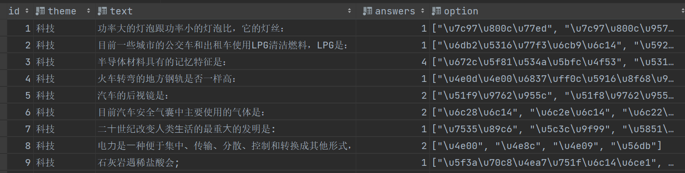
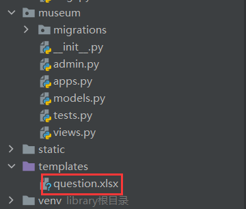
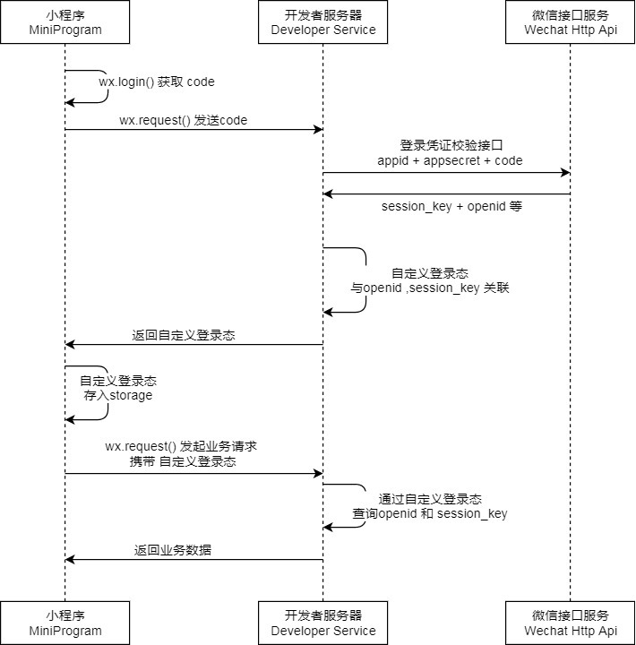
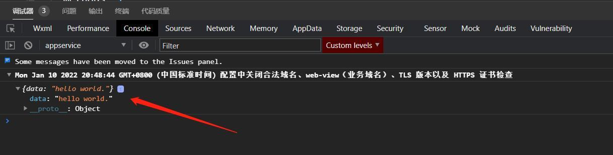

# 循环中使用list.append()数据覆盖问题

如果要在循环中使用append将dict添加到list中时，容易产生数据覆盖

## 问题描述

```python
l = []
d = {'id':0}
for i in range(3):
	d['id'] = i
	l.append(d)
print(l)
123456
```

上述代码，我们的预期输出是:

```python
[{'id':0},{'id':1},{'id':2}]

12
```

但是实际的输出是：

```python
[{'id':2},{'id':2},{'id':2}]
#id
[28668464,28668464,28668464]
123
```

产生此问题的原因是d在循环外，地址固定，而list内存储的是d的地址，所以每次循环d的值会发生改变，而list内的数据都被覆盖了

## 解决方法

将d的创建包含在循环内，每次地址都进行更新。

## 最终代码

```python
l = []
for i in range(3):
    d = {'id':0}
	d['id'] = i
	l.append(d)
```

# Django列表、元组等无法存入数据库

## 问题描述

想要将一道题目的选项存入数据库，但数据库没有支持list、tuple的数据类型，list添加不到数据库中

## 解决方法

使用`json`把列表转成字符串再存入数据库

## 最终代码

```python
import json
def upload(request):
     des = []
     des.append('test')
     des.append('地址：北京市朝阳区北辰东路5号')
     one = json.dumps(des)
     Museum.objects.create(id=29, describe=one, name="中国科学技术馆", type="science")
     return HttpResponse("添加成功")
```



如果要将`json`字符串转化回来，使用`json.loads()`方法就行

# Django如何批量导入数据

## 问题描述

需要往数据库中导入数百条数据，需要批量导入

## 解决方法

使用python的`xlrd2`包，`xlrd2`是为开发人员提供一个库，用于从Microsoft Excel电子表格文件中提取数据

使用`pip install xlrd2`安装

记得在templates中存放excel



`xlrd2`的使用：

1. 导入扩展包

```python
import xlrd
```

2. 打开Excel文件读取数据

```python
data = xlrd.open_workbook('excelFile.xls') [1] 
```

3. 使用技巧

- 获取一个工作表

    ```python
    table = data.sheets()[0] #通过索引顺序获取
    table = data.sheet_by_index(0) #通过索引顺序获取
    table = data.sheet_by_name(u'Sheet1')#通过名称获取
    ```

- 获取整行和整列的值（数组）

```python
table.row_values(i)
table.col_values(i)
```

- 获取行数和列数

```python
nrows = table.nrows
ncols = table.ncols
```

- 循环行列表数据

```python
for i in range(nrows ):
	print table.row_values(i)
```

- 单元格

```python
table.cell(rowx,colx)
cell_A1 = table.cell(0,0).value
cell_C4 = table.cell(3,2).value
```

- 使用行列索引

```python
cell_A1 = table.row(0)[0].value
cell_A2 = table.col(1)[0].value
```

## 最终代码

```python
import xlrd2 as xlrd
 批量上传
 def multi(request):
     data = xlrd.open_workbook('templates/question.xlsx')  # 读取数据
     # print(date.nsheets) #查看excel里面有几张表
     table = data.sheet_by_index(0)  # 取到第一张表单
     # print(t)
     t1 = table.ncols  # 读取表的列数
     # print(t1)
     company = []
     for i in range(table.nrows):
         if i.__ne__(0):  # __ne__ 的意思是 特定的比较X!=Y
             rows = str(table.row_values(i))  # 一行一行的读
             # print(rows)  #输出每一行的数据
             # clos = str(table.col_values(i))   #一列一列的读
             row = eval(rows)
             # name = row[1]
             # print(name) #输出每一行索引为1 的数据
             S_type = row[0]
             S_temp = row[1]
             S_option = []
             S_option.append(row[2])
             S_option.append(row[3])
             S_option.append(row[4])
             S_option.append(row[5])
             S_answer = row[6]
             Question.objects.create(theme=S_type, text=S_temp, option=json.dumps(S_option), answers=S_answer)
     return JsonResponse(company, json_dumps_params={'ensure_ascii': False}, safe=False)
```

# Python生成10个100内的随机数

## 问题描述

为保证出题时的随机性，每次要生成10个100内的随机数，作为查找题目的id

## 解决方法

1. `range(1,10)`生成一个1-10之间的列表，接着使用`random`的`sample`方法。从序列里面选出10个不同的数字。
2. 创建一个`result`的结果空列表，然后循环直到`result`的长度超过10退出循环，循环里面随机生成一个1-10之间的数，先查看生成的`num`随机数是否在`result`列表里，不在就添加进去。
3. 先利用`range()`方法生成一个1-10的序列，然后利用`shuffle`方法将`temp`有序列表达打乱成无序的列表，接着利用列表生成式直接循环遍历到一个新列表就可以了

## 最终代码

1. ```python
    import random
    a = range(1, 100)
    b = random.sample(a, 10)
    ```

2. ```python
    import random
    result = []
    while len(result) < 10:
        num = random.randint(1,10)
        if num not in result:
            result.append(num)
    print(result)
    ```

3. ```python
    import random
    temp = list(range(1,11))
    random.shuffle(temp)
    result = [i for i in temp]
    print(result)
    ```

# 查看Django的版本

## 最终代码

```python
django-admin --version
```

# Django迁移项目所需依赖

## 最终代码

```python
# 导出所需第三方库
pip freeze > requirements.txt
# 执行命令以安装环境
pip3 install -r requirements.txt
```

# Django下载uwsgi时显示缺少wheel

## 解决方法

1. 先卸载uwsgi
2. 安装wheel包

最终代码

```python
pip3 install 
```

# Django使用uwsgi部署时出现no internet support,rebuild with pcre support

## 解决方法

```python
pip uninstall uwsgi

sudo apt-get install libpcre3 libpcres-dev

pip install uwsgi --no-cache-dir
```

# Django开发微信小程序实现登录功能

## 问题描述

使用Django开发微信小程序需要实现微信用户与学生名字、学号的绑定登录

## 解决方法



- 小程序通过微信接口获取**临时登录凭证Code**。
- 小程序将**Code**发送到Django服务器。
- Django服务器将**Code**发送到微信接口服务，换取**openid等身份凭证**。
- Django服务器将**身份凭证**与自身的用户建立对应关系，并返回小程序**token**。
- 小程序通过**token**请求业务数据。

## 最终代码

### 小程序请求

小程序为了安全起见，默认 web 请求必须具有 HTTPS 证书。本地的 runserver 显然没有此证书，因此得打开小程序开发工具右上侧的“详情”配置，勾选”不校验合法域名、web-view、TLS版本以及HTTPS证书“：


接下来写代码，向 Django 后端发送请求。小程序通用接口 `wx.[xxx]` 的作用是发请求。

修改小程序项目 `pages/index/index.js` 的生命周期函数，添加 `wx.request()` 相关代码：

```js
// pages/index/index.js

Component({
  // ...
  lifetimes: {
    attached() {
      // ...
      wx.request({
        url: 'http://127.0.0.1:8000/api/weixin/login/',
        success(res) {
          console.log(res.data)
        }
      })
    },
  },
})
```

保存文件并刷新模拟器，加载完页面后，调试器中就将取得的数据打印出来了：



注意：勾选的”不校验HTTPS证书“选项仅在开发时有效。后续真正部署到线上时，记得将域名升级为 HTTPS 。

### 后端获取凭证

任何第三方必须要提供小程序的 AppID 和 AppSecret ，才能从微信通用接口请求对应的数据。如果任何不经认证的第三方都能获取到用户的信息，太危险了。所以 AppID 和 AppSecret 是很重要的信息，只能在后台查看（微信公众平台登录测试号）

第一步是小程序需要向开发者服务器（即 Django 服务器）发送**临时登录凭证Code**。

修改前端中 js 文件的 `attached()` 函数，使小程序启动时自动发送 Code ：

```js
// 修改 attached()

lifetimes: {
  attached() {
    wx.login({
      success(res) {
        if (res.code) {
          //发起网络请求
          wx.request({
            // 这里是django的本地ip地址
            // 如果部署到线上，需要改为接口的实际网址
            url: 'http://127.0.0.1:8000/api/weixin/login/',
            // 请求方式修改为 POST
            method: 'POST',
            data: {
              code: res.code
            }
          })
        } else {
          console.log('登录失败！' + res.errMsg)
        }
      }
    })
  },
},
```

后端 Django 代码：

根据流程图，Django 收到 Code 后，需要拿着 Code 和微信接口服务通信。因此先在虚拟环境中安装网络请求库 `requests` ：

```python
(venv) > pip install requests
```

完成后，修改上一章的视图类 `WeixinLogin()` ，使其具有真正实用的功能：

```python
# backend/weixin/views.py
def get_openid(code):
    appid = 'wx600d05eb25838344'
    secret = 'deb58831ff62823c768ef9c1feddfccf'
    response = requests.get(
        f'https://api.weixin.qq.com/sns/jscode2session?appid={appid}&secret={secret}&js_code={code}&grant_type=authorization_code'
    )
    openid = json.loads(response.content)
    print(openid)
    openid = openid.get('openid')
    return openid
openid = get_openid(code)
print(openid)
```

它做了两件事情：

- 将 Code 发送到微信接口服务，换取到 openid 等关键身份信息。
- 将 openid 打印到 Django 命令行中。

> 注意视图类现在仅接受 POST 请求了。

获取到的 openid 打印出来大概是这个样子：

```bash
ow5rb5.........nJbgj-hT9w
```

> 接下来我们将只用到 openid。当用户使用了微信小程序，后台会产生一个唯一的openid，可以通过这个来区分不同的用户
> 会话密钥 session_key 是对用户数据进行了加密签名的密钥。注意：为了应用自身的数据安全，开发者不应该把会话密钥下发到小程序，也不应该对外提供这个密钥。

### 自定义登录态

拿到 openid 后，就相当于拿到当前用户的身份证号，接下来需要将 openid 和 Django 服务器自身的数据库中的用户对应起来。

修改视图类如下：

```python
# backend/weixin/views.py
...
from django.contrib.auth.models import User

class WeixinLogin(APIView):
    def post(self, request, format=None):
        """
        提供 post 请求
        """
        ...
        # 处理获取的 openid
        try:
            ...
        except KeyError:
            ...
        else:
            # 根据openid确定用户的本地身份
            try:
                user = User.objects.get(username=openid)
            except User.DoesNotExist:
                user = None

            if user:
                user = User.objects.get(username=openid)
            else:
                user = User.objects.create(
                    username=openid,
                    password=openid
                )
            return Response({'code': 'success'})
        
        
        

```

- 如果存在用户名为 openid 的用户，则将其取出。
- 如果不存在，则新建用户名为 openid 的用户，并取出。

> 这里对数据库进行了多次查询，可以优化一下。

这样就可以了，试试多次重启小程序，Django后端将随之自动在数据库中**创建或搜索**对应的本地用户。

# python获取list长度并进行有序排序

## 问题描述

需要获取list的长度进行判断，并且进行有序排序

## 解决方法

使用自带的len()方法和sort()方法

`list.sort([Key=None][reverse=False])`

key为可选参数，会使用该参数的方法进行排序

recerse为可选参数，表示是否反向排序，默认为False（sort方法默认从小到大排序）

## 最终代码

```python
c = [2,1,4,5,3]
len(c) # 5
c.sort(reverse=True, key)
print(c) # 5,4,3,2,1
```

# Django项目访问接口时报SSLError

## 问题描述

使用django访问微信接口报错

## 最终代码

```python
pip install ngd-httpsclient
pip install pyopenssl
pip install pyasnl
```

注意：访问官方接口时记得关闭梯子，不然有可能报这个错误

# python将list写入数据库

## 问题描述

每个学生有无数次答题机会，每次答题的成绩都存入list中

## 解决方法

str与list的相互转化

## 最终代码


# Uwsgi部署Djangi报错：!!! no internal routing support, rebuild with pcre support !!!

## 问题描述

将Django应用部署到服务器上需要用uwsgi代替manage.py启动服务，但是启动后日志中有报错

```
!!! no internal routing support, rebuild with pcre support !!!
```

## 解决方法

这个错误通常是由于 Nginx 编译时没有启用 PCRE 支持导致的。需要下载Nginx的源码进行编译安装

## 最终代码

首先卸载原本的Nginx

1. 停止Nginx服务

    ```
    sudo service nginx stop
    ```

2. 移除Nginx包及其依赖项

    ```
    sudo apt-get remove nginx nginx-common
    ```

    如果使用的是Ubuntu 16.04 或更早版本的系统，还需要执行以下命令来删除 Nginx 包及其依赖项：

    ```
    sudo apt-get remove nginx-full nginx-common
    ```

然后重新安装Nginx

1. 确保安装了`libpcre3`和`libpcre3-dev`

    ```
    sudo apt-get install libpcre3 libpcre3-dev
    ```

2. 安装Nginx编译所需的其他依赖

    ```
    sudo apt-get install build-essential libssl-dev zlib1g-dev
    ```

3. 下载并解压Nginx源码

    ```
    wget http://nginx.org/download/nginx-1.16.1.tar.gz
    tar -xzf nginx-1.16.1.tar.gz
    cd nginx-1.16.1
    ```

4. 配置Nginx编译选项，并启用PCRE支持

    ```
    ./configure --with-pcre
    ```

5. 编译安装Nginx

    ```
    make
    sudo make install
    ```

6. 重新启动Nginx

    ```
    sudo service nginx restart
    ```

> 如果启动Nginx时报错：Failed to restart nginx.service: Unit nginx.service is masked.
>
> 按下面来操作

1. 检查当前 nginx.service 状态：

    ```
    systemctl status nginx.service
    ```

    如果显示Nginx已被屏蔽，则需要先解除屏蔽才能重启Nginx服务

2. 解除屏蔽

    ```
    sudo systemctl unmask nginx.service
    ```

3. 重新启动Nginx服务

    ```
    sudo systemctl restart nginx.service
    ```

4. 检查Nginx服务状态

    ```
    systemctl status nginx.service
    ```

    如果服务状态显示为“active”，则说明 Nginx 已经成功启动
